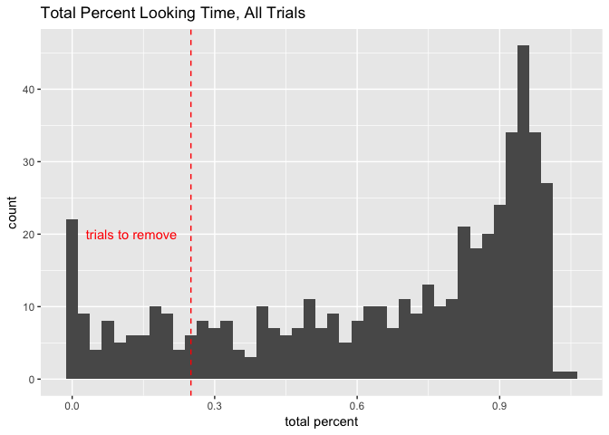
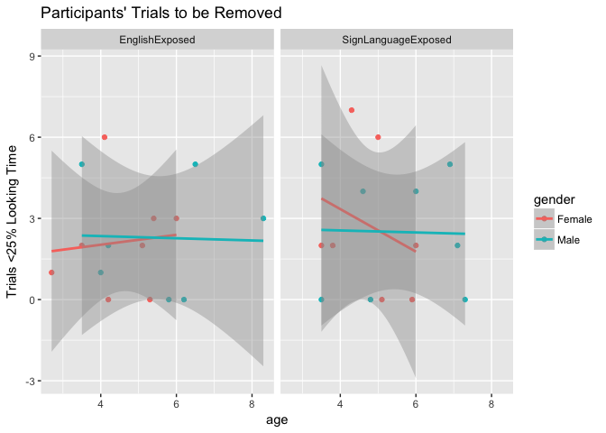

Data Import and Cleanup (study2children)
================
Adam Stone, PhD
11-03-2017

-   [Introduction](#introduction)
-   [Removing Bad/Irrelevant Data](#removing-badirrelevant-data)
-   [Checking for Outliers](#checking-for-outliers)
-   [Save!](#save)
-   [Participant Table](#participant-table)

Introduction
============

Great! At this point, I've run a Matlab script on the children's raw data to tally up all AOI hits for each video/trial they viewed. We start with 67 children. Not all of them go into our analysis. Some are babies, for one thing! Others had bad eye tracking calibration or were too fussy, and so were wholly thrown out. Other kids may have bad trials (e.g., no eye gaze data for more than 75% of the video). We'll go through each at a time. For now here's **all** our data.

``` r
# Libraries
library(tidyverse)
library(feather)
library(stringr)
#library(cowplot)

# Import data (and fix one participant name)
data <- read_feather("childrawdata.feather") %>%
  mutate(participant = case_when(
    participant == "Ab07ov09_22m" ~ "Ab07ov09_32m",
    TRUE ~ participant
  ))

# Get ages
ages <- read_csv("childrenages.csv")
data <- data %>% left_join(ages, by = "participant")
data %>% select(participant,language,age) %>% distinct() # print data table
```

    ## # A tibble: 67 x 3
    ##            participant            language   age
    ##                  <chr>               <chr> <dbl>
    ##  1        Ab07ov09_32m      EnglishExposed   2.7
    ##  2     AB11Mi20_5M_10D      EnglishExposed   0.4
    ##  3  Ainsely03_27_5y_1m      EnglishExposed   5.1
    ##  4       al10pa24_4yrs      EnglishExposed   4.0
    ##  5       Allan_SE_3.5y SignLanguageExposed   3.5
    ##  6         an06he01_6m      EnglishExposed   0.5
    ##  7 Annika_3_24_10_CODA SignLanguageExposed   6.0
    ##  8      AsherCalibOnly      EnglishExposed   0.0
    ##  9  Aveline CODA 6y,1m SignLanguageExposed   5.1
    ## 10         ca05he16_6m      EnglishExposed   0.5
    ## # ... with 57 more rows

``` r
# Histogram of ages
data %>% select(participant,language,age) %>% 
  distinct() %>% 
  ggplot(aes(x = age)) + geom_histogram(fill = "royalblue") + ggtitle("Ages in Full Dataset")
```


Removing Bad/Irrelevant Data
============================

First, let's get rid of all below 2 years old. Then we're going to remove specific children for various reasons, here's a list of who we removed.

``` r
alldata <- data
data <- data %>%
  filter(age > 2.0) %>%
  filter(participant != "OwenTwin030212_4y2m") %>%
  filter(participant != "Kiera_8_20_13 3y,5m")

anti_join(alldata, data, by = "participant") %>% 
  select(participant, recording, analysis, language, group, age) %>% 
  distinct() %>%
  filter(age > 2.0)
```

    ## # A tibble: 2 x 6
    ##           participant                 recording             analysis
    ##                 <chr>                     <chr>                <chr>
    ## 1 OwenTwin030212_4y2m Owen twin 4y2m POOR CALIB Good_But_Needs_Shift
    ## 2 Kiera_8_20_13 3y,5m    Rec 08 little SHRUNKEN Good_But_Needs_Shift
    ## # ... with 3 more variables: language <chr>, group <int>, age <dbl>

All children saw all trials. Now, we need to remove trials where looking data was collected &lt;25% of the video length. I'm importing a table of clip lengths, see below. The videos were shown at 25 FPS so frames / 25 = seconds.

``` r
cliplength <- read_csv("cliplengths.csv") %>%
  rename(clip_sec = seconds) %>%
  separate(story, into = c("video", "clipnum")) %>%
  filter(clipnum < 3) %>%
  unite(video, clipnum, col = "story", sep = "_")

cliplength
```

    ## # A tibble: 8 x 3
    ##          story frames clip_sec
    ## *        <chr>  <int>    <dbl>
    ## 1 Cinderella_1    211     8.44
    ## 2 Cinderella_2    105     4.20
    ## 3  KingMidas_1    228     9.12
    ## 4  KingMidas_2    277    11.08
    ## 5  RedRiding_1    210     8.40
    ## 6  RedRiding_2    193     7.72
    ## 7 ThreeBears_1    188     7.52
    ## 8 ThreeBears_2    278    11.12

Now let's fold that in. I'm summing up all AOI hits for each video/trial, converting that to seconds (divide by 60, as Tobii's sampling rate is 60 Hz), and throwing out any trials &lt; 25%.

``` r
trialcheck <- data %>%
  group_by(participant, condition, trial) %>%
  summarise(hits = sum(hits)) %>%
  mutate(secs = hits/120) %>%
  separate(condition, into = c("story", "clipnum", "direction", "media"), sep = "_") %>%
  unite(story, clipnum, col = "story", sep = "_") %>%
  left_join(cliplength, by = "story") %>%
  mutate(percent = secs / clip_sec) %>%
  mutate(lessthan25 = percent <= 0.25)

# Histogram of trial total percentages
ggplot(trialcheck, aes(x = percent)) + 
  geom_histogram(binwidth = 0.025) + ggtitle("Total Percent Looking Time, All Trials") + xlab("total percent") +
  geom_vline(xintercept = 0.25, linetype = "dashed", color = "red") + 
  annotate("text", x = 0.125, y = 20, label = "trials to remove", color = "red")
```



``` r
# Values to put in commentary
numtotakeout = sum(trialcheck$lessthan25)
numtotaltrials = dim(trialcheck)[1]
percenttakeout = paste(numtotakeout/numtotaltrials * 100, "%", sep = "")
```

We removed 89 trials out of 496 (17.9435483870968%). Was there any correlation with the number of trials removed by age, language, or gender? Scatterplot below - looks fine. (Took out one CODA girl that has nearly all trials removed, was skewing the data).

``` r
# Grab age/group data we need for scatterplot
agegroup <- data %>%
  select(participant, age, language, gender) %>%
  distinct()

# Join age/group data with trialcheck data (actually trialcheck2, just for plotting)
trialcheck2 <- trialcheck %>%
  group_by(participant) %>%
  summarize(trialsremoved = sum(lessthan25)) %>%
  left_join(agegroup, by = "participant") %>%
  filter(trialsremoved < 10)

# Scatterplot of bad trials grouped by age, language, gender
ggplot(trialcheck2, aes(x = age, y = trialsremoved, color = gender)) + geom_point() + 
  facet_wrap("language") + geom_smooth(method = "lm") + 
  ggtitle("Participants' Trials to be Removed") + ylab("Trials <25% Looking Time")
```



We'll also take out Jelena (very low looking rate overall) in addition to taking out all the bad trials, using the code block below.

``` r
# Select only bad trials to use in an anti_join
trialcheck <- trialcheck %>%
  filter(lessthan25 == TRUE) %>% 
  select(participant, trial)

# Now remove all bad trials.
data <- data %>%
  anti_join(trialcheck, by = c("participant","trial"))

# Table of trials per baby
data %>% select(participant, language, trial) %>% distinct() %>% group_by(language, participant) %>% summarise(trials = n()) %>% arrange(trials)
```

    ## # A tibble: 31 x 3
    ## # Groups:   language [2]
    ##               language              participant trials
    ##                  <chr>                    <chr>  <int>
    ##  1 SignLanguageExposed   JelenaCODAhearing_4y2m      2
    ##  2 SignLanguageExposed                   sophia      9
    ##  3      EnglishExposed  Elizabeth 11_17_11_4y1m     10
    ##  4 SignLanguageExposed                JuliaCoda     10
    ##  5      EnglishExposed       na01pe06_2013_3.5y     11
    ##  6      EnglishExposed     Timothy_7_18_09_6.5y     11
    ##  7 SignLanguageExposed            Cyrus_SE_3.5y     11
    ##  8 SignLanguageExposed                    Gavin     11
    ##  9 SignLanguageExposed Isabella 5 year old Deaf     11
    ## 10 SignLanguageExposed      emmet_12_10_12_CODA     12
    ## # ... with 21 more rows

So based on that, we're removing Jelena.

``` r
data <- data %>% filter(participant != "JelenaCODAhearing_4y2m")
```

Checking for Outliers
=====================

Now I'm going to make a histogram of each story and AOI, to check if there are any kids who may have had their eye gaze shifted incorrectly (or needs to be shifted). Because there are so many AOIs we'll show separate histograms for each fairy tale.

``` r
# Pull apart condition and AOI columns
data <- data %>%
  separate(condition, into = c("story", "clipnum", "direction", "media"), sep = "_") %>%
  unite(story, clipnum, col = "story", sep = "_") %>%
  select(-media) %>%
  separate(aoi, into = c("math", "label", "aoi", "hitlabel", "indicator"), sep = "_") %>%
  select(-math, -label, -hitlabel, -indicator)

# Remove numbers from end of AOI label 
data <- data %>%
  mutate(aoi = case_when(
    str_detect(aoi, "\\d") ~ str_sub(aoi, 0, -2),
    TRUE ~ aoi
  ))

# Now let's add cliplengths again, but this time to data, and calculate percentage looking times
data <- data %>%
  left_join(cliplength, by = "story") %>%
  select(-frames) %>%
  mutate(secs = hits/120,
         percent = secs/clip_sec)

# Histogram!
data_ci <- data %>% filter(str_detect(story, "Cinderella"), percent > 0.04)
data_km <- data %>% filter(str_detect(story, "KingMidas"), percent > 0.04)
data_3b <- data %>% filter(str_detect(story, "ThreeBears"), percent > 0.04)
data_rr <- data %>% filter(str_detect(story, "RedRiding"), percent > 0.04)

ggplot(data_ci, aes(x = percent)) + geom_histogram() + facet_grid(aoi ~ story) + theme(strip.text.y = element_text(angle = 0), axis.text.y = element_blank(), axis.ticks = element_blank()) + ylab("")
```


``` r
ggplot(data_km, aes(x = percent)) + geom_histogram() + facet_grid(aoi ~ story) + theme(strip.text.y = element_text(angle = 0), axis.text.y = element_blank(), axis.ticks = element_blank()) + ylab("")
```


``` r
ggplot(data_3b, aes(x = percent)) + geom_histogram() + facet_grid(aoi ~ story) + theme(strip.text.y = element_text(angle = 0), axis.text.y = element_blank(), axis.ticks = element_blank()) + ylab("")
```


``` r
ggplot(data_rr, aes(x = percent)) + geom_histogram() + facet_grid(aoi ~ story) + theme(strip.text.y = element_text(angle = 0), axis.text.y = element_blank(), axis.ticks = element_blank()) + ylab("")
```


Based on these histograms, I sent to Rain on 26 Oct 2017 this table. Plus I asked about Jelena (CODA) who had very little data in 14 out of 16 trials so she was thrown out entirely from the dataset. I wrote to Rain:

> Alright, here's what I found. Good news, I'm not seeing any really BAD kids! Yay. Just two that may need to be looked at. Attached is the list of all kids/stories I flagged for having way too much looking in that AOI. The trial column indicates which clip out of 16 (so 5 means 5th clip in the sequence). Most kids on the list are fine really, I think, and, yes, these AOIs were flagged for having weirdly high percentages but what probably happened was that they zoned out during that particular clip or stared at something interesting/idiosyncratic. I would especially review the static gaze plot/scatterplot images for these kids:

> Lyla (Group 1) - A lot of chest looking. Calibration may have been shifted down.

> Mason (Group 2) - VERY focused on MidFaceCenter across several stories (that's usually a low AOI). It could be that his calibration is shifted up; all other kids look at MidFaceBottom, not MidFaceCenter). Or it could just be his idiosyncratic looking behavior. Give it a look.

> Isabella (Group 1) - I know we're not using her for this paper, but FYI her eye gaze was kinda random for a few stories. Might be something interesting there. I don't think it's mis-shifted or anything, though.

``` r
outliers <- read_csv("outliers.csv") %>%
  separate(outlier, into = letters[seq( from = 1, to = 9 )]) %>%
  select(-a, -c, -h) %>%
  rename(participant = b,
         group = d,
         trial = g,
         aoi = i) %>%
  unite(col = "story", e:f, sep = "_") %>%
  select(group, participant, story, trial, aoi) %>%
  arrange(group, participant)
```

    ## Parsed with column specification:
    ## cols(
    ##   outlier = col_character()
    ## )

``` r
outliers
```

    ## # A tibble: 37 x 5
    ##    group participant        story trial              aoi
    ##    <chr>       <chr>        <chr> <chr>            <chr>
    ##  1     1     Ainsely Cinderella_2     9  leftchestbottom
    ##  2     1     Ainsely  KingMidas_1    15   midchestbottom
    ##  3     1     Ainsely  RedRiding_1    10            belly
    ##  4     1    al10pa24 Cinderella_1    15       belowchest
    ##  5     1      Annika ThreeBears_1     6 rightchestbottom
    ##  6     1       dylan Cinderella_2     1    midfacecenter
    ##  7     1       Isiah Cinderella_1     5         leftside
    ##  8     1       Isiah Cinderella_1     5 rightchestcenter
    ##  9     1       Isiah  KingMidas_2     4            belly
    ## 10     1       Isiah ThreeBears_1    14            belly
    ## # ... with 27 more rows

``` r
write_csv(outliers, "outlierkids.csv")
```

Save!
=====

Great. Let's save this as \`cleanedchildeyedata.csv'.

``` r
# A bit more cleaning up
data <- data %>%
  mutate(direction = case_when(
    direction == "FW" ~ "forward",
    direction == "ER" ~ "reversed"
  )) %>%
  mutate(language = case_when(
    language == "SignLanguageExposed" ~ "sign",
    language == "EnglishExposed" ~ "english"
  )) %>%
  mutate(group = as.factor(group),
         gender = as.factor(gender),
         language = as.factor(language),
         story = as.factor(story),
         direction = as.factor(direction),
         aoi = as.factor(aoi))

# Save as csv and feather (feather preserves column types for R)
write_csv(data,"cleanedchildeyedata.csv")
write_feather(data,"cleanedchildeyedata.feather")
```

Participant Table
=================

Now we can present the following table about our participants.

``` r
participants <- data %>%
  select(participant, gender, language, age) %>%
  distinct()

participants_n <- participants %>%
  count(gender, language) %>%
  spread(gender, n)

participants_age <- participants %>%
  group_by(language) %>%
  summarise(age_m = round(mean(age), 1), 
            age_sd = round(sd(age), 1),
            age_min = range(age)[1],
            age_max = range(age)[2]) %>%
  mutate(age_range = paste(age_min, age_max, sep = " - ")) %>%
  select(-age_min, -age_max) %>%
  mutate(age_mean = paste(age_m, age_sd, sep = "±")) %>%
  select(-age_m, -age_sd) %>%
  select(language, age_mean, age_range)

left_join(participants_n, participants_age, by = "language")
```

    ## # A tibble: 2 x 5
    ##   language Female  Male age_mean age_range
    ##     <fctr>  <int> <int>    <chr>     <chr>
    ## 1  english      8     6    5±1.5 2.7 - 8.3
    ## 2     sign      8     8  5.1±1.3 3.5 - 7.3
