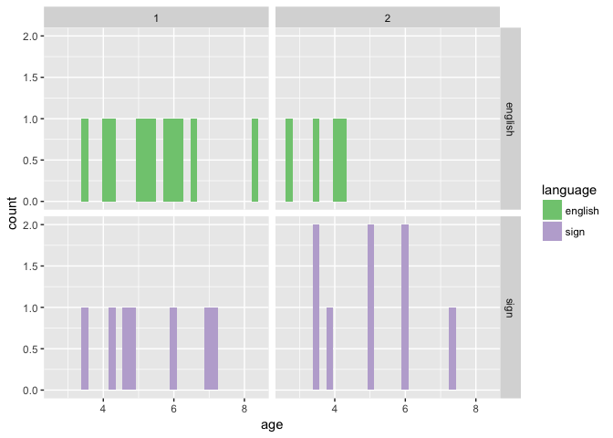
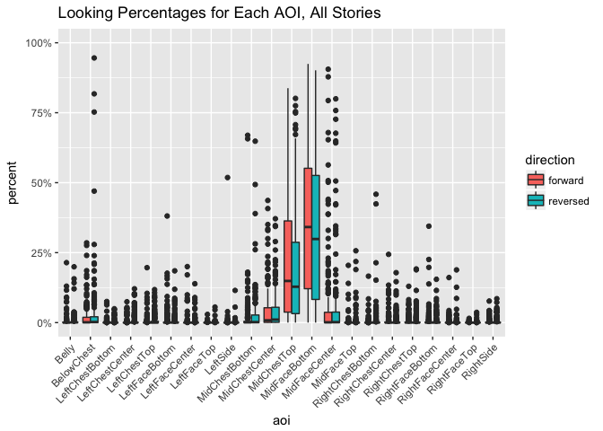

Basic Eye Gaze (study2children)
================
Adam Stone, PhD
10-26-2017

-   [Starting Out](#starting-out)

Starting Out
============

We've cleaned up the data in [01importclean](01importclean.nb.html). So we're importing it here. First, let's do boxplots of each AOI across all stories and kids, grouping for forward vs. reversed.

``` r
# Libraries
library(tidyverse)
```

    ## Loading tidyverse: ggplot2
    ## Loading tidyverse: tibble
    ## Loading tidyverse: tidyr
    ## Loading tidyverse: readr
    ## Loading tidyverse: purrr
    ## Loading tidyverse: dplyr

    ## Warning: package 'dplyr' was built under R version 3.4.2

    ## Conflicts with tidy packages ----------------------------------------------

    ## filter(): dplyr, stats
    ## lag():    dplyr, stats

``` r
library(feather)
library(scales)
```

    ## 
    ## Attaching package: 'scales'

    ## The following object is masked from 'package:purrr':
    ## 
    ##     discard

    ## The following object is masked from 'package:readr':
    ## 
    ##     col_factor

``` r
library(stringr)
#library(cowplot)

# Import data that's been cleaned up from 01importclean
data <- read_feather("cleanedchildeyedata.feather")

# Boxplot!
ggplot(data, aes(x = aoi, y = percent, fill = direction)) + 
  geom_boxplot() + theme(axis.text.x = element_text(angle=45, hjust = 1)) +
  ggtitle("Looking Percentages for Each AOI, All Stories") +
  scale_y_continuous(labels = scales::percent, limits = c(0,1))
```



Looks like by far most of the activity is along the Mid\*\* AOIs. Let's look closer.

``` r
data_mid <- data %>%
  filter(str_detect(aoi,"Mid"))

ggplot(data_mid, aes(x = aoi, y = percent, fill = direction)) + 
  geom_boxplot() + theme(axis.text.x = element_text(angle=45, hjust = 1)) +
  ggtitle("Looking Percentages for Middle AOIs, All Stories") +
  scale_y_continuous(labels = scales::percent, limits = c(0,1))
```


