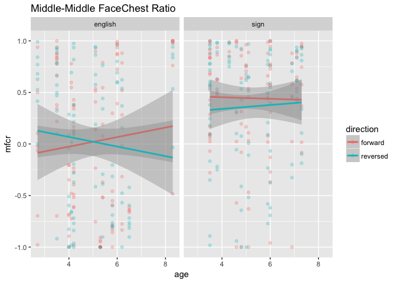
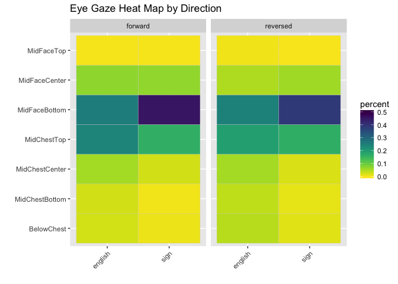

Basic Eye Gaze (study2children)
================
Adam Stone, PhD
11-13-2017

-   [Starting Out](#starting-out)
-   [Heat Maps](#heat-maps)
-   [Statistical Testing of FCR/mFCR](#statistical-testing-of-fcrmfcr)
    -   [Language, Direction, & Age Predictors](#language-direction-age-predictors)
    -   [Direction & Language Predictors](#direction-language-predictors)
    -   [Language as only predictor](#language-as-only-predictor)
-   [Could Age be Polynomial?](#could-age-be-polynomial)
-   [How Young Can We Go?](#how-young-can-we-go)

Starting Out
============

We've cleaned up the data in [01importclean](01importclean.nb.html). So we're importing it here. Let's grab histograms of our kids and groups.

``` r
# Libraries
library(tidyverse)
library(feather)
library(scales)
library(stringr)
library(viridis)
library(lme4)
library(lmerTest)
library(RColorBrewer)
#library(cowplot)

# Import data that's been cleaned up from 01importclean
data <- read_feather("cleanedchildeyedata.feather")

data_ages <- data %>%
  select(participant, language, age, group) %>%
  distinct()

ggplot(data_ages, aes(x = age, fill = language)) + geom_histogram() + facet_grid(language ~ group) + scale_fill_brewer(palette = "Accent")
```


First, let's do boxplots of each AOI across all stories and kids, grouping for forward vs. reversed.

``` r
# Boxplot!
ggplot(data, aes(x = aoi, y = percent, fill = direction)) + 
  geom_boxplot() + theme(axis.text.x = element_text(angle=45, hjust = 1)) +
  ggtitle("Looking Percentages for Each AOI, All Stories") +
  scale_y_continuous(labels = scales::percent, limits = c(0,1))
```


Looks like by far most of the activity is along the Mid\*\* AOIs. Let's look closer.

``` r
data_mid <- data %>%
  filter(str_detect(aoi,"Mid") | aoi == "BelowChest")

ggplot(data_mid, aes(x = aoi, y = percent, fill = direction)) + 
  geom_boxplot() + theme(axis.text.x = element_text(angle=45, hjust = 1)) +
  ggtitle("Looking Percentages for Middle AOIs, All Stories") +
  scale_y_continuous(labels = scales::percent, limits = c(0,1))
```


As a preliminary analysis I'm going to just look at MidChestTop and MidFaceBottom. Are there differences based on direction, group, or age for either AOI?

``` r
data_mid %>% 
  filter(aoi == "MidChestTop" | aoi == "MidFaceBottom") %>%
  ggplot(aes(x = age, y = percent, color = direction)) + geom_point(alpha = 0.25) +
  geom_smooth(method = "lm") + facet_grid(language ~ aoi) +
  scale_y_continuous(labels = scales::percent, limits = c(0,1)) +
  ggtitle("Top 2 AOIs")
```


I am not observing big differences for directin. But I sort of notice that CODAs show increased looking at MidFaceBottom as they get older, while English kids don't (and actually show a downward trajectory).

What if we defined a Face-Chest Ratio (FCR) such that:

1.  MidFaceCenter, MidFaceBottom = Face
2.  MidChestTop, MidChestCenter, MidChestBottom, BelowChest = Chest
3.  FCR = face - chest / face + chest

Let's try that. Let's also try only MidFaceBottom vs. MidChestTop too, and call that MFCR (for middle of middle).

Ooh, cool chart below. Looks like both effects of direction, language, and age. Signing kids, right away, have higher FCR (positive) while English kids have just slightly negative FCR. And signing kids' behavior doesn't really change depending on direction or age. English kids, however, show a big change based on direction, and on age.

``` r
data_mid <- data_mid %>%
  select(-secs, -hits) %>%
  spread(aoi,percent) %>%
  group_by(participant, trial) %>%
  mutate(face = sum(MidFaceCenter, MidFaceBottom, na.rm = TRUE),
         chest = sum(MidChestTop, MidChestCenter, MidChestBottom, BelowChest, na.rm = TRUE),
         fcr = (face - chest) / (face + chest),
         mfcr = (MidFaceBottom - MidChestTop) / (MidFaceBottom + MidChestTop))

ggplot(data_mid, aes(x = age, y = fcr, color = direction)) + geom_point(alpha = 0.25) +
  geom_smooth(method = "lm") + facet_wrap("language") + ggtitle("FaceChest Ratio")
```


Let's also check out MFCR (a stricter ratio). Almost the same thing.

``` r
ggplot(data_mid, aes(x = age, y = mfcr, color = direction)) + geom_point(alpha = 0.25) +
  geom_smooth(method = "lm") + facet_wrap("language") + ggtitle("Middle-Middle FaceChest Ratio")
```

    ## Warning: Removed 10 rows containing non-finite values (stat_smooth).

    ## Warning: Removed 10 rows containing missing values (geom_point).



Heat Maps
=========

So this is rad! Such obvious group differences should also be reflected in a heat map that is collapsed across age and direction. And the heat map below shows that CODAs really focus on the MidFaceBottom AOI, while English-exposed children are a bit more spread out, looking much more at the chest.

``` r
data_mid_heat <- data_mid %>%
  ungroup() %>%
  select(-face, -chest, -fcr, -mfcr) %>%
  gather(aoi, percent, BelowChest:MidFaceTop) %>%
  group_by(language, participant, direction, aoi) %>%
  summarise(percent = mean(percent, na.rm = TRUE)) %>%
  group_by(language, direction, aoi) %>%
  summarise(percent = mean(percent, na.rm = TRUE)) %>%
  group_by(language, aoi) %>%
  summarise(percent = mean(percent, na.rm = TRUE)) %>%
  mutate(aoi = factor(aoi, levels = c("BelowChest", "MidChestBottom", "MidChestCenter", "MidChestTop",
                                      "MidFaceBottom", "MidFaceCenter", "MidFaceTop")))

ggplot(data_mid_heat, aes(x = language, y = aoi)) +
  geom_tile(aes(fill=percent),color="lightgray",na.rm=TRUE) + 
  scale_fill_viridis(option = "viridis", direction=-1, limits = c(0,.5)) +
  theme(axis.text.x=element_text(angle=45,hjust=1)) +
  ylab("") + xlab("") + ggtitle("Eye Gaze Heat Map")
```


``` r
data_mid_heat <- data_mid %>%
  ungroup() %>%
  select(-face, -chest, -fcr, -mfcr) %>%
  gather(aoi, percent, BelowChest:MidFaceTop) %>%
  group_by(language, participant, direction, aoi) %>%
  summarise(percent = mean(percent, na.rm = TRUE)) %>%
  group_by(language, direction, aoi) %>%
  summarise(percent = mean(percent, na.rm = TRUE)) %>%
  mutate(aoi = factor(aoi, levels = c("BelowChest", "MidChestBottom", "MidChestCenter", "MidChestTop",
                                      "MidFaceBottom", "MidFaceCenter", "MidFaceTop")))

ggplot(data_mid_heat, aes(x = language, y = aoi)) +
  geom_tile(aes(fill=percent),color="lightgray",na.rm=TRUE) + 
  scale_fill_viridis(option = "viridis", direction=-1, limits = c(0,.5)) +
  theme(axis.text.x=element_text(angle=45,hjust=1)) +
  ylab("") + xlab("") + ggtitle("Eye Gaze Heat Map by Direction") + facet_wrap("direction")
```



``` r
ggplot(data_mid_heat, aes(x = direction, y = aoi)) +
  geom_tile(aes(fill=percent),color="lightgray",na.rm=TRUE) + 
  scale_fill_viridis(option = "viridis", direction=-1, limits = c(0,.5)) +
  theme(axis.text.x=element_text(angle=45,hjust=1)) +
  ylab("") + xlab("") + ggtitle("Eye Gaze Heat Map by Group") + facet_wrap("language")
```


Statistical Testing of FCR/mFCR
===============================

Now that we've found something interesting with FCR and mFCR, let's see if it holds up in stats modeling.

Language, Direction, & Age Predictors
-------------------------------------

First, a LMM with predictors Language, Direction, and Age, and outcome variable FCR. Nothing significant, or even close to it! I'm surprised.

``` r
fcr_lmm <- lmer(fcr ~ age * language * direction + (1|story) + (1|participant), data = data_mid)
summary(fcr_lmm)
```

    ## Linear mixed model fit by REML t-tests use Satterthwaite approximations
    ##   to degrees of freedom [lmerMod]
    ## Formula: 
    ## fcr ~ age * language * direction + (1 | story) + (1 | participant)
    ##    Data: data_mid
    ## 
    ## REML criterion at convergence: 620
    ## 
    ## Scaled residuals: 
    ##     Min      1Q  Median      3Q     Max 
    ## -3.1685 -0.5139  0.1055  0.6598  2.2496 
    ## 
    ## Random effects:
    ##  Groups      Name        Variance Std.Dev.
    ##  participant (Intercept) 0.16732  0.4091  
    ##  story       (Intercept) 0.01707  0.1306  
    ##  Residual                0.21935  0.4683  
    ## Number of obs: 394, groups:  participant, 29; story, 8
    ## 
    ## Fixed effects:
    ##                                     Estimate Std. Error        df t value
    ## (Intercept)                         -0.27810    0.44124  30.60000  -0.630
    ## age                                  0.03366    0.08394  30.20000   0.401
    ## languagesign                         0.65114    0.64900  29.70000   1.003
    ## directionreversed                    0.22868    0.25715 361.50000   0.889
    ## age:languagesign                    -0.02659    0.12299  29.80000  -0.216
    ## age:directionreversed               -0.05090    0.05088 354.80000  -1.000
    ## languagesign:directionreversed      -0.46453    0.37384 357.60000  -1.243
    ## age:languagesign:directionreversed   0.07136    0.07160 361.20000   0.997
    ##                                    Pr(>|t|)
    ## (Intercept)                           0.533
    ## age                                   0.691
    ## languagesign                          0.324
    ## directionreversed                     0.374
    ## age:languagesign                      0.830
    ## age:directionreversed                 0.318
    ## languagesign:directionreversed        0.215
    ## age:languagesign:directionreversed    0.320
    ## 
    ## Correlation of Fixed Effects:
    ##             (Intr) age    lnggsg drctnr ag:lng ag:drc lnggs:
    ## age         -0.956                                          
    ## languagesgn -0.671  0.648                                   
    ## dirctnrvrsd -0.290  0.289  0.192                            
    ## age:lnggsgn  0.651 -0.680 -0.966 -0.192                     
    ## ag:drctnrvr  0.278 -0.300 -0.180 -0.959  0.198              
    ## lnggsgn:drc  0.196 -0.193 -0.287 -0.674  0.279  0.639       
    ## ag:lnggsgn: -0.194  0.209  0.275  0.671 -0.289 -0.695 -0.963

Let's repeat the LMM with outcome mFCR. Same thing, although the t values are slightly better.

``` r
mfcr_lmm <- lmer(mfcr ~ age * language * direction + (1|story) + (1|participant), data = data_mid)
summary(mfcr_lmm)
```

    ## Linear mixed model fit by REML t-tests use Satterthwaite approximations
    ##   to degrees of freedom [lmerMod]
    ## Formula: 
    ## mfcr ~ age * language * direction + (1 | story) + (1 | participant)
    ##    Data: data_mid
    ## 
    ## REML criterion at convergence: 616.1
    ## 
    ## Scaled residuals: 
    ##     Min      1Q  Median      3Q     Max 
    ## -3.2457 -0.4811  0.0973  0.6299  1.9439 
    ## 
    ## Random effects:
    ##  Groups      Name        Variance Std.Dev.
    ##  participant (Intercept) 0.18646  0.4318  
    ##  story       (Intercept) 0.01089  0.1043  
    ##  Residual                0.22575  0.4751  
    ## Number of obs: 384, groups:  participant, 29; story, 8
    ## 
    ## Fixed effects:
    ##                                     Estimate Std. Error        df t value
    ## (Intercept)                         -0.16326    0.46161  29.50000  -0.354
    ## age                                  0.03027    0.08797  29.40000   0.344
    ## languagesign                         0.74548    0.68081  29.00000   1.095
    ## directionreversed                    0.30590    0.26027 350.90000   1.175
    ## age:languagesign                    -0.05087    0.12899  29.00000  -0.394
    ## age:directionreversed               -0.05713    0.05133 332.90000  -1.113
    ## languagesign:directionreversed      -0.58129    0.37949 347.90000  -1.532
    ## age:languagesign:directionreversed   0.08633    0.07261 351.70000   1.189
    ##                                    Pr(>|t|)
    ## (Intercept)                           0.726
    ## age                                   0.733
    ## languagesign                          0.283
    ## directionreversed                     0.241
    ## age:languagesign                      0.696
    ## age:directionreversed                 0.267
    ## languagesign:directionreversed        0.126
    ## age:languagesign:directionreversed    0.235
    ## 
    ## Correlation of Fixed Effects:
    ##             (Intr) age    lnggsg drctnr ag:lng ag:drc lnggs:
    ## age         -0.959                                          
    ## languagesgn -0.672  0.648                                   
    ## dirctnrvrsd -0.280  0.278  0.185                            
    ## age:lnggsgn  0.653 -0.680 -0.966 -0.185                     
    ## ag:drctnrvr  0.268 -0.288 -0.174 -0.958  0.190              
    ## lnggsgn:drc  0.189 -0.185 -0.277 -0.674  0.270  0.639       
    ## ag:lnggsgn: -0.187  0.200  0.266  0.669 -0.279 -0.693 -0.962

What if we did ANCOVAs (C because age would be a covariate). First, FCR as outcome.

Direction & Language Predictors
-------------------------------

In the LMMs we've run so far, age is always the worst predictor. So we should have taken that out first, anyway.

**OLD TEXT** Alright, we got a very significant effect of language (p = 0.003). Signing kids have a much higher FCR than non-signing kids.

``` r
fcr_lmm_noage <- lmer(fcr ~ direction * language + (1|story) + (1|participant), data = data_mid)
summary(fcr_lmm_noage)
```

    ## Linear mixed model fit by REML t-tests use Satterthwaite approximations
    ##   to degrees of freedom [lmerMod]
    ## Formula: fcr ~ direction * language + (1 | story) + (1 | participant)
    ##    Data: data_mid
    ## 
    ## REML criterion at convergence: 606.7
    ## 
    ## Scaled residuals: 
    ##     Min      1Q  Median      3Q     Max 
    ## -3.1970 -0.5310  0.0706  0.6924  2.2405 
    ## 
    ## Random effects:
    ##  Groups      Name        Variance Std.Dev.
    ##  participant (Intercept) 0.15528  0.3941  
    ##  story       (Intercept) 0.01747  0.1322  
    ##  Residual                0.21866  0.4676  
    ## Number of obs: 394, groups:  participant, 29; story, 8
    ## 
    ## Fixed effects:
    ##                                 Estimate Std. Error        df t value
    ## (Intercept)                     -0.11267    0.12548  37.10000  -0.898
    ## directionreversed               -0.01901    0.07252 356.40000  -0.262
    ## languagesign                     0.52261    0.16195  33.10000   3.227
    ## directionreversed:languagesign  -0.11186    0.09989 362.40000  -1.120
    ##                                Pr(>|t|)   
    ## (Intercept)                     0.37502   
    ## directionreversed               0.79335   
    ## languagesign                    0.00282 **
    ## directionreversed:languagesign  0.26355   
    ## ---
    ## Signif. codes:  0 '***' 0.001 '**' 0.01 '*' 0.05 '.' 0.1 ' ' 1
    ## 
    ## Correlation of Fixed Effects:
    ##             (Intr) drctnr lnggsg
    ## dirctnrvrsd -0.289              
    ## languagesgn -0.669  0.231       
    ## drctnrvrsd:  0.215 -0.744 -0.309

The mFCR LMM gives us similar results - strong effect of language (p = 0.006).

``` r
mfcr_lmm_noage <- lmer(mfcr ~ direction * language + (1|story) + (1|participant), data = data_mid)
summary(mfcr_lmm_noage)
```

    ## Linear mixed model fit by REML t-tests use Satterthwaite approximations
    ##   to degrees of freedom [lmerMod]
    ## Formula: mfcr ~ direction * language + (1 | story) + (1 | participant)
    ##    Data: data_mid
    ## 
    ## REML criterion at convergence: 603.4
    ## 
    ## Scaled residuals: 
    ##     Min      1Q  Median      3Q     Max 
    ## -3.2711 -0.5204  0.1225  0.6437  1.9733 
    ## 
    ## Random effects:
    ##  Groups      Name        Variance Std.Dev.
    ##  participant (Intercept) 0.1725   0.4153  
    ##  story       (Intercept) 0.0111   0.1053  
    ##  Residual                0.2253   0.4747  
    ## Number of obs: 384, groups:  participant, 29; story, 8
    ## 
    ## Fixed effects:
    ##                                 Estimate Std. Error        df t value
    ## (Intercept)                     -0.01466    0.12749  35.00000  -0.115
    ## directionreversed                0.02740    0.07428 337.10000   0.369
    ## languagesign                     0.49109    0.16960  32.20000   2.896
    ## directionreversed:languagesign  -0.15266    0.10219 347.20000  -1.494
    ##                                Pr(>|t|)   
    ## (Intercept)                     0.90911   
    ## directionreversed               0.71246   
    ## languagesign                    0.00675 **
    ## directionreversed:languagesign  0.13611   
    ## ---
    ## Signif. codes:  0 '***' 0.001 '**' 0.01 '*' 0.05 '.' 0.1 ' ' 1
    ## 
    ## Correlation of Fixed Effects:
    ##             (Intr) drctnr lnggsg
    ## dirctnrvrsd -0.283              
    ## languagesgn -0.689  0.219       
    ## drctnrvrsd:  0.210 -0.743 -0.296

Language as only predictor
--------------------------

Same thing here. So it's not age or direction, but language, that has the effect. And that's good! I want to look at forward v. reversed separately next.

``` r
fcr_lmm_langonly <- lmer(fcr ~  language + (1|story) + (1|participant) + (1|direction), data = data_mid)
summary(fcr_lmm_langonly)
```

    ## Linear mixed model fit by REML t-tests use Satterthwaite approximations
    ##   to degrees of freedom [lmerMod]
    ## Formula: 
    ## fcr ~ language + (1 | story) + (1 | participant) + (1 | direction)
    ##    Data: data_mid
    ## 
    ## REML criterion at convergence: 603
    ## 
    ## Scaled residuals: 
    ##     Min      1Q  Median      3Q     Max 
    ## -3.2757 -0.5541  0.0825  0.6827  2.2582 
    ## 
    ## Random effects:
    ##  Groups      Name        Variance Std.Dev.
    ##  participant (Intercept) 0.153595 0.39191 
    ##  story       (Intercept) 0.016853 0.12982 
    ##  direction   (Intercept) 0.001982 0.04452 
    ##  Residual                0.219090 0.46807 
    ## Number of obs: 394, groups:  participant, 29; story, 8; direction, 2
    ## 
    ## Fixed effects:
    ##              Estimate Std. Error      df t value Pr(>|t|)   
    ## (Intercept)   -0.1221     0.1234 26.0770  -0.990  0.33139   
    ## languagesign   0.4667     0.1533 27.1160   3.045  0.00513 **
    ## ---
    ## Signif. codes:  0 '***' 0.001 '**' 0.01 '*' 0.05 '.' 0.1 ' ' 1
    ## 
    ## Correlation of Fixed Effects:
    ##             (Intr)
    ## languagesgn -0.641

Forward only. Language effect, p = 0.004.

``` r
fcr_lmm_langonly_f <- lmer(fcr ~  language + (1|story) + (1|participant), data = filter(data_mid,direction=="forward"))
summary(fcr_lmm_langonly_f)
```

    ## Linear mixed model fit by REML t-tests use Satterthwaite approximations
    ##   to degrees of freedom [lmerMod]
    ## Formula: fcr ~ language + (1 | story) + (1 | participant)
    ##    Data: filter(data_mid, direction == "forward")
    ## 
    ## REML criterion at convergence: 307.7
    ## 
    ## Scaled residuals: 
    ##      Min       1Q   Median       3Q      Max 
    ## -2.87861 -0.47925  0.01445  0.63019  2.16228 
    ## 
    ## Random effects:
    ##  Groups      Name        Variance Std.Dev.
    ##  participant (Intercept) 0.1548   0.3934  
    ##  story       (Intercept) 0.0381   0.1952  
    ##  Residual                0.1974   0.4443  
    ## Number of obs: 198, groups:  participant, 29; story, 8
    ## 
    ## Fixed effects:
    ##              Estimate Std. Error      df t value Pr(>|t|)   
    ## (Intercept)   -0.1016     0.1374 26.9050  -0.739  0.46612   
    ## languagesign   0.5026     0.1637 28.5180   3.070  0.00466 **
    ## ---
    ## Signif. codes:  0 '***' 0.001 '**' 0.01 '*' 0.05 '.' 0.1 ' ' 1
    ## 
    ## Correlation of Fixed Effects:
    ##             (Intr)
    ## languagesgn -0.634

Reversed only. Weaker language effect, p = 0.0131.

``` r
fcr_lmm_langonly_r <- lmer(fcr ~  language + (1|story) + (1|participant), data = filter(data_mid,direction=="reversed"))
summary(fcr_lmm_langonly_r)
```

    ## Linear mixed model fit by REML t-tests use Satterthwaite approximations
    ##   to degrees of freedom [lmerMod]
    ## Formula: fcr ~ language + (1 | story) + (1 | participant)
    ##    Data: filter(data_mid, direction == "reversed")
    ## 
    ## REML criterion at convergence: 327
    ## 
    ## Scaled residuals: 
    ##     Min      1Q  Median      3Q     Max 
    ## -2.6902 -0.5529  0.1116  0.7156  2.2685 
    ## 
    ## Random effects:
    ##  Groups      Name        Variance Std.Dev.
    ##  participant (Intercept) 0.1459   0.3820  
    ##  story       (Intercept) 0.0183   0.1353  
    ##  Residual                0.2317   0.4814  
    ## Number of obs: 196, groups:  participant, 29; story, 8
    ## 
    ## Fixed effects:
    ##              Estimate Std. Error      df t value Pr(>|t|)  
    ## (Intercept)   -0.1510     0.1256 27.3960  -1.203   0.2392  
    ## languagesign   0.4357     0.1606 28.3090   2.714   0.0112 *
    ## ---
    ## Signif. codes:  0 '***' 0.001 '**' 0.01 '*' 0.05 '.' 0.1 ' ' 1
    ## 
    ## Correlation of Fixed Effects:
    ##             (Intr)
    ## languagesgn -0.672

Let's go ahead and plot boxplots to represent LMMs with only language as an important effect. (We can add in direction too). FaceChest Ratio here.

``` r
ggplot(data_mid, aes(x = language, y = fcr, fill = language)) + geom_boxplot() + scale_fill_brewer(palette = "Dark2") + ylab("FaceChest Ratio") + ggtitle("FaceChest Ratio by Language")
```


``` r
ggplot(data_mid, aes(x = language, y = fcr, fill = direction)) + geom_boxplot() + ylab("FaceChest Ratio") + ggtitle("FaceChest Ratio by Language & Direction")
```


And Middle-Middle FaceChest Ratio here.

``` r
ggplot(data_mid, aes(x = language, y = mfcr, fill = language)) + geom_boxplot() + scale_fill_brewer(palette = "Dark2") + ylab("M-FaceChest Ratio") + ggtitle("Middle-Middle FaceChest Ratio by Language")
```

    ## Warning: Removed 10 rows containing non-finite values (stat_boxplot).


``` r
ggplot(data_mid, aes(x = language, y = mfcr, fill = direction)) + geom_boxplot() + ylab("M-FaceChest Ratio") + ggtitle("Middle-Middle FaceChest Ratio by Language & Direction")
```

    ## Warning: Removed 10 rows containing non-finite values (stat_boxplot).


Could Age be Polynomial?
========================

I graphed age using a polynomial scale (^2, parabolic) and there definitely seems to be something there. I'm not sure how to work with these, though, so putting it off for a bit later. See below:

``` r
ggplot(data_mid, aes(x = age, y = fcr, color = direction)) + geom_point(alpha = 0.25) +
  geom_smooth(method = "loess", span = 5) + facet_wrap("language") + ggtitle("FaceChest Ratio")
```


``` r
ggplot(data_mid, aes(x = age, y = mfcr, color = direction)) + geom_point(alpha = 0.25) +
  geom_smooth(method = "loess", span = 5) + facet_wrap("language") + ggtitle("MFaceChest Ratio")
```

    ## Warning: Removed 10 rows containing non-finite values (stat_smooth).

    ## Warning: Removed 10 rows containing missing values (geom_point).


How Young Can We Go?
====================

How young can we still find differences between NSE and CODA kids? If we look only at 2 to 4.9 year old kids then the language effect gets weaker (p = 0.06) but then again it's only 12 kids total. (If I lower the cutoff to 4.5, it's 0.05, but 10 kids; if it's 4, it's 0.60, but only 6 kids).

``` r
data_young <- data_mid %>%
  ungroup() %>%
  filter(age < 4)
data_young %>% select(participant, language) %>% distinct() %>% count(language)
```

    ## # A tibble: 2 x 2
    ##   language     n
    ##     <fctr> <int>
    ## 1  english     3
    ## 2     sign     4

``` r
fcr_lmm_young <- lmer(fcr ~ direction * language + (1|story) + (1|participant), data = data_young)
summary(fcr_lmm_young)
```

    ## Linear mixed model fit by REML t-tests use Satterthwaite approximations
    ##   to degrees of freedom [lmerMod]
    ## Formula: fcr ~ direction * language + (1 | story) + (1 | participant)
    ##    Data: data_young
    ## 
    ## REML criterion at convergence: 137.6
    ## 
    ## Scaled residuals: 
    ##     Min      1Q  Median      3Q     Max 
    ## -2.8198 -0.4807  0.2198  0.6865  1.3552 
    ## 
    ## Random effects:
    ##  Groups      Name        Variance Std.Dev.
    ##  story       (Intercept) 0.007896 0.08886 
    ##  participant (Intercept) 0.037463 0.19355 
    ##  Residual                0.210455 0.45875 
    ## Number of obs: 95, groups:  story, 8; participant, 7
    ## 
    ## Fixed effects:
    ##                                Estimate Std. Error       df t value
    ## (Intercept)                     0.25552    0.15526  8.93000   1.646
    ## directionreversed               0.06896    0.14625 83.21000   0.472
    ## languagesign                    0.20965    0.20015  8.38000   1.047
    ## directionreversed:languagesign -0.25117    0.19202 81.50000  -1.308
    ##                                Pr(>|t|)
    ## (Intercept)                       0.134
    ## directionreversed                 0.639
    ## languagesign                      0.324
    ## directionreversed:languagesign    0.195
    ## 
    ## Correlation of Fixed Effects:
    ##             (Intr) drctnr lnggsg
    ## dirctnrvrsd -0.468              
    ## languagesgn -0.740  0.356       
    ## drctnrvrsd:  0.350 -0.747 -0.474
