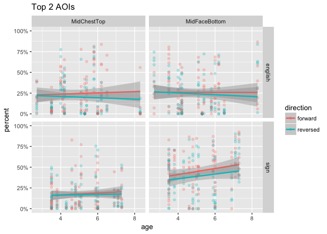
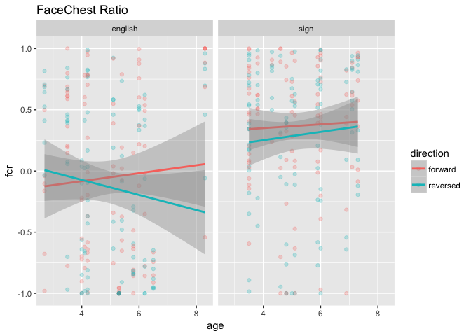
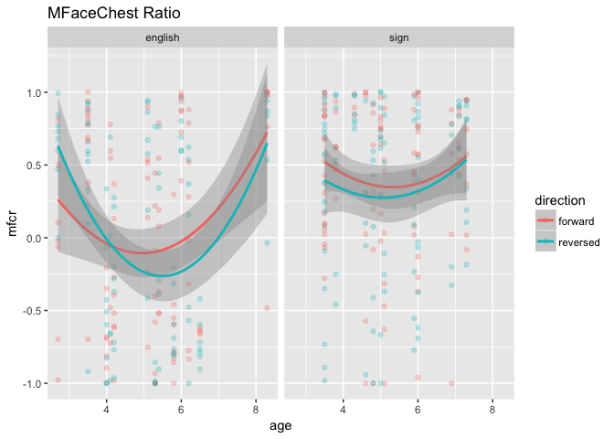

Basic Eye Gaze (study2children)
================
Adam Stone, PhD
10-27-2017

-   [Starting Out](#starting-out)
-   [Statistical Testing of FCR/mFCR](#statistical-testing-of-fcrmfcr)
    -   [Language, Direction, & Age Predictors](#language-direction-age-predictors)
    -   [Language & Age Predictors](#language-age-predictors)
    -   [Direction & Language Predictors](#direction-language-predictors)
    -   [Language as only predictor](#language-as-only-predictor)
-   [Could Age be Polynomial?](#could-age-be-polynomial)
-   [How Young Can We Go?](#how-young-can-we-go)

Starting Out
============

We've cleaned up the data in [01importclean](01importclean.nb.html). So we're importing it here. Let's grab histograms of our kids and groups.

``` r
# Libraries
library(tidyverse)
```

    ## Loading tidyverse: ggplot2
    ## Loading tidyverse: tibble
    ## Loading tidyverse: tidyr
    ## Loading tidyverse: readr
    ## Loading tidyverse: purrr
    ## Loading tidyverse: dplyr

    ## Warning: package 'dplyr' was built under R version 3.4.2

    ## Conflicts with tidy packages ----------------------------------------------

    ## filter(): dplyr, stats
    ## lag():    dplyr, stats

``` r
library(feather)
library(scales)
```

    ## 
    ## Attaching package: 'scales'

    ## The following object is masked from 'package:purrr':
    ## 
    ##     discard

    ## The following object is masked from 'package:readr':
    ## 
    ##     col_factor

``` r
library(stringr)
library(viridis)
```

    ## Loading required package: viridisLite

    ## 
    ## Attaching package: 'viridis'

    ## The following object is masked from 'package:scales':
    ## 
    ##     viridis_pal

``` r
library(lme4)
```

    ## Warning: package 'lme4' was built under R version 3.4.2

    ## Loading required package: Matrix

    ## 
    ## Attaching package: 'Matrix'

    ## The following object is masked from 'package:tidyr':
    ## 
    ##     expand

``` r
library(lmerTest)
```

    ## 
    ## Attaching package: 'lmerTest'

    ## The following object is masked from 'package:lme4':
    ## 
    ##     lmer

    ## The following object is masked from 'package:stats':
    ## 
    ##     step

``` r
library(RColorBrewer)
#library(cowplot)

# Import data that's been cleaned up from 01importclean
data <- read_feather("cleanedchildeyedata.feather")

data_ages <- data %>%
  select(participant, language, age, group) %>%
  distinct()

ggplot(data_ages, aes(x = age, fill = language)) + geom_histogram() + facet_grid(language ~ group) + scale_fill_brewer(palette = "Accent")
```

    ## `stat_bin()` using `bins = 30`. Pick better value with `binwidth`.


First, let's do boxplots of each AOI across all stories and kids, grouping for forward vs. reversed.

``` r
# Boxplot!
ggplot(data, aes(x = aoi, y = percent, fill = direction)) + 
  geom_boxplot() + theme(axis.text.x = element_text(angle=45, hjust = 1)) +
  ggtitle("Looking Percentages for Each AOI, All Stories") +
  scale_y_continuous(labels = scales::percent, limits = c(0,1))
```


Looks like by far most of the activity is along the Mid\*\* AOIs. Let's look closer.

``` r
data_mid <- data %>%
  filter(str_detect(aoi,"Mid"))

ggplot(data_mid, aes(x = aoi, y = percent, fill = direction)) + 
  geom_boxplot() + theme(axis.text.x = element_text(angle=45, hjust = 1)) +
  ggtitle("Looking Percentages for Middle AOIs, All Stories") +
  scale_y_continuous(labels = scales::percent, limits = c(0,1))
```


As a preliminary analysis I'm going to just look at MidChestTop and MidFaceBottom. Are there differences based on direction, group, or age for either AOI?

``` r
data_mid %>% 
  filter(aoi == "MidChestTop" | aoi == "MidFaceBottom") %>%
  ggplot(aes(x = age, y = percent, color = direction)) + geom_point(alpha = 0.25) +
  geom_smooth(method = "lm") + facet_grid(language ~ aoi) +
  scale_y_continuous(labels = scales::percent, limits = c(0,1)) +
  ggtitle("Top 2 AOIs")
```



I am not observing big differences for directin. But I sort of notice that CODAs show increased looking at MidFaceBottom as they get older, while English kids don't (and actually show a downward trajectory).

What if we defined a Face-Chest Ratio (FCR) such that:

1.  MidFaceTop, MidFaceCenter, MidFaceBottom = Face
2.  MidChestTop, MidChestCenter, MidChestBottom = Chest
3.  FCR = face - chest / face + chest

Let's try that. Let's also try only MidFaceBottom vs. MidChestTop too, and call that MFCR (for middle of middle).

Ooh, cool chart below. Looks like both effects of direction, language, and age. Signing kids, right away, have higher FCR (positive) while English kids have just slightly negative FCR. And signing kids' behavior doesn't really change depending on direction or age. English kids, however, show a big change based on direction, and on age.

``` r
data_mid <- data_mid %>%
  select(-secs, -hits) %>%
  spread(aoi,percent) %>%
  group_by(participant, trial) %>%
  mutate(face = sum(MidFaceTop, MidFaceCenter, MidFaceBottom, na.rm = TRUE),
         chest = sum(MidChestTop, MidChestCenter, MidChestBottom, na.rm = TRUE),
         fcr = (face - chest) / (face + chest),
         mfcr = (MidFaceBottom - MidChestTop) / (MidFaceBottom + MidChestTop))

ggplot(data_mid, aes(x = age, y = fcr, color = direction)) + geom_point(alpha = 0.25) +
  geom_smooth(method = "lm") + facet_wrap("language") + ggtitle("FaceChest Ratio")
```

    ## Warning: Removed 1 rows containing non-finite values (stat_smooth).

    ## Warning: Removed 1 rows containing missing values (geom_point).



Let's also check out MFCR (a stricter ratio). Almost the same thing.

``` r
ggplot(data_mid, aes(x = age, y = mfcr, color = direction)) + geom_point(alpha = 0.25) +
  geom_smooth(method = "lm") + facet_wrap("language") + ggtitle("Middle-Middle FaceChest Ratio")
```

    ## Warning: Removed 6 rows containing non-finite values (stat_smooth).

    ## Warning: Removed 6 rows containing missing values (geom_point).


So this is rad! Such obvious group differences should also be reflected in a heat map that is collapsed across age and direction. And the heat map below shows that CODAs really focus on the MidFaceBottom AOI, while English-exposed children are a bit more spread out, looking much more at the chest.

``` r
data_mid_heat <- data_mid %>%
  ungroup() %>%
  select(-face, -chest, -fcr, -mfcr) %>%
  gather(aoi, percent, MidChestBottom:MidFaceTop) %>%
  group_by(language, participant, direction, aoi) %>%
  summarise(percent = mean(percent, na.rm = TRUE)) %>%
  group_by(language, direction, aoi) %>%
  summarise(percent = mean(percent, na.rm = TRUE)) %>%
  group_by(language, aoi) %>%
  summarise(percent = mean(percent, na.rm = TRUE)) %>%
  mutate(aoi = factor(aoi, levels = c("MidChestBottom", "MidChestCenter", "MidChestTop",
                                      "MidFaceBottom", "MidFaceCenter", "MidFaceTop")))

ggplot(data_mid_heat, aes(x = language, y = aoi)) +
  geom_tile(aes(fill=percent),color="lightgray",na.rm=TRUE) + 
  scale_fill_viridis(option = "viridis", direction=-1, limits = c(0,1)) +
  theme(axis.text.x=element_text(angle=45,hjust=1)) +
  ylab("") + xlab("") + ggtitle("Eye Gaze Heat Map")
```


Statistical Testing of FCR/mFCR
===============================

Now that we've found something interesting with FCR and mFCR, let's see if it holds up in stats modeling.

Language, Direction, & Age Predictors
-------------------------------------

First, a LMM with predictors Language, Direction, and Age, and outcome variable FCR. Nothing significant, or even close to it! I'm surprised.

``` r
fcr_lmm <- lmer(fcr ~ age * language * direction + (1|story) + (1|participant), data = data_mid)
summary(fcr_lmm)
```

    ## Linear mixed model fit by REML t-tests use Satterthwaite approximations
    ##   to degrees of freedom [lmerMod]
    ## Formula: 
    ## fcr ~ age * language * direction + (1 | story) + (1 | participant)
    ##    Data: data_mid
    ## 
    ## REML criterion at convergence: 640.1
    ## 
    ## Scaled residuals: 
    ##      Min       1Q   Median       3Q      Max 
    ## -3.04398 -0.55553  0.08178  0.64613  2.26377 
    ## 
    ## Random effects:
    ##  Groups      Name        Variance Std.Dev.
    ##  participant (Intercept) 0.15505  0.3938  
    ##  story       (Intercept) 0.01634  0.1278  
    ##  Residual                0.23434  0.4841  
    ## Number of obs: 393, groups:  participant, 29; story, 8
    ## 
    ## Fixed effects:
    ##                                     Estimate Std. Error        df t value
    ## (Intercept)                         -0.37008    0.45868  30.70000  -0.807
    ## age                                  0.05443    0.08552  30.50000   0.636
    ## languagesign                         0.73269    0.65132  30.20000   1.125
    ## directionreversed                    0.32277    0.27668 358.80000   1.167
    ## age:languagesign                    -0.04434    0.12242  30.20000  -0.362
    ## age:directionreversed               -0.06392    0.05356 358.40000  -1.193
    ## languagesign:directionreversed      -0.57312    0.39431 355.40000  -1.453
    ## age:languagesign:directionreversed   0.09136    0.07479 359.10000   1.222
    ##                                    Pr(>|t|)
    ## (Intercept)                           0.426
    ## age                                   0.529
    ## languagesign                          0.269
    ## directionreversed                     0.244
    ## age:languagesign                      0.720
    ## age:directionreversed                 0.233
    ## languagesign:directionreversed        0.147
    ## age:languagesign:directionreversed    0.223
    ## 
    ## Correlation of Fixed Effects:
    ##             (Intr) age    lnggsg drctnr ag:lng ag:drc lnggs:
    ## age         -0.959                                          
    ## languagesgn -0.696  0.673                                   
    ## dirctnrvrsd -0.304  0.302  0.210                            
    ## age:lnggsgn  0.669 -0.697 -0.968 -0.207                     
    ## ag:drctnrvr  0.290 -0.313 -0.196 -0.959  0.212              
    ## lnggsgn:drc  0.211 -0.206 -0.304 -0.692  0.295  0.654       
    ## ag:lnggsgn: -0.206  0.220  0.291  0.679 -0.305 -0.702 -0.963

Let's repeat the LMM with outcome mFCR. Same thing, although the t values are slightly better.

``` r
mfcr_lmm <- lmer(mfcr ~ age * language * direction + (1|story) + (1|participant), data = data_mid)
summary(mfcr_lmm)
```

    ## Linear mixed model fit by REML t-tests use Satterthwaite approximations
    ##   to degrees of freedom [lmerMod]
    ## Formula: 
    ## mfcr ~ age * language * direction + (1 | story) + (1 | participant)
    ##    Data: data_mid
    ## 
    ## REML criterion at convergence: 638.7
    ## 
    ## Scaled residuals: 
    ##     Min      1Q  Median      3Q     Max 
    ## -3.0734 -0.5352  0.1119  0.6600  2.3866 
    ## 
    ## Random effects:
    ##  Groups      Name        Variance Std.Dev.
    ##  participant (Intercept) 0.15990  0.3999  
    ##  story       (Intercept) 0.01036  0.1018  
    ##  Residual                0.23943  0.4893  
    ## Number of obs: 388, groups:  participant, 29; story, 8
    ## 
    ## Fixed effects:
    ##                                     Estimate Std. Error        df t value
    ## (Intercept)                         -0.30904    0.46445  30.50000  -0.665
    ## age                                  0.05944    0.08672  30.40000   0.685
    ## languagesign                         0.85824    0.66088  30.20000   1.299
    ## directionreversed                    0.40197    0.27939 354.90000   1.439
    ## age:languagesign                    -0.07556    0.12420  30.20000  -0.608
    ## age:directionreversed               -0.07457    0.05392 347.50000  -1.383
    ## languagesign:directionreversed      -0.69975    0.39880 350.90000  -1.755
    ## age:languagesign:directionreversed   0.10942    0.07560 355.20000   1.447
    ##                                    Pr(>|t|)  
    ## (Intercept)                          0.5108  
    ## age                                  0.4983  
    ## languagesign                         0.2039  
    ## directionreversed                    0.1511  
    ## age:languagesign                     0.5475  
    ## age:directionreversed                0.1675  
    ## languagesign:directionreversed       0.0802 .
    ## age:languagesign:directionreversed   0.1487  
    ## ---
    ## Signif. codes:  0 '***' 0.001 '**' 0.01 '*' 0.05 '.' 0.1 ' ' 1
    ## 
    ## Correlation of Fixed Effects:
    ##             (Intr) age    lnggsg drctnr ag:lng ag:drc lnggs:
    ## age         -0.961                                          
    ## languagesgn -0.698  0.673                                   
    ## dirctnrvrsd -0.303  0.299  0.209                            
    ## age:lnggsgn  0.670 -0.697 -0.968 -0.206                     
    ## ag:drctnrvr  0.289 -0.310 -0.196 -0.959  0.211              
    ## lnggsgn:drc  0.210 -0.205 -0.303 -0.692  0.294  0.656       
    ## ag:lnggsgn: -0.205  0.218  0.290  0.678 -0.303 -0.702 -0.963

What if we did ANCOVAs (C because age would be a covariate). First, FCR as outcome.

Language & Age Predictors
-------------------------

Let's take out direction. The FCR LMM tells us same thing, nothing.

``` r
fcr_lmm_nodir <- lmer(fcr ~ age * language + (1|story) + (1|participant) + (1|direction), data = data_mid)
summary(fcr_lmm_nodir)
```

    ## Linear mixed model fit by REML t-tests use Satterthwaite approximations
    ##   to degrees of freedom [lmerMod]
    ## Formula: fcr ~ age * language + (1 | story) + (1 | participant) + (1 |  
    ##     direction)
    ##    Data: data_mid
    ## 
    ## REML criterion at convergence: 629.5
    ## 
    ## Scaled residuals: 
    ##      Min       1Q   Median       3Q      Max 
    ## -3.15644 -0.54003  0.09707  0.63988  2.26585 
    ## 
    ## Random effects:
    ##  Groups      Name        Variance  Std.Dev.
    ##  participant (Intercept) 0.1544437 0.39299 
    ##  story       (Intercept) 0.0163306 0.12779 
    ##  direction   (Intercept) 0.0005939 0.02437 
    ##  Residual                0.2343351 0.48408 
    ## Number of obs: 393, groups:  participant, 29; story, 8; direction, 2
    ## 
    ## Fixed effects:
    ##                   Estimate Std. Error        df t value Pr(>|t|)
    ## (Intercept)      -0.207093   0.436471 25.450000  -0.474    0.639
    ## age               0.022327   0.081087 24.921000   0.275    0.785
    ## languagesign      0.446324   0.619324 24.947000   0.721    0.478
    ## age:languagesign  0.001183   0.116370 24.936000   0.010    0.992
    ## 
    ## Correlation of Fixed Effects:
    ##             (Intr) age    lnggsg
    ## age         -0.958              
    ## languagesgn -0.696  0.675       
    ## age:lnggsgn  0.668 -0.697 -0.968

And the mFCR, nothing either.

``` r
mfcr_lmm_nodir <- lmer(mfcr ~ age * language + (1|story) + (1|participant) + (1|direction), data = data_mid)
summary(mfcr_lmm_nodir)
```

    ## Linear mixed model fit by REML t-tests use Satterthwaite approximations
    ##   to degrees of freedom [lmerMod]
    ## Formula: mfcr ~ age * language + (1 | story) + (1 | participant) + (1 |  
    ##     direction)
    ##    Data: data_mid
    ## 
    ## REML criterion at convergence: 629.4
    ## 
    ## Scaled residuals: 
    ##     Min      1Q  Median      3Q     Max 
    ## -3.1980 -0.5418  0.1150  0.6517  2.3948 
    ## 
    ## Random effects:
    ##  Groups      Name        Variance  Std.Dev.
    ##  participant (Intercept) 0.1592913 0.39911 
    ##  story       (Intercept) 0.0099986 0.09999 
    ##  direction   (Intercept) 0.0002034 0.01426 
    ##  Residual                0.2404840 0.49039 
    ## Number of obs: 388, groups:  participant, 29; story, 8; direction, 2
    ## 
    ## Fixed effects:
    ##                  Estimate Std. Error       df t value Pr(>|t|)
    ## (Intercept)      -0.10605    0.44198 25.19200  -0.240    0.812
    ## age               0.02199    0.08234 24.93200   0.267    0.792
    ## languagesign      0.50707    0.62884 24.95200   0.806    0.428
    ## age:languagesign -0.02075    0.11817 24.94700  -0.176    0.862
    ## 
    ## Correlation of Fixed Effects:
    ##             (Intr) age    lnggsg
    ## age         -0.961              
    ## languagesgn -0.698  0.675       
    ## age:lnggsgn  0.670 -0.697 -0.968

Direction & Language Predictors
-------------------------------

In the LMMs we've run so far, age is always the worst predictor. So we should have taken that out first, anyway.

Alright, we got a very significant effect of language (p = 0.003). Signing kids have a much higher FCR than non-signing kids.

``` r
fcr_lmm_noage <- lmer(fcr ~ direction * language + (1|story) + (1|participant), data = data_mid)
summary(fcr_lmm_noage)
```

    ## Linear mixed model fit by REML t-tests use Satterthwaite approximations
    ##   to degrees of freedom [lmerMod]
    ## Formula: fcr ~ direction * language + (1 | story) + (1 | participant)
    ##    Data: data_mid
    ## 
    ## REML criterion at convergence: 627.6
    ## 
    ## Scaled residuals: 
    ##      Min       1Q   Median       3Q      Max 
    ## -3.07340 -0.58279  0.09029  0.64638  2.24934 
    ## 
    ## Random effects:
    ##  Groups      Name        Variance Std.Dev.
    ##  participant (Intercept) 0.14465  0.3803  
    ##  story       (Intercept) 0.01718  0.1311  
    ##  Residual                0.23384  0.4836  
    ## Number of obs: 393, groups:  participant, 29; story, 8
    ## 
    ## Fixed effects:
    ##                                  Estimate Std. Error         df t value
    ## (Intercept)                     -0.094768   0.127128  37.500000  -0.745
    ## directionreversed                0.005206   0.078826 338.000000   0.066
    ## languagesign                     0.509856   0.159633  34.100000   3.194
    ## directionreversed:languagesign  -0.115087   0.106066 349.000000  -1.085
    ##                                Pr(>|t|)   
    ## (Intercept)                     0.46064   
    ## directionreversed               0.94738   
    ## languagesign                    0.00301 **
    ## directionreversed:languagesign  0.27865   
    ## ---
    ## Signif. codes:  0 '***' 0.001 '**' 0.01 '*' 0.05 '.' 0.1 ' ' 1
    ## 
    ## Correlation of Fixed Effects:
    ##             (Intr) drctnr lnggsg
    ## dirctnrvrsd -0.312              
    ## languagesgn -0.694  0.260       
    ## drctnrvrsd:  0.241 -0.771 -0.335

The mFCR LMM gives us similar results - strong effect of language (p = 0.006).

``` r
mfcr_lmm_noage <- lmer(mfcr ~ direction * language + (1|story) + (1|participant), data = data_mid)
summary(mfcr_lmm_noage)
```

    ## Linear mixed model fit by REML t-tests use Satterthwaite approximations
    ##   to degrees of freedom [lmerMod]
    ## Formula: mfcr ~ direction * language + (1 | story) + (1 | participant)
    ##    Data: data_mid
    ## 
    ## REML criterion at convergence: 626.8
    ## 
    ## Scaled residuals: 
    ##     Min      1Q  Median      3Q     Max 
    ## -3.0997 -0.5625  0.1197  0.6694  2.3660 
    ## 
    ## Random effects:
    ##  Groups      Name        Variance Std.Dev.
    ##  participant (Intercept) 0.1488   0.3857  
    ##  story       (Intercept) 0.0109   0.1044  
    ##  Residual                0.2393   0.4892  
    ## Number of obs: 388, groups:  participant, 29; story, 8
    ## 
    ## Fixed effects:
    ##                                  Estimate Std. Error         df t value
    ## (Intercept)                     -0.007819   0.125389  36.400000  -0.062
    ## directionreversed                0.030089   0.079392 305.100000   0.379
    ## languagesign                     0.474624   0.161707  34.000000   2.935
    ## directionreversed:languagesign  -0.149427   0.107158 321.600000  -1.394
    ##                                Pr(>|t|)   
    ## (Intercept)                     0.95062   
    ## directionreversed               0.70496   
    ## languagesign                    0.00594 **
    ## directionreversed:languagesign  0.16414   
    ## ---
    ## Signif. codes:  0 '***' 0.001 '**' 0.01 '*' 0.05 '.' 0.1 ' ' 1
    ## 
    ## Correlation of Fixed Effects:
    ##             (Intr) drctnr lnggsg
    ## dirctnrvrsd -0.314              
    ## languagesgn -0.712  0.254       
    ## drctnrvrsd:  0.241 -0.767 -0.331

Language as only predictor
--------------------------

Same thing here. So it's not age or direction, but language, that has the effect. And that's good! I want to look at forward v. reversed separately next.

``` r
fcr_lmm_langonly <- lmer(fcr ~  language + (1|story) + (1|participant) + (1|direction), data = data_mid)
summary(fcr_lmm_langonly)
```

    ## Linear mixed model fit by REML t-tests use Satterthwaite approximations
    ##   to degrees of freedom [lmerMod]
    ## Formula: 
    ## fcr ~ language + (1 | story) + (1 | participant) + (1 | direction)
    ##    Data: data_mid
    ## 
    ## REML criterion at convergence: 623.3
    ## 
    ## Scaled residuals: 
    ##      Min       1Q   Median       3Q      Max 
    ## -3.15801 -0.54829  0.09626  0.64377  2.25915 
    ## 
    ## Random effects:
    ##  Groups      Name        Variance  Std.Dev.
    ##  participant (Intercept) 0.1427210 0.3778  
    ##  story       (Intercept) 0.0163475 0.1279  
    ##  direction   (Intercept) 0.0005904 0.0243  
    ##  Residual                0.2343280 0.4841  
    ## Number of obs: 393, groups:  participant, 29; story, 8; direction, 2
    ## 
    ## Fixed effects:
    ##              Estimate Std. Error       df t value Pr(>|t|)   
    ## (Intercept)  -0.09198    0.12096 28.87900  -0.760  0.45316   
    ## languagesign  0.45210    0.14953 27.00800   3.024  0.00542 **
    ## ---
    ## Signif. codes:  0 '***' 0.001 '**' 0.01 '*' 0.05 '.' 0.1 ' ' 1
    ## 
    ## Correlation of Fixed Effects:
    ##             (Intr)
    ## languagesgn -0.680

Forward only. Language effect, p = 0.004.

``` r
fcr_lmm_langonly_f <- lmer(fcr ~  language + (1|story) + (1|participant), data = filter(data_mid,direction=="forward"))
summary(fcr_lmm_langonly_f)
```

    ## Linear mixed model fit by REML t-tests use Satterthwaite approximations
    ##   to degrees of freedom [lmerMod]
    ## Formula: fcr ~ language + (1 | story) + (1 | participant)
    ##    Data: filter(data_mid, direction == "forward")
    ## 
    ## REML criterion at convergence: 310.2
    ## 
    ## Scaled residuals: 
    ##      Min       1Q   Median       3Q      Max 
    ## -2.86826 -0.54847  0.04211  0.65165  2.11931 
    ## 
    ## Random effects:
    ##  Groups      Name        Variance Std.Dev.
    ##  participant (Intercept) 0.13644  0.3694  
    ##  story       (Intercept) 0.03502  0.1871  
    ##  Residual                0.20608  0.4540  
    ## Number of obs: 197, groups:  participant, 29; story, 8
    ## 
    ## Fixed effects:
    ##              Estimate Std. Error       df t value Pr(>|t|)   
    ## (Intercept)  -0.08631    0.13616 26.26500  -0.634  0.53165   
    ## languagesign  0.49507    0.15915 29.00600   3.111  0.00416 **
    ## ---
    ## Signif. codes:  0 '***' 0.001 '**' 0.01 '*' 0.05 '.' 0.1 ' ' 1
    ## 
    ## Correlation of Fixed Effects:
    ##             (Intr)
    ## languagesgn -0.666

Reversed only. Weaker language effect, p = 0.0131.

``` r
fcr_lmm_langonly_r <- lmer(fcr ~  language + (1|story) + (1|participant), data = filter(data_mid,direction=="reversed"))
summary(fcr_lmm_langonly_r)
```

    ## Linear mixed model fit by REML t-tests use Satterthwaite approximations
    ##   to degrees of freedom [lmerMod]
    ## Formula: fcr ~ language + (1 | story) + (1 | participant)
    ##    Data: filter(data_mid, direction == "reversed")
    ## 
    ## REML criterion at convergence: 342
    ## 
    ## Scaled residuals: 
    ##     Min      1Q  Median      3Q     Max 
    ## -2.8758 -0.6267  0.1551  0.6497  2.3261 
    ## 
    ## Random effects:
    ##  Groups      Name        Variance Std.Dev.
    ##  participant (Intercept) 0.14306  0.3782  
    ##  story       (Intercept) 0.01461  0.1209  
    ##  Residual                0.25525  0.5052  
    ## Number of obs: 196, groups:  participant, 29; story, 8
    ## 
    ## Fixed effects:
    ##              Estimate Std. Error      df t value Pr(>|t|)  
    ## (Intercept)   -0.1167     0.1281 27.3370  -0.912   0.3700  
    ## languagesign   0.4293     0.1622 28.4630   2.646   0.0131 *
    ## ---
    ## Signif. codes:  0 '***' 0.001 '**' 0.01 '*' 0.05 '.' 0.1 ' ' 1
    ## 
    ## Correlation of Fixed Effects:
    ##             (Intr)
    ## languagesgn -0.707

Let's go ahead and plot boxplots to represent LMMs with only language as an important effect. (We can add in direction too). FaceChest Ratio here.

``` r
ggplot(data_mid, aes(x = language, y = fcr, fill = language)) + geom_boxplot() + scale_fill_brewer(palette = "Dark2") + ylab("FaceChest Ratio") + ggtitle("FaceChest Ratio by Language")
```

    ## Warning: Removed 1 rows containing non-finite values (stat_boxplot).


``` r
ggplot(data_mid, aes(x = language, y = fcr, fill = direction)) + geom_boxplot() + ylab("FaceChest Ratio") + ggtitle("FaceChest Ratio by Language & Direction")
```

    ## Warning: Removed 1 rows containing non-finite values (stat_boxplot).


And Middle-Middle FaceChest Ratio here.

``` r
ggplot(data_mid, aes(x = language, y = mfcr, fill = language)) + geom_boxplot() + scale_fill_brewer(palette = "Dark2") + ylab("M-FaceChest Ratio") + ggtitle("Middle-Middle FaceChest Ratio by Language")
```

    ## Warning: Removed 6 rows containing non-finite values (stat_boxplot).


``` r
ggplot(data_mid, aes(x = language, y = mfcr, fill = direction)) + geom_boxplot() + ylab("M-FaceChest Ratio") + ggtitle("Middle-Middle FaceChest Ratio by Language & Direction")
```

    ## Warning: Removed 6 rows containing non-finite values (stat_boxplot).


Could Age be Polynomial?
========================

I graphed age using a polynomial scale (^2, parabolic) and there definitely seems to be something there. I'm not sure how to work with these, though, so putting it off for a bit later. See below:

``` r
ggplot(data_mid, aes(x = age, y = fcr, color = direction)) + geom_point(alpha = 0.25) +
  geom_smooth(method = "loess", span = 5) + facet_wrap("language") + ggtitle("FaceChest Ratio")
```

    ## Warning: Removed 1 rows containing non-finite values (stat_smooth).

    ## Warning: Removed 1 rows containing missing values (geom_point).


``` r
ggplot(data_mid, aes(x = age, y = mfcr, color = direction)) + geom_point(alpha = 0.25) +
  geom_smooth(method = "loess", span = 5) + facet_wrap("language") + ggtitle("MFaceChest Ratio")
```

    ## Warning: Removed 6 rows containing non-finite values (stat_smooth).

    ## Warning: Removed 6 rows containing missing values (geom_point).



How Young Can We Go?
====================

How young can we still find differences between NSE and CODA kids? If we look only at 2 to 4.9 year old kids then the language effect gets weaker (p = 0.06) but then again it's only 12 kids total. (If I lower the cutoff to 4.5, it's 0.05, but 10 kids; if it's 4, it's 0.60, but only 6 kids).

``` r
data_young <- data_mid %>%
  ungroup() %>%
  filter(age < 4)
data_young %>% select(participant, language) %>% distinct() %>% count(language)
```

    ## # A tibble: 2 x 2
    ##   language     n
    ##     <fctr> <int>
    ## 1  english     2
    ## 2     sign     4

``` r
fcr_lmm_young <- lmer(fcr ~ direction * language + (1|story) + (1|participant), data = data_young)
summary(fcr_lmm_young)
```

    ## Linear mixed model fit by REML t-tests use Satterthwaite approximations
    ##   to degrees of freedom [lmerMod]
    ## Formula: fcr ~ direction * language + (1 | story) + (1 | participant)
    ##    Data: data_young
    ## 
    ## REML criterion at convergence: 121.9
    ## 
    ## Scaled residuals: 
    ##     Min      1Q  Median      3Q     Max 
    ## -2.8773 -0.4826  0.2243  0.6822  1.4392 
    ## 
    ## Random effects:
    ##  Groups      Name        Variance Std.Dev.
    ##  story       (Intercept) 0.006683 0.08175 
    ##  participant (Intercept) 0.056710 0.23814 
    ##  Residual                0.208995 0.45716 
    ## Number of obs: 84, groups:  story, 8; participant, 6
    ## 
    ## Fixed effects:
    ##                                Estimate Std. Error      df t value
    ## (Intercept)                      0.3171     0.2101  6.0000   1.509
    ## directionreversed                0.2139     0.1702 69.8500   1.257
    ## languagesign                     0.1405     0.2555  5.8700   0.550
    ## directionreversed:languagesign  -0.4200     0.2124 74.9500  -1.978
    ##                                Pr(>|t|)  
    ## (Intercept)                      0.1820  
    ## directionreversed                0.2129  
    ## languagesign                     0.6027  
    ## directionreversed:languagesign   0.0516 .
    ## ---
    ## Signif. codes:  0 '***' 0.001 '**' 0.01 '*' 0.05 '.' 0.1 ' ' 1
    ## 
    ## Correlation of Fixed Effects:
    ##             (Intr) drctnr lnggsg
    ## dirctnrvrsd -0.419              
    ## languagesgn -0.807  0.345       
    ## drctnrvrsd:  0.336 -0.801 -0.422
