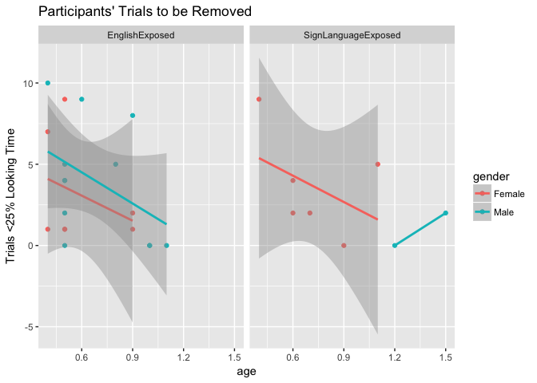
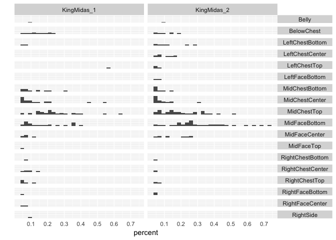
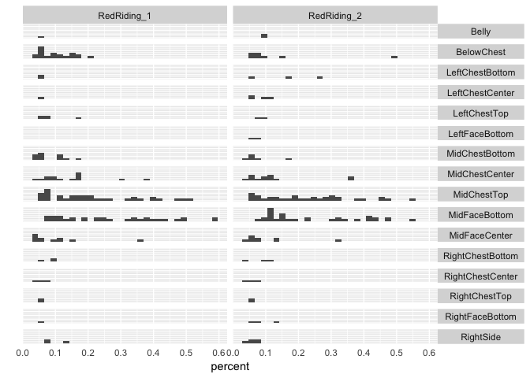
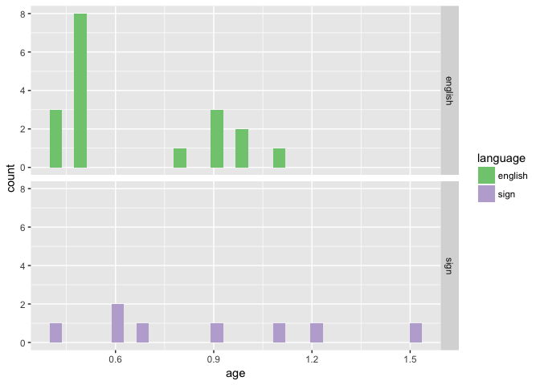

Baby Data Import and Cleanup (study2children)
================
Adam Stone, PhD
11-13-2017

-   [Introduction](#introduction)
-   [Checking for Outliers](#checking-for-outliers)
-   [Save!](#save)
-   [Participant Table](#participant-table)

Introduction
============

Let's repeat [01importclean](01importclean.nb.html) but this time, select ONLY babies. YES!

First, get rid of all older than 2 years old. Then we're going to remove specific babies for various reasons, here's a list of who we removed.

``` r
# Libraries
library(tidyverse)
library(feather)
library(stringr)
library(RColorBrewer)
#library(cowplot)

# Import data (and fix one participant name)
data <- read_feather("childrawdata.feather") %>%
  mutate(participant = case_when(
    participant == "Ab07ov09_22m" ~ "Ab07ov09_32m",
    TRUE ~ participant
  ))

# Get ages
ages <- read_csv("childrenages.csv")
data <- data %>% left_join(ages, by = "participant")
#data %>% select(participant,language,age) %>% distinct() # print data table

# # Histogram of ages
# data %>% select(participant,language,age) %>% 
#   distinct() %>% 
#   ggplot(aes(x = age)) + geom_histogram(fill = "royalblue") + ggtitle("Ages in Full Dataset")

alldata <- data
data <- data %>%
  filter(age < 2.0) %>%
  filter(participant != "AsherCalibOnly") %>%
  filter(participant != "do09ne07_6m_4d") %>%
  filter(participant != "Em12ad10_14m_24d") %>%
  filter(participant != "ka11es12_7m_MomTerp") %>%
  filter(participant != "boy 6 m SHIFTED") %>%
  filter(participant != "Sara8monthsDeafCODA") %>%
  filter(participant != "za05da21_6m_15days_Squirmy")

anti_join(alldata, data, by = "participant") %>% 
  select(participant, recording, analysis, language, group, age) %>% 
  distinct() %>%
  filter(age < 2.0)
```

    ## # A tibble: 7 x 6
    ##                  participant                              recording
    ##                        <chr>                                  <chr>
    ## 1             AsherCalibOnly                      Asher_GREAT_Calib
    ## 2             do09ne07_6m_4d               do09ne07 6m4d POOR CALIB
    ## 3           Em12ad10_14m_24d                      em 15m POOR CALIB
    ## 4        ka11es12_7m_MomTerp      ka11es12 7m lot of movement fussy
    ## 5            boy 6 m SHIFTED            Rec 02 shiftupward DONT USE
    ## 6        Sara8monthsDeafCODA Sara 8m CODA Dont Use Tired GOOD calib
    ## 7 za05da21_6m_15days_Squirmy    za05da12 6m15d GoodCalibVERYSquirmy
    ## # ... with 4 more variables: analysis <chr>, language <chr>, group <int>,
    ## #   age <dbl>

Next, we want to get a general idea of how many trials each baby saw. The trials column will tell us which babies saw *less* than 16 trials. Okay, just 3 kids and all saw at least half the study. All good.

``` r
data %>% group_by(participant) %>% summarise(trials = max(trial)) %>% filter(trials < 16)
```

    ## # A tibble: 4 x 2
    ##           participant trials
    ##                 <chr>  <dbl>
    ## 1 GemmaF_11_4_13_CODA     15
    ## 2     Gianna_CODA_18m     15
    ## 3      vi11hi18_1027d     13
    ## 4            wyatt 7m     10

Now, we need to remove trials where looking data was collected &lt;25% of the video length. I'm importing a table of clip lengths, see below. The videos were shown at 25 FPS so frames / 25 = seconds.

``` r
cliplength <- read_csv("cliplengths.csv") %>%
  rename(clip_sec = seconds) %>%
  separate(story, into = c("video", "clipnum")) %>%
  filter(clipnum < 3) %>%
  unite(video, clipnum, col = "story", sep = "_")

trialcheck <- data %>%
  group_by(participant, condition, trial) %>%
  summarise(hits = sum(hits)) %>%
  mutate(secs = hits/120) %>%
  separate(condition, into = c("story", "clipnum", "direction", "media"), sep = "_") %>%
  unite(story, clipnum, col = "story", sep = "_") %>%
  left_join(cliplength, by = "story") %>%
  mutate(percent = secs / clip_sec) %>%
  mutate(lessthan25 = percent <= 0.25)

# Histogram of trial total percentages
ggplot(trialcheck, aes(x = percent)) + 
  geom_histogram(binwidth = 0.025) + ggtitle("Total Percent Looking Time, All Trials") + xlab("total percent") +
  geom_vline(xintercept = 0.25, linetype = "dashed", color = "red") + 
  annotate("text", x = 0.125, y = 20, label = "trials to remove", color = "red")
```


``` r
# Values to put in commentary
numtotakeout = sum(trialcheck$lessthan25)
numtotaltrials = dim(trialcheck)[1]
percenttakeout = paste(numtotakeout/numtotaltrials * 100, "%", sep = "")
```

We removed 98 trials out of 437 (22.4256292906178%). Was there any correlation with the number of trials removed by age, language, or gender? Scatterplot below - looks fine. (Took out one CODA girl that has nearly all trials removed, was skewing the data).

``` r
# Grab age/group data we need for scatterplot
agegroup <- data %>%
  select(participant, age, language, gender) %>%
  distinct()

# Join age/group data with trialcheck data (actually trialcheck2, just for plotting)
trialcheck2 <- trialcheck %>%
  group_by(participant) %>%
  summarize(trialsremoved = sum(lessthan25)) %>%
  left_join(agegroup, by = "participant") 

# Scatterplot of bad trials grouped by age, language, gender
ggplot(trialcheck2, aes(x = age, y = trialsremoved, color = gender)) + geom_point() + 
  facet_wrap("language") + geom_smooth(method = "lm") + 
  ggtitle("Participants' Trials to be Removed") + ylab("Trials <25% Looking Time")
```

    ## Warning in qt((1 - level)/2, df): NaNs produced



Now take out bad trials - and let's check how many good trials each baby has.

``` r
# Select only bad trials to use in an anti_join
trialcheck <- trialcheck %>%
  filter(lessthan25 == TRUE) %>% 
  select(participant, trial)

# Now remove all bad trials.
data <- data %>%
  anti_join(trialcheck, by = c("participant","trial"))

# Table of trials per baby
data %>% select(participant, language, trial) %>% distinct() %>% group_by(language, participant) %>% summarise(trials = n()) %>% arrange(trials)
```

    ## # A tibble: 28 x 3
    ## # Groups:   language [2]
    ##               language         participant trials
    ##                  <chr>               <chr>  <int>
    ##  1      EnglishExposed            wyatt 7m      1
    ##  2      EnglishExposed       Li11hy29_5m_M      6
    ##  3      EnglishExposed     lo08jo20_6m_14d      7
    ##  4 SignLanguageExposed         Brooke CODA      7
    ##  5      EnglishExposed    WY06WE01_10M_17D      8
    ##  6      EnglishExposed     AB11Mi20_5M_10D      9
    ##  7 SignLanguageExposed GemmaF_11_4_13_CODA     10
    ##  8      EnglishExposed   DY10PE27_6m_11d_m     11
    ##  9      EnglishExposed        ma01wa22_10m     11
    ## 10      EnglishExposed    pa09ha06_9m_6d_m     11
    ## # ... with 18 more rows

Based on that list, we'll take out Wyatt. (We may want to take out Li11hy29 and Brooke, but let's keep them in for now and see what happens.)

``` r
data <- data %>% filter(participant != "wyatt 7m")
```

Checking for Outliers
=====================

Now I'm going to make a histogram of each story and AOI, to check if there are any kids who may have had their eye gaze shifted incorrectly (or needs to be shifted). Because there are so many AOIs we'll show separate histograms for each fairy tale.

``` r
# Pull apart condition and AOI columns
data <- data %>%
  separate(condition, into = c("story", "clipnum", "direction", "media"), sep = "_") %>%
  unite(story, clipnum, col = "story", sep = "_") %>%
  select(-media) %>%
  separate(aoi, into = c("math", "label", "aoi", "hitlabel", "indicator"), sep = "_") %>%
  select(-math, -label, -hitlabel, -indicator)

# Remove numbers from end of AOI label 
data <- data %>%
  mutate(aoi = case_when(
    str_detect(aoi, "\\d") ~ str_sub(aoi, 0, -2),
    TRUE ~ aoi
  ))

# Now let's add cliplengths again, but this time to data, and calculate percentage looking times
data <- data %>%
  left_join(cliplength, by = "story") %>%
  select(-frames) %>%
  mutate(secs = hits/120,
         percent = secs/clip_sec)

# Histogram!
data_ci <- data %>% filter(str_detect(story, "Cinderella"), percent > 0.04)
data_km <- data %>% filter(str_detect(story, "KingMidas"), percent > 0.04)
data_3b <- data %>% filter(str_detect(story, "ThreeBears"), percent > 0.04)
data_rr <- data %>% filter(str_detect(story, "RedRiding"), percent > 0.04)

ggplot(data_ci, aes(x = percent)) + geom_histogram() + facet_grid(aoi ~ story) + theme(strip.text.y = element_text(angle = 0), axis.text.y = element_blank(), axis.ticks = element_blank()) + ylab("") +
  scale_x_continuous(breaks=seq(0, 1, .1))
```


``` r
ggplot(data_km, aes(x = percent)) + geom_histogram() + facet_grid(aoi ~ story) + theme(strip.text.y = element_text(angle = 0), axis.text.y = element_blank(), axis.ticks = element_blank()) + ylab("") +
  scale_x_continuous(breaks=seq(0, 1, .1))
```



``` r
ggplot(data_3b, aes(x = percent)) + geom_histogram() + facet_grid(aoi ~ story) + theme(strip.text.y = element_text(angle = 0), axis.text.y = element_blank(), axis.ticks = element_blank()) + ylab("") +
  scale_x_continuous(breaks=seq(0, 1, .1))
```


``` r
ggplot(data_rr, aes(x = percent)) + geom_histogram() + facet_grid(aoi ~ story) + theme(strip.text.y = element_text(angle = 0), axis.text.y = element_blank(), axis.ticks = element_blank()) + ylab("") +
  scale_x_continuous(breaks=seq(0, 1, .1))
```



Save!
=====

Great. Let's save this as \`cleanedchildeyedata.csv'.

``` r
# A bit more cleaning up
data <- data %>%
  mutate(direction = case_when(
    direction == "FW" ~ "forward",
    direction == "ER" ~ "reversed"
  )) %>%
  mutate(language = case_when(
    language == "SignLanguageExposed" ~ "sign",
    language == "EnglishExposed" ~ "english"
  )) %>%
  mutate(group = as.factor(group),
         gender = as.factor(gender),
         language = as.factor(language),
         story = as.factor(story),
         direction = as.factor(direction),
         aoi = as.factor(aoi))

# Save as csv and feather (feather preserves column types for R)
write_csv(data,"cleanedbabyeyedata.csv")
write_feather(data,"cleanedbabyeyedata.feather")
```

Participant Table
=================

Now we can present the following table about our participants.

``` r
participants <- data %>%
  select(participant, gender, language, age) %>%
  distinct()

participants_n <- participants %>%
  count(gender, language) %>%
  spread(gender, n)

participants_age <- participants %>%
  group_by(language) %>%
  summarise(age_m = round(mean(age), 1), 
            age_sd = round(sd(age), 1),
            age_min = range(age)[1],
            age_max = range(age)[2]) %>%
  mutate(age_range = paste(age_min, age_max, sep = " - ")) %>%
  select(-age_min, -age_max) %>%
  mutate(age_mean = paste(age_m, age_sd, sep = "±")) %>%
  select(-age_m, -age_sd) %>%
  select(language, age_mean, age_range)

left_join(participants_n, participants_age, by = "language")
```

    ## # A tibble: 2 x 5
    ##   language Female  Male age_mean age_range
    ##     <fctr>  <int> <int>    <chr>     <chr>
    ## 1  english      8    11  0.7±0.2 0.4 - 1.1
    ## 2     sign      6     2  0.9±0.4 0.4 - 1.5

``` r
data %>% select(participant, age, language) %>% distinct() %>% ggplot(aes(x = age, fill = language)) + geom_histogram() + facet_grid(language ~ .) + scale_fill_brewer(palette = "Accent")
```

    ## `stat_bin()` using `bins = 30`. Pick better value with `binwidth`.


