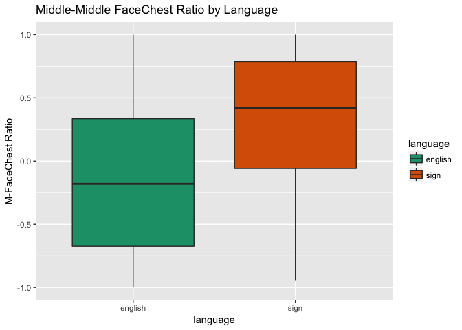
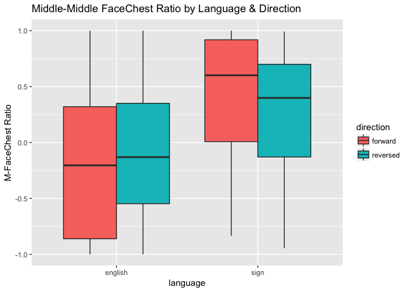

Baby Basic Eye Gaze (study2children)
================
Adam Stone, PhD
10-30-2017

-   [Starting Out](#starting-out)
-   [Statistical Testing of FCR/mFCR](#statistical-testing-of-fcrmfcr)
    -   [Language, Direction, & Age Predictors](#language-direction-age-predictors)
    -   [Language & Age Predictors](#language-age-predictors)
    -   [Direction & Language Predictors](#direction-language-predictors)
    -   [Language as only predictor](#language-as-only-predictor)

Starting Out
============

We've cleaned up the data in [03importcleanbabies](03importcleanbabies.nb.html). So we're importing it here. Let's get a chart of how old our babies are.

``` r
# Libraries
library(tidyverse)
```

    ## Loading tidyverse: ggplot2
    ## Loading tidyverse: tibble
    ## Loading tidyverse: tidyr
    ## Loading tidyverse: readr
    ## Loading tidyverse: purrr
    ## Loading tidyverse: dplyr

    ## Conflicts with tidy packages ----------------------------------------------

    ## filter(): dplyr, stats
    ## lag():    dplyr, stats

``` r
library(feather)
library(scales)
```

    ## 
    ## Attaching package: 'scales'

    ## The following object is masked from 'package:purrr':
    ## 
    ##     discard

    ## The following object is masked from 'package:readr':
    ## 
    ##     col_factor

``` r
library(stringr)
library(viridis)
```

    ## Loading required package: viridisLite

    ## 
    ## Attaching package: 'viridis'

    ## The following object is masked from 'package:scales':
    ## 
    ##     viridis_pal

``` r
library(lme4)
```

    ## Loading required package: Matrix

    ## 
    ## Attaching package: 'Matrix'

    ## The following object is masked from 'package:tidyr':
    ## 
    ##     expand

``` r
library(lmerTest)
```

    ## 
    ## Attaching package: 'lmerTest'

    ## The following object is masked from 'package:lme4':
    ## 
    ##     lmer

    ## The following object is masked from 'package:stats':
    ## 
    ##     step

``` r
library(RColorBrewer)
#library(cowplot)

# Import data that's been cleaned up from 01importclean
data <- read_feather("cleanedbabyeyedata.feather")

data_ages <- data %>%
  select(participant, language, age, group) %>%
  distinct()

ggplot(data_ages, aes(x = age, fill = language)) + geom_histogram() + facet_grid(language ~ group) + scale_fill_brewer(palette = "Accent")
```

    ## `stat_bin()` using `bins = 30`. Pick better value with `binwidth`.


Next, let's do boxplots of each AOI across all stories and kids, grouping for forward vs. reversed.

``` r
# Boxplot!
ggplot(data, aes(x = aoi, y = percent, fill = direction)) + 
  geom_boxplot() + theme(axis.text.x = element_text(angle=45, hjust = 1)) +
  ggtitle("Looking Percentages for Each AOI, All Stories") +
  scale_y_continuous(labels = scales::percent, limits = c(0,1))
```


Looks like by far most of the activity is along the Mid\*\* AOIs. Let's look closer.

``` r
data_mid <- data %>%
  filter(str_detect(aoi,"Mid"))

ggplot(data_mid, aes(x = aoi, y = percent, fill = direction)) + 
  geom_boxplot() + theme(axis.text.x = element_text(angle=45, hjust = 1)) +
  ggtitle("Looking Percentages for Middle AOIs, All Stories") +
  scale_y_continuous(labels = scales::percent, limits = c(0,1))
```


As a preliminary analysis I'm going to just look at MidChestTop and MidFaceBottom. Are there differences based on direction, group, or age for either AOI?

``` r
data_mid %>% 
  filter(aoi == "MidChestTop" | aoi == "MidFaceBottom") %>%
  ggplot(aes(x = age, y = percent, color = direction)) + geom_point(alpha = 0.25) +
  geom_smooth(method = "lm") + facet_grid(language ~ aoi) +
  scale_y_continuous(labels = scales::percent, limits = c(0,1)) +
  ggtitle("Top 2 AOIs")
```


I am not observing big differences for direction. And not strong patterns across age, although there are subtle upward trends for increased chest looking in NSE kids as they get older, but increased face looking in CODAS as they get older.

What if we defined a Face-Chest Ratio (FCR) such that:

1.  MidFaceTop, MidFaceCenter, MidFaceBottom = Face
2.  MidChestTop, MidChestCenter, MidChestBottom = Chest
3.  FCR = face - chest / face + chest

Let's try that. Let's also try only MidFaceBottom vs. MidChestTop too, and call that MFCR (for middle of middle).

CHart belows suggests group differences and that CODA babies have a trend to more face-looking while NSE babies don't.

``` r
data_mid <- data_mid %>%
  select(-secs, -hits) %>%
  spread(aoi,percent) %>%
  group_by(participant, trial) %>%
  mutate(face = sum(MidFaceTop, MidFaceCenter, MidFaceBottom, na.rm = TRUE),
         chest = sum(MidChestTop, MidChestCenter, MidChestBottom, na.rm = TRUE),
         fcr = (face - chest) / (face + chest),
         mfcr = (MidFaceBottom - MidChestTop) / (MidFaceBottom + MidChestTop))

ggplot(data_mid, aes(x = age, y = fcr, color = direction)) + geom_point(alpha = 0.25) +
  geom_smooth(method = "lm") + facet_wrap("language") + ggtitle("FaceChest Ratio")
```

    ## Warning: Removed 1 rows containing non-finite values (stat_smooth).

    ## Warning: Removed 1 rows containing missing values (geom_point).


Let's also check out MFCR (a stricter ratio). Almost the same thing.

``` r
ggplot(data_mid, aes(x = age, y = mfcr, color = direction)) + geom_point(alpha = 0.25) +
  geom_smooth(method = "lm") + facet_wrap("language") + ggtitle("Middle-Middle FaceChest Ratio")
```

    ## Warning: Removed 5 rows containing non-finite values (stat_smooth).

    ## Warning: Removed 5 rows containing missing values (geom_point).


So this is rad! Such obvious group differences should also be reflected in a heat map that is collapsed across age and direction. And the heat map below shows that CODAs really focus on the MidFaceBottom AOI, while English-exposed children are a bit more spread out, looking much more at the chest.

``` r
data_mid_heat <- data_mid %>%
  ungroup() %>%
  select(-face, -chest, -fcr, -mfcr) %>%
  gather(aoi, percent, MidChestBottom:MidFaceTop) %>%
  group_by(language, participant, direction, aoi) %>%
  summarise(percent = mean(percent, na.rm = TRUE)) %>%
  group_by(language, direction, aoi) %>%
  summarise(percent = mean(percent, na.rm = TRUE)) %>%
  group_by(language, aoi) %>%
  summarise(percent = mean(percent, na.rm = TRUE)) %>%
  mutate(aoi = factor(aoi, levels = c("MidChestBottom", "MidChestCenter", "MidChestTop",
                                      "MidFaceBottom", "MidFaceCenter", "MidFaceTop")))

ggplot(data_mid_heat, aes(x = language, y = aoi)) +
  geom_tile(aes(fill=percent),color="lightgray",na.rm=TRUE) + 
  scale_fill_viridis(option = "viridis", direction=-1, limits = c(0,1)) +
  theme(axis.text.x=element_text(angle=45,hjust=1)) +
  ylab("") + xlab("") + ggtitle("Eye Gaze Heat Map")
```


Statistical Testing of FCR/mFCR
===============================

Now that we've found something interesting with FCR and mFCR, let's see if it holds up in stats modeling.

Language, Direction, & Age Predictors
-------------------------------------

First, a LMM with predictors Language, Direction, and Age, and outcome variable FCR. Nothing significant.

``` r
fcr_lmm <- lmer(fcr ~ age * language * direction + (1|story) + (1|participant), data = data_mid)
summary(fcr_lmm)
```

    ## Linear mixed model fit by REML t-tests use Satterthwaite approximations
    ##   to degrees of freedom [lmerMod]
    ## Formula: 
    ## fcr ~ age * language * direction + (1 | story) + (1 | participant)
    ##    Data: data_mid
    ## 
    ## REML criterion at convergence: 365.9
    ## 
    ## Scaled residuals: 
    ##      Min       1Q   Median       3Q      Max 
    ## -2.61494 -0.63288  0.00868  0.62137  2.70917 
    ## 
    ## Random effects:
    ##  Groups      Name        Variance Std.Dev.
    ##  participant (Intercept) 0.264049 0.51386 
    ##  story       (Intercept) 0.007888 0.08881 
    ##  Residual                0.135838 0.36856 
    ## Number of obs: 321, groups:  participant, 26; story, 8
    ## 
    ## Fixed effects:
    ##                                     Estimate Std. Error        df t value
    ## (Intercept)                          0.08077    0.37018  23.88000   0.218
    ## age                                 -0.45383    0.52303  23.31000  -0.868
    ## languagesign                        -0.27400    0.63970  23.97000  -0.428
    ## directionreversed                   -0.01239    0.14493 285.88000  -0.085
    ## age:languagesign                     1.03038    0.75876  23.53000   1.358
    ## age:directionreversed                0.17949    0.20047 286.13000   0.895
    ## languagesign:directionreversed      -0.15373    0.26293 285.34000  -0.585
    ## age:languagesign:directionreversed  -0.18464    0.30073 285.51000  -0.614
    ##                                    Pr(>|t|)
    ## (Intercept)                           0.829
    ## age                                   0.394
    ## languagesign                          0.672
    ## directionreversed                     0.932
    ## age:languagesign                      0.187
    ## age:directionreversed                 0.371
    ## languagesign:directionreversed        0.559
    ## age:languagesign:directionreversed    0.540
    ## 
    ## Correlation of Fixed Effects:
    ##             (Intr) age    lnggsg drctnr ag:lng ag:drc lnggs:
    ## age         -0.940                                          
    ## languagesgn -0.575  0.544                                   
    ## dirctnrvrsd -0.195  0.180  0.113                            
    ## age:lnggsgn  0.648 -0.689 -0.920 -0.124                     
    ## ag:drctnrvr  0.184 -0.190 -0.107 -0.943  0.131              
    ## lnggsgn:drc  0.108 -0.099 -0.203 -0.552  0.180  0.522       
    ## ag:lnggsgn: -0.122  0.127  0.187  0.629 -0.193 -0.668 -0.926

Let's repeat the LMM with outcome mFCR. Same thing, although the t values are slightly better.

``` r
mfcr_lmm <- lmer(mfcr ~ age * language * direction + (1|story) + (1|participant), data = data_mid)
summary(mfcr_lmm)
```

    ## Linear mixed model fit by REML t-tests use Satterthwaite approximations
    ##   to degrees of freedom [lmerMod]
    ## Formula: 
    ## mfcr ~ age * language * direction + (1 | story) + (1 | participant)
    ##    Data: data_mid
    ## 
    ## REML criterion at convergence: 431.8
    ## 
    ## Scaled residuals: 
    ##      Min       1Q   Median       3Q      Max 
    ## -3.11287 -0.58570  0.04336  0.61866  2.57921 
    ## 
    ## Random effects:
    ##  Groups      Name        Variance Std.Dev.
    ##  participant (Intercept) 0.228368 0.47788 
    ##  story       (Intercept) 0.005924 0.07697 
    ##  Residual                0.176262 0.41984 
    ## Number of obs: 317, groups:  participant, 26; story, 8
    ## 
    ## Fixed effects:
    ##                                      Estimate Std. Error         df
    ## (Intercept)                          0.171463   0.351816  24.740000
    ## age                                 -0.492422   0.496327  24.010000
    ## languagesign                        -0.313203   0.608389  24.900000
    ## directionreversed                    0.005929   0.167733 282.200000
    ## age:languagesign                     1.062499   0.720129  24.250000
    ## age:directionreversed                0.156811   0.230585 282.490000
    ## languagesign:directionreversed      -0.163784   0.300833 281.530000
    ## age:languagesign:directionreversed  -0.172806   0.343924 281.710000
    ##                                    t value Pr(>|t|)
    ## (Intercept)                          0.487    0.630
    ## age                                 -0.992    0.331
    ## languagesign                        -0.515    0.611
    ## directionreversed                    0.035    0.972
    ## age:languagesign                     1.475    0.153
    ## age:directionreversed                0.680    0.497
    ## languagesign:directionreversed      -0.544    0.587
    ## age:languagesign:directionreversed  -0.502    0.616
    ## 
    ## Correlation of Fixed Effects:
    ##             (Intr) age    lnggsg drctnr ag:lng ag:drc lnggs:
    ## age         -0.940                                          
    ## languagesgn -0.575  0.544                                   
    ## dirctnrvrsd -0.242  0.222  0.140                            
    ## age:lnggsgn  0.648 -0.689 -0.921 -0.153                     
    ## ag:drctnrvr  0.228 -0.233 -0.132 -0.944  0.161              
    ## lnggsgn:drc  0.135 -0.124 -0.246 -0.558  0.219  0.528       
    ## ag:lnggsgn: -0.153  0.157  0.226  0.633 -0.234 -0.671 -0.926

What if we did ANCOVAs (C because age would be a covariate). First, FCR as outcome.

Language & Age Predictors
-------------------------

Let's take out direction. The FCR LMM tells us same thing, nothing.

``` r
fcr_lmm_nodir <- lmer(fcr ~ age * language + (1|story) + (1|participant) + (1|direction), data = data_mid)
summary(fcr_lmm_nodir)
```

    ## Linear mixed model fit by REML t-tests use Satterthwaite approximations
    ##   to degrees of freedom [lmerMod]
    ## Formula: fcr ~ age * language + (1 | story) + (1 | participant) + (1 |  
    ##     direction)
    ##    Data: data_mid
    ## 
    ## REML criterion at convergence: 366.4
    ## 
    ## Scaled residuals: 
    ##      Min       1Q   Median       3Q      Max 
    ## -2.54550 -0.61154  0.03568  0.57066  2.76525 
    ## 
    ## Random effects:
    ##  Groups      Name        Variance Std.Dev.
    ##  participant (Intercept) 0.265161 0.51494 
    ##  story       (Intercept) 0.007821 0.08843 
    ##  direction   (Intercept) 0.000000 0.00000 
    ##  Residual                0.138878 0.37266 
    ## Number of obs: 321, groups:  participant, 26; story, 8; direction, 2
    ## 
    ## Fixed effects:
    ##                  Estimate Std. Error       df t value Pr(>|t|)
    ## (Intercept)       0.07507    0.36397 22.10000   0.206    0.838
    ## age              -0.36618    0.51477 21.65300  -0.711    0.484
    ## languagesign     -0.35468    0.62796 22.03700  -0.565    0.578
    ## age:languagesign  0.94809    0.74632 21.81100   1.270    0.217
    ## 
    ## Correlation of Fixed Effects:
    ##             (Intr) age    lnggsg
    ## age         -0.939              
    ## languagesgn -0.575  0.544       
    ## age:lnggsgn  0.648 -0.690 -0.920

And the mFCR, nothing either.

``` r
mfcr_lmm_nodir <- lmer(mfcr ~ age * language + (1|story) + (1|participant) + (1|direction), data = data_mid)
summary(mfcr_lmm_nodir)
```

    ## Linear mixed model fit by REML t-tests use Satterthwaite approximations
    ##   to degrees of freedom [lmerMod]
    ## Formula: mfcr ~ age * language + (1 | story) + (1 | participant) + (1 |  
    ##     direction)
    ##    Data: data_mid
    ## 
    ## REML criterion at convergence: 431.1
    ## 
    ## Scaled residuals: 
    ##      Min       1Q   Median       3Q      Max 
    ## -2.94411 -0.59546  0.01194  0.60875  2.37024 
    ## 
    ## Random effects:
    ##  Groups      Name        Variance Std.Dev.
    ##  participant (Intercept) 0.228666 0.47819 
    ##  story       (Intercept) 0.005818 0.07628 
    ##  direction   (Intercept) 0.000000 0.00000 
    ##  Residual                0.178881 0.42294 
    ## Number of obs: 317, groups:  participant, 26; story, 8; direction, 2
    ## 
    ## Fixed effects:
    ##                  Estimate Std. Error      df t value Pr(>|t|)
    ## (Intercept)        0.1762     0.3417 21.9350   0.516    0.611
    ## age               -0.4176     0.4831 21.4660  -0.864    0.397
    ## languagesign      -0.4003     0.5904 21.9930  -0.678    0.505
    ## age:languagesign   0.9879     0.7008 21.6700   1.410    0.173
    ## 
    ## Correlation of Fixed Effects:
    ##             (Intr) age    lnggsg
    ## age         -0.940              
    ## languagesgn -0.575  0.544       
    ## age:lnggsgn  0.648 -0.689 -0.920

Direction & Language Predictors
-------------------------------

In the LMMs we've run so far, age is always the worst predictor. So we should have taken that out first, anyway.

Alright, we got an effect of language (p = 0.07) AND an interaction with direction, p = 0.008. CODA babies generally have much higher FCR, but they're also strongly affected by reversal.

``` r
fcr_lmm_noage <- lmer(fcr ~ direction * language + (1|story) + (1|participant), data = data_mid)
summary(fcr_lmm_noage)
```

    ## Linear mixed model fit by REML t-tests use Satterthwaite approximations
    ##   to degrees of freedom [lmerMod]
    ## Formula: fcr ~ direction * language + (1 | story) + (1 | participant)
    ##    Data: data_mid
    ## 
    ## REML criterion at convergence: 366.9
    ## 
    ## Scaled residuals: 
    ##      Min       1Q   Median       3Q      Max 
    ## -2.64278 -0.65096  0.01931  0.60551  2.69211 
    ## 
    ## Random effects:
    ##  Groups      Name        Variance Std.Dev.
    ##  participant (Intercept) 0.258979 0.5089  
    ##  story       (Intercept) 0.008046 0.0897  
    ##  Residual                0.135267 0.3678  
    ## Number of obs: 321, groups:  participant, 26; story, 8
    ## 
    ## Fixed effects:
    ##                                 Estimate Std. Error        df t value
    ## (Intercept)                     -0.22253    0.12578  28.07000  -1.769
    ## directionreversed                0.11004    0.04809 286.17000   2.288
    ## languagesign                     0.53379    0.23459  25.42000   2.275
    ## directionreversed:languagesign  -0.28166    0.09338 286.09000  -3.016
    ##                                Pr(>|t|)   
    ## (Intercept)                     0.08774 . 
    ## directionreversed               0.02286 * 
    ## languagesign                    0.03156 * 
    ## directionreversed:languagesign  0.00279 **
    ## ---
    ## Signif. codes:  0 '***' 0.001 '**' 0.01 '*' 0.05 '.' 0.1 ' ' 1
    ## 
    ## Correlation of Fixed Effects:
    ##             (Intr) drctnr lnggsg
    ## dirctnrvrsd -0.188              
    ## languagesgn -0.502  0.101       
    ## drctnrvrsd:  0.097 -0.513 -0.193

The mFCR LMM gives us similar results.

``` r
mfcr_lmm_noage <- lmer(mfcr ~ direction * language + (1|story) + (1|participant), data = data_mid)
summary(mfcr_lmm_noage)
```

    ## Linear mixed model fit by REML t-tests use Satterthwaite approximations
    ##   to degrees of freedom [lmerMod]
    ## Formula: mfcr ~ direction * language + (1 | story) + (1 | participant)
    ##    Data: data_mid
    ## 
    ## REML criterion at convergence: 433.1
    ## 
    ## Scaled residuals: 
    ##      Min       1Q   Median       3Q      Max 
    ## -3.10653 -0.57291  0.04485  0.63100  2.51725 
    ## 
    ## Random effects:
    ##  Groups      Name        Variance Std.Dev.
    ##  participant (Intercept) 0.226977 0.47642 
    ##  story       (Intercept) 0.006088 0.07802 
    ##  Residual                0.175313 0.41870 
    ## Number of obs: 317, groups:  participant, 26; story, 8
    ## 
    ## Fixed effects:
    ##                                 Estimate Std. Error        df t value
    ## (Intercept)                     -0.15812    0.11949  28.12000  -1.323
    ## directionreversed                0.11379    0.05525 282.22000   2.059
    ## languagesign                     0.51618    0.22384  26.00000   2.306
    ## directionreversed:languagesign  -0.28723    0.10656 281.96000  -2.695
    ##                                Pr(>|t|)   
    ## (Intercept)                     0.19642   
    ## directionreversed               0.04038 * 
    ## languagesign                    0.02934 * 
    ## directionreversed:languagesign  0.00745 **
    ## ---
    ## Signif. codes:  0 '***' 0.001 '**' 0.01 '*' 0.05 '.' 0.1 ' ' 1
    ## 
    ## Correlation of Fixed Effects:
    ##             (Intr) drctnr lnggsg
    ## dirctnrvrsd -0.230              
    ## languagesgn -0.505  0.122       
    ## drctnrvrsd:  0.119 -0.517 -0.231

Language as only predictor
--------------------------

Same thing here. So it's not age or direction, but language, that has the effect. And that's good! I want to look at forward v. reversed separately next.

``` r
fcr_lmm_langonly <- lmer(fcr ~  language + (1|story) + (1|participant) + (1|direction), data = data_mid)
summary(fcr_lmm_langonly)
```

    ## Linear mixed model fit by REML t-tests use Satterthwaite approximations
    ##   to degrees of freedom [lmerMod]
    ## Formula: 
    ## fcr ~ language + (1 | story) + (1 | participant) + (1 | direction)
    ##    Data: data_mid
    ## 
    ## REML criterion at convergence: 369.2
    ## 
    ## Scaled residuals: 
    ##      Min       1Q   Median       3Q      Max 
    ## -2.53990 -0.62217  0.04344  0.57250  2.77627 
    ## 
    ## Random effects:
    ##  Groups      Name        Variance Std.Dev.
    ##  participant (Intercept) 0.259969 0.50987 
    ##  story       (Intercept) 0.007863 0.08867 
    ##  direction   (Intercept) 0.000000 0.00000 
    ##  Residual                0.138920 0.37272 
    ## Number of obs: 321, groups:  participant, 26; story, 8; direction, 2
    ## 
    ## Fixed effects:
    ##              Estimate Std. Error      df t value Pr(>|t|)  
    ## (Intercept)   -0.1682     0.1237 26.0250  -1.360   0.1856  
    ## languagesign   0.3974     0.2308 23.5660   1.722   0.0981 .
    ## ---
    ## Signif. codes:  0 '***' 0.001 '**' 0.01 '*' 0.05 '.' 0.1 ' ' 1
    ## 
    ## Correlation of Fixed Effects:
    ##             (Intr)
    ## languagesgn -0.502

Forward only. Language effect, p = 0.05.

``` r
fcr_lmm_langonly_f <- lmer(fcr ~  language + (1|story) + (1|participant), data = filter(data_mid,direction=="forward"))
summary(fcr_lmm_langonly_f)
```

    ## Linear mixed model fit by REML t-tests use Satterthwaite approximations
    ##   to degrees of freedom [lmerMod]
    ## Formula: fcr ~ language + (1 | story) + (1 | participant)
    ##    Data: filter(data_mid, direction == "forward")
    ## 
    ## REML criterion at convergence: 191
    ## 
    ## Scaled residuals: 
    ##      Min       1Q   Median       3Q      Max 
    ## -2.73928 -0.47724  0.06556  0.52480  2.04068 
    ## 
    ## Random effects:
    ##  Groups      Name        Variance Std.Dev.
    ##  participant (Intercept) 0.26666  0.5164  
    ##  story       (Intercept) 0.02712  0.1647  
    ##  Residual                0.11283  0.3359  
    ## Number of obs: 164, groups:  participant, 26; story, 8
    ## 
    ## Fixed effects:
    ##              Estimate Std. Error      df t value Pr(>|t|)  
    ## (Intercept)   -0.2393     0.1359 27.0920  -1.760   0.0896 .
    ## languagesign   0.5628     0.2367 22.5130   2.377   0.0263 *
    ## ---
    ## Signif. codes:  0 '***' 0.001 '**' 0.01 '*' 0.05 '.' 0.1 ' ' 1
    ## 
    ## Correlation of Fixed Effects:
    ##             (Intr)
    ## languagesgn -0.469

Reversed only. Weaker language effect, p = 0.0131.

``` r
fcr_lmm_langonly_r <- lmer(fcr ~  language + (1|story) + (1|participant), data = filter(data_mid,direction=="reversed"))
summary(fcr_lmm_langonly_r)
```

    ## Linear mixed model fit by REML t-tests use Satterthwaite approximations
    ##   to degrees of freedom [lmerMod]
    ## Formula: fcr ~ language + (1 | story) + (1 | participant)
    ##    Data: filter(data_mid, direction == "reversed")
    ## 
    ## REML criterion at convergence: 209
    ## 
    ## Scaled residuals: 
    ##     Min      1Q  Median      3Q     Max 
    ## -2.5163 -0.5394 -0.0433  0.5234  2.7001 
    ## 
    ## Random effects:
    ##  Groups      Name        Variance Std.Dev.
    ##  participant (Intercept) 0.22996  0.4795  
    ##  story       (Intercept) 0.01997  0.1413  
    ##  Residual                0.14085  0.3753  
    ## Number of obs: 157, groups:  participant, 26; story, 8
    ## 
    ## Fixed effects:
    ##              Estimate Std. Error      df t value Pr(>|t|)
    ## (Intercept)   -0.1084     0.1262 25.9680  -0.859    0.398
    ## languagesign   0.2504     0.2239 22.5850   1.119    0.275
    ## 
    ## Correlation of Fixed Effects:
    ##             (Intr)
    ## languagesgn -0.475

Let's go ahead and plot boxplots to represent LMMs with only language as an important effect. (We can add in direction too). FaceChest Ratio here.

``` r
ggplot(data_mid, aes(x = language, y = fcr, fill = language)) + geom_boxplot() + scale_fill_brewer(palette = "Dark2") + ylab("FaceChest Ratio") + ggtitle("FaceChest Ratio by Language")
```

    ## Warning: Removed 1 rows containing non-finite values (stat_boxplot).


``` r
ggplot(data_mid, aes(x = language, y = fcr, fill = direction)) + geom_boxplot() + ylab("FaceChest Ratio") + ggtitle("FaceChest Ratio by Language & Direction")
```

    ## Warning: Removed 1 rows containing non-finite values (stat_boxplot).


And Middle-Middle FaceChest Ratio here.

``` r
ggplot(data_mid, aes(x = language, y = mfcr, fill = language)) + geom_boxplot() + scale_fill_brewer(palette = "Dark2") + ylab("M-FaceChest Ratio") + ggtitle("Middle-Middle FaceChest Ratio by Language")
```

    ## Warning: Removed 5 rows containing non-finite values (stat_boxplot).



``` r
ggplot(data_mid, aes(x = language, y = mfcr, fill = direction)) + geom_boxplot() + ylab("M-FaceChest Ratio") + ggtitle("Middle-Middle FaceChest Ratio by Language & Direction")
```

    ## Warning: Removed 5 rows containing non-finite values (stat_boxplot).


