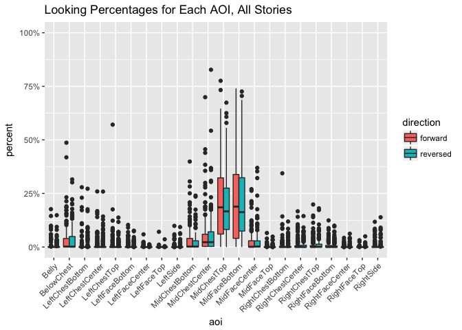
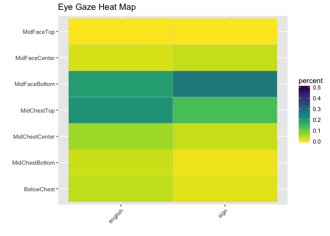

Baby Basic Eye Gaze (study2children)
================
Adam Stone, PhD
11-13-2017

-   [Starting Out](#starting-out)
-   [Heat Maps](#heat-maps)
-   [Statistical Testing of FCR/mFCR](#statistical-testing-of-fcrmfcr)
    -   [Language, Direction, & Age Predictors](#language-direction-age-predictors)
    -   [Direction & Language Predictors](#direction-language-predictors)
    -   [Language as only predictor](#language-as-only-predictor)

Starting Out
============

We've cleaned up the data in [03importcleanbabies](03importcleanbabies.nb.html). So we're importing it here. Let's get a chart of how old our babies are.

``` r
# Libraries
library(tidyverse)
```

    ## ── Attaching packages ────────────────────────────────────────────────────────────────────────── tidyverse 1.2.0 ──

    ## ✔ ggplot2 2.2.1     ✔ purrr   0.2.4
    ## ✔ tibble  1.3.4     ✔ dplyr   0.7.4
    ## ✔ tidyr   0.7.2     ✔ stringr 1.2.0
    ## ✔ readr   1.1.1     ✔ forcats 0.2.0

    ## ── Conflicts ───────────────────────────────────────────────────────────────────────────── tidyverse_conflicts() ──
    ## ✖ dplyr::filter() masks stats::filter()
    ## ✖ dplyr::lag()    masks stats::lag()

``` r
library(feather)
library(scales)
```

    ## 
    ## Attaching package: 'scales'

    ## The following object is masked from 'package:purrr':
    ## 
    ##     discard

    ## The following object is masked from 'package:readr':
    ## 
    ##     col_factor

``` r
library(stringr)
library(viridis)
```

    ## Loading required package: viridisLite

    ## 
    ## Attaching package: 'viridis'

    ## The following object is masked from 'package:scales':
    ## 
    ##     viridis_pal

``` r
library(lme4)
```

    ## Loading required package: Matrix

    ## 
    ## Attaching package: 'Matrix'

    ## The following object is masked from 'package:tidyr':
    ## 
    ##     expand

``` r
library(lmerTest)
```

    ## 
    ## Attaching package: 'lmerTest'

    ## The following object is masked from 'package:lme4':
    ## 
    ##     lmer

    ## The following object is masked from 'package:stats':
    ## 
    ##     step

``` r
library(RColorBrewer)
#library(cowplot)

# Import data that's been cleaned up from 01importclean
data <- read_feather("cleanedbabyeyedata.feather")

data_ages <- data %>%
  select(participant, language, age, group) %>%
  distinct()

ggplot(data_ages, aes(x = age, fill = language)) + geom_histogram() + facet_grid(language ~ group) + scale_fill_brewer(palette = "Accent")
```

    ## `stat_bin()` using `bins = 30`. Pick better value with `binwidth`.


Next, let's do boxplots of each AOI across all stories and kids, grouping for forward vs. reversed.

``` r
# Boxplot!
ggplot(data, aes(x = aoi, y = percent, fill = direction)) + 
  geom_boxplot() + theme(axis.text.x = element_text(angle=45, hjust = 1)) +
  ggtitle("Looking Percentages for Each AOI, All Stories") +
  scale_y_continuous(labels = scales::percent, limits = c(0,1))
```



Looks like by far most of the activity is along the Mid\*\* AOIs. Let's look closer.

``` r
data_mid <- data %>%
  filter(str_detect(aoi,"Mid") | aoi == "BelowChest")

ggplot(data_mid, aes(x = aoi, y = percent, fill = direction)) + 
  geom_boxplot() + theme(axis.text.x = element_text(angle=45, hjust = 1)) +
  ggtitle("Looking Percentages for Middle AOIs, All Stories") +
  scale_y_continuous(labels = scales::percent, limits = c(0,1))
```


As a preliminary analysis I'm going to just look at MidChestTop and MidFaceBottom. Are there differences based on direction, group, or age for either AOI?

``` r
data_mid %>% 
  filter(aoi == "MidChestTop" | aoi == "MidFaceBottom") %>%
  ggplot(aes(x = age, y = percent, color = direction)) + geom_point(alpha = 0.25) +
  geom_smooth(method = "lm") + facet_grid(language ~ aoi) +
  scale_y_continuous(labels = scales::percent, limits = c(0,1)) +
  ggtitle("Top 2 AOIs")
```


I am not observing big differences for direction. And not strong patterns across age, although there are subtle upward trends for increased chest looking in NSE kids as they get older, but increased face looking in CODAS as they get older.

What if we defined a Face-Chest Ratio (FCR) such that:

1.  MidFaceCenter, MidFaceBottom = Face
2.  MidChestTop, MidChestCenter, MidChestBottom, BelowChest = Chest
3.  FCR = face - chest / face + chest

Let's try that. Let's also try only MidFaceBottom vs. MidChestTop too, and call that MFCR (for middle of middle).

CHart belows suggests group differences and that CODA babies have a trend to more face-looking while NSE babies don't.

``` r
data_mid <- data_mid %>%
  select(-secs, -hits) %>%
  spread(aoi,percent) %>%
  group_by(participant, trial) %>%
  mutate(face = sum(MidFaceCenter, MidFaceBottom, na.rm = TRUE),
         chest = sum(MidChestTop, MidChestCenter, MidChestBottom, BelowChest, na.rm = TRUE),
         fcr = (face - chest) / (face + chest),
         mfcr = (MidFaceBottom - MidChestTop) / (MidFaceBottom + MidChestTop))

ggplot(data_mid, aes(x = age, y = fcr, color = direction)) + geom_point(alpha = 0.25) +
  geom_smooth(method = "lm") + facet_wrap("language") + ggtitle("FaceChest Ratio")
```


Let's also check out MFCR (a stricter ratio). Almost the same thing.

``` r
ggplot(data_mid, aes(x = age, y = mfcr, color = direction)) + geom_point(alpha = 0.25) +
  geom_smooth(method = "lm") + facet_wrap("language") + ggtitle("Middle-Middle FaceChest Ratio")
```

    ## Warning: Removed 5 rows containing non-finite values (stat_smooth).

    ## Warning: Removed 5 rows containing missing values (geom_point).


So this is rad! Such obvious group differences should also be reflected in a heat map that is collapsed across age and direction. And the heat map below shows that CODAs really focus on the MidFaceBottom AOI, while English-exposed children are a bit more spread out, looking much more at the chest.

Heat Maps
=========

``` r
data_mid_heat <- data_mid %>%
  ungroup() %>%
  select(-face, -chest, -fcr, -mfcr) %>%
  gather(aoi, percent, BelowChest:MidFaceTop) %>%
  group_by(language, participant, direction, aoi) %>%
  summarise(percent = mean(percent, na.rm = TRUE)) %>%
  group_by(language, direction, aoi) %>%
  summarise(percent = mean(percent, na.rm = TRUE)) %>%
  group_by(language, aoi) %>%
  summarise(percent = mean(percent, na.rm = TRUE)) %>%
  mutate(aoi = factor(aoi, levels = c("BelowChest", "MidChestBottom", "MidChestCenter", "MidChestTop",
                                      "MidFaceBottom", "MidFaceCenter", "MidFaceTop")))

ggplot(data_mid_heat, aes(x = language, y = aoi)) +
  geom_tile(aes(fill=percent),color="lightgray",na.rm=TRUE) + 
  scale_fill_viridis(option = "viridis", direction=-1, limits = c(0,.5)) +
  theme(axis.text.x=element_text(angle=45,hjust=1)) +
  ylab("") + xlab("") + ggtitle("Eye Gaze Heat Map")
```



``` r
data_mid_heat <- data_mid %>%
  ungroup() %>%
  select(-face, -chest, -fcr, -mfcr) %>%
  gather(aoi, percent, BelowChest:MidFaceTop) %>%
  group_by(language, participant, direction, aoi) %>%
  summarise(percent = mean(percent, na.rm = TRUE)) %>%
  group_by(language, direction, aoi) %>%
  summarise(percent = mean(percent, na.rm = TRUE)) %>%
  mutate(aoi = factor(aoi, levels = c("BelowChest", "MidChestBottom", "MidChestCenter", "MidChestTop",
                                      "MidFaceBottom", "MidFaceCenter", "MidFaceTop")))

ggplot(data_mid_heat, aes(x = language, y = aoi)) +
  geom_tile(aes(fill=percent),color="lightgray",na.rm=TRUE) + 
  scale_fill_viridis(option = "viridis", direction=-1, limits = c(0,.5)) +
  theme(axis.text.x=element_text(angle=45,hjust=1)) +
  ylab("") + xlab("") + ggtitle("Eye Gaze Heat Map by Direction") + facet_wrap("direction")
```


``` r
ggplot(data_mid_heat, aes(x = direction, y = aoi)) +
  geom_tile(aes(fill=percent),color="lightgray",na.rm=TRUE) + 
  scale_fill_viridis(option = "viridis", direction=-1, limits = c(0,.5)) +
  theme(axis.text.x=element_text(angle=45,hjust=1)) +
  ylab("") + xlab("") + ggtitle("Eye Gaze Heat Map by Group") + facet_wrap("language")
```


Statistical Testing of FCR/mFCR
===============================

Now that we've found something interesting with FCR and mFCR, let's see if it holds up in stats modeling.

Language, Direction, & Age Predictors
-------------------------------------

First, a LMM with predictors Language, Direction, and Age, and outcome variable FCR. Nothing significant.

``` r
fcr_lmm <- lmer(fcr ~ age * language * direction + (1|story) + (1|participant), data = data_mid)
summary(fcr_lmm)
```

    ## Linear mixed model fit by REML t-tests use Satterthwaite approximations
    ##   to degrees of freedom [lmerMod]
    ## Formula: 
    ## fcr ~ age * language * direction + (1 | story) + (1 | participant)
    ##    Data: data_mid
    ## 
    ## REML criterion at convergence: 372.9
    ## 
    ## Scaled residuals: 
    ##     Min      1Q  Median      3Q     Max 
    ## -2.5321 -0.6784  0.0350  0.6154  2.9711 
    ## 
    ## Random effects:
    ##  Groups      Name        Variance Std.Dev.
    ##  participant (Intercept) 0.267511 0.51721 
    ##  story       (Intercept) 0.009763 0.09881 
    ##  Residual                0.130164 0.36078 
    ## Number of obs: 338, groups:  participant, 27; story, 8
    ## 
    ## Fixed effects:
    ##                                      Estimate Std. Error         df
    ## (Intercept)                        -5.128e-04  3.721e-01  2.500e+01
    ## age                                -3.772e-01  5.254e-01  2.433e+01
    ## languagesign                       -3.538e-01  6.376e-01  2.469e+01
    ## directionreversed                   6.608e-03  1.419e-01  3.016e+02
    ## age:languagesign                    9.871e-01  7.609e-01  2.443e+01
    ## age:directionreversed               1.223e-01  1.963e-01  3.018e+02
    ## languagesign:directionreversed     -1.381e-01  2.525e-01  3.008e+02
    ## age:languagesign:directionreversed -1.369e-01  2.929e-01  3.015e+02
    ##                                    t value Pr(>|t|)
    ## (Intercept)                         -0.001    0.999
    ## age                                 -0.718    0.480
    ## languagesign                        -0.555    0.584
    ## directionreversed                    0.047    0.963
    ## age:languagesign                     1.297    0.207
    ## age:directionreversed                0.623    0.534
    ## languagesign:directionreversed      -0.547    0.585
    ## age:languagesign:directionreversed  -0.467    0.641
    ## 
    ## Correlation of Fixed Effects:
    ##             (Intr) age    lnggsg drctnr ag:lng ag:drc lnggs:
    ## age         -0.939                                          
    ## languagesgn -0.578  0.548                                   
    ## dirctnrvrsd -0.190  0.175  0.111                            
    ## age:lnggsgn  0.648 -0.691 -0.926 -0.122                     
    ## ag:drctnrvr  0.179 -0.185 -0.105 -0.943  0.129              
    ## lnggsgn:drc  0.107 -0.098 -0.189 -0.562  0.171  0.530       
    ## ag:lnggsgn: -0.120  0.124  0.176  0.633 -0.184 -0.672 -0.932

Let's repeat the LMM with outcome mFCR. Same thing, although the t values are slightly better.

``` r
mfcr_lmm <- lmer(mfcr ~ age * language * direction + (1|story) + (1|participant), data = data_mid)
summary(mfcr_lmm)
```

    ## Linear mixed model fit by REML t-tests use Satterthwaite approximations
    ##   to degrees of freedom [lmerMod]
    ## Formula: 
    ## mfcr ~ age * language * direction + (1 | story) + (1 | participant)
    ##    Data: data_mid
    ## 
    ## REML criterion at convergence: 460.1
    ## 
    ## Scaled residuals: 
    ##     Min      1Q  Median      3Q     Max 
    ## -3.9885 -0.5905  0.0732  0.6389  2.4805 
    ## 
    ## Random effects:
    ##  Groups      Name        Variance Std.Dev.
    ##  participant (Intercept) 0.226250 0.47566 
    ##  story       (Intercept) 0.008297 0.09109 
    ##  Residual                0.179761 0.42398 
    ## Number of obs: 333, groups:  participant, 27; story, 8
    ## 
    ## Fixed effects:
    ##                                     Estimate Std. Error        df t value
    ## (Intercept)                          0.16081    0.35124  26.15000   0.458
    ## age                                 -0.46613    0.49485  25.24000  -0.942
    ## languagesign                        -0.36576    0.60371  26.13000  -0.606
    ## directionreversed                    0.02309    0.16944 296.95000   0.136
    ## age:languagesign                     1.02519    0.71792  25.51000   1.428
    ## age:directionreversed                0.12510    0.23294 297.16000   0.537
    ## languagesign:directionreversed      -0.17973    0.30089 295.59000  -0.597
    ## age:languagesign:directionreversed  -0.13717    0.34735 296.43000  -0.395
    ##                                    Pr(>|t|)
    ## (Intercept)                           0.651
    ## age                                   0.355
    ## languagesign                          0.550
    ## directionreversed                     0.892
    ## age:languagesign                      0.165
    ## age:directionreversed                 0.592
    ## languagesign:directionreversed        0.551
    ## age:languagesign:directionreversed    0.693
    ## 
    ## Correlation of Fixed Effects:
    ##             (Intr) age    lnggsg drctnr ag:lng ag:drc lnggs:
    ## age         -0.939                                          
    ## languagesgn -0.577  0.546                                   
    ## dirctnrvrsd -0.245  0.225  0.142                            
    ## age:lnggsgn  0.647 -0.689 -0.927 -0.155                     
    ## ag:drctnrvr  0.230 -0.237 -0.134 -0.944  0.163              
    ## lnggsgn:drc  0.137 -0.126 -0.247 -0.562  0.223  0.531       
    ## ag:lnggsgn: -0.154  0.159  0.230  0.633 -0.237 -0.671 -0.933

What if we did ANCOVAs (C because age would be a covariate). First, FCR as outcome.

Direction & Language Predictors
-------------------------------

In the LMMs we've run so far, age is always the worst predictor. So we should have taken that out first, anyway.

Alright, we got an effect of language (p = 0.07) AND an interaction with direction, p = 0.008. CODA babies generally have much higher FCR, but they're also strongly affected by reversal.

``` r
fcr_lmm_noage <- lmer(fcr ~ direction * language + (1|story) + (1|participant), data = data_mid)
summary(fcr_lmm_noage)
```

    ## Linear mixed model fit by REML t-tests use Satterthwaite approximations
    ##   to degrees of freedom [lmerMod]
    ## Formula: fcr ~ direction * language + (1 | story) + (1 | participant)
    ##    Data: data_mid
    ## 
    ## REML criterion at convergence: 373.4
    ## 
    ## Scaled residuals: 
    ##      Min       1Q   Median       3Q      Max 
    ## -2.55277 -0.64077  0.03266  0.61254  2.96431 
    ## 
    ## Random effects:
    ##  Groups      Name        Variance Std.Dev.
    ##  participant (Intercept) 0.262574 0.5124  
    ##  story       (Intercept) 0.009861 0.0993  
    ##  Residual                0.129481 0.3598  
    ## Number of obs: 338, groups:  participant, 27; story, 8
    ## 
    ## Fixed effects:
    ##                                 Estimate Std. Error        df t value
    ## (Intercept)                     -0.25232    0.12723  29.78000  -1.983
    ## directionreversed                0.09004    0.04705 302.24000   1.914
    ## languagesign                     0.43296    0.22422  26.29000   1.931
    ## directionreversed:languagesign  -0.23460    0.08565 302.35000  -2.739
    ##                                Pr(>|t|)   
    ## (Intercept)                     0.05663 . 
    ## directionreversed               0.05659 . 
    ## languagesign                    0.06434 . 
    ## directionreversed:languagesign  0.00653 **
    ## ---
    ## Signif. codes:  0 '***' 0.001 '**' 0.01 '*' 0.05 '.' 0.1 ' ' 1
    ## 
    ## Correlation of Fixed Effects:
    ##             (Intr) drctnr lnggsg
    ## dirctnrvrsd -0.182              
    ## languagesgn -0.524  0.103       
    ## drctnrvrsd:  0.100 -0.549 -0.183

The mFCR LMM gives us similar results.

``` r
mfcr_lmm_noage <- lmer(mfcr ~ direction * language + (1|story) + (1|participant), data = data_mid)
summary(mfcr_lmm_noage)
```

    ## Linear mixed model fit by REML t-tests use Satterthwaite approximations
    ##   to degrees of freedom [lmerMod]
    ## Formula: mfcr ~ direction * language + (1 | story) + (1 | participant)
    ##    Data: data_mid
    ## 
    ## REML criterion at convergence: 461.2
    ## 
    ## Scaled residuals: 
    ##     Min      1Q  Median      3Q     Max 
    ## -3.9893 -0.5899  0.0563  0.6405  2.4299 
    ## 
    ## Random effects:
    ##  Groups      Name        Variance Std.Dev.
    ##  participant (Intercept) 0.224255 0.47356 
    ##  story       (Intercept) 0.008418 0.09175 
    ##  Residual                0.178765 0.42281 
    ## Number of obs: 333, groups:  participant, 27; story, 8
    ## 
    ## Fixed effects:
    ##                                Estimate Std. Error       df t value
    ## (Intercept)                     -0.1509     0.1202  30.2100  -1.255
    ## directionreversed                0.1092     0.0558 297.2700   1.957
    ## languagesign                     0.4376     0.2122  27.1100   2.062
    ## directionreversed:languagesign  -0.2773     0.1012 297.4900  -2.739
    ##                                Pr(>|t|)   
    ## (Intercept)                     0.21913   
    ## directionreversed               0.05134 . 
    ## languagesign                    0.04888 * 
    ## directionreversed:languagesign  0.00653 **
    ## ---
    ## Signif. codes:  0 '***' 0.001 '**' 0.01 '*' 0.05 '.' 0.1 ' ' 1
    ## 
    ## Correlation of Fixed Effects:
    ##             (Intr) drctnr lnggsg
    ## dirctnrvrsd -0.231              
    ## languagesgn -0.525  0.131       
    ## drctnrvrsd:  0.127 -0.551 -0.232

Language as only predictor
--------------------------

**OLD OLD OLD** Same thing here. So it's not age or direction, but language, that has the effect. And that's good! I want to look at forward v. reversed separately next.

``` r
fcr_lmm_langonly <- lmer(fcr ~  language + (1|story) + (1|participant) + (1|direction), data = data_mid)
summary(fcr_lmm_langonly)
```

    ## Linear mixed model fit by REML t-tests use Satterthwaite approximations
    ##   to degrees of freedom [lmerMod]
    ## Formula: 
    ## fcr ~ language + (1 | story) + (1 | participant) + (1 | direction)
    ##    Data: data_mid
    ## 
    ## REML criterion at convergence: 373.4
    ## 
    ## Scaled residuals: 
    ##      Min       1Q   Median       3Q      Max 
    ## -2.52251 -0.64524  0.03641  0.59910  3.04559 
    ## 
    ## Random effects:
    ##  Groups      Name        Variance Std.Dev.
    ##  participant (Intercept) 0.262928 0.51276 
    ##  story       (Intercept) 0.009879 0.09939 
    ##  direction   (Intercept) 0.000000 0.00000 
    ##  Residual                0.131887 0.36316 
    ## Number of obs: 338, groups:  participant, 27; story, 8; direction, 2
    ## 
    ## Fixed effects:
    ##              Estimate Std. Error      df t value Pr(>|t|)
    ## (Intercept)   -0.2080     0.1252 27.8180  -1.661    0.108
    ## languagesign   0.3203     0.2207 24.5560   1.452    0.159
    ## 
    ## Correlation of Fixed Effects:
    ##             (Intr)
    ## languagesgn -0.523

Forward only. Language effect, p = 0.05.

``` r
fcr_lmm_langonly_f <- lmer(fcr ~  language + (1|story) + (1|participant), data = filter(data_mid,direction=="forward"))
summary(fcr_lmm_langonly_f)
```

    ## Linear mixed model fit by REML t-tests use Satterthwaite approximations
    ##   to degrees of freedom [lmerMod]
    ## Formula: fcr ~ language + (1 | story) + (1 | participant)
    ##    Data: filter(data_mid, direction == "forward")
    ## 
    ## REML criterion at convergence: 192.4
    ## 
    ## Scaled residuals: 
    ##     Min      1Q  Median      3Q     Max 
    ## -2.5744 -0.5436  0.1448  0.5734  1.9771 
    ## 
    ## Random effects:
    ##  Groups      Name        Variance Std.Dev.
    ##  participant (Intercept) 0.28570  0.5345  
    ##  story       (Intercept) 0.02801  0.1673  
    ##  Residual                0.10521  0.3244  
    ## Number of obs: 173, groups:  participant, 27; story, 8
    ## 
    ## Fixed effects:
    ##              Estimate Std. Error      df t value Pr(>|t|)  
    ## (Intercept)   -0.2697     0.1397 28.6130  -1.930   0.0635 .
    ## languagesign   0.4490     0.2319 23.6640   1.936   0.0649 .
    ## ---
    ## Signif. codes:  0 '***' 0.001 '**' 0.01 '*' 0.05 '.' 0.1 ' ' 1
    ## 
    ## Correlation of Fixed Effects:
    ##             (Intr)
    ## languagesgn -0.494

Reversed only. Weaker language effect, p = 0.0131.

``` r
fcr_lmm_langonly_r <- lmer(fcr ~  language + (1|story) + (1|participant), data = filter(data_mid,direction=="reversed"))
summary(fcr_lmm_langonly_r)
```

    ## Linear mixed model fit by REML t-tests use Satterthwaite approximations
    ##   to degrees of freedom [lmerMod]
    ## Formula: fcr ~ language + (1 | story) + (1 | participant)
    ##    Data: filter(data_mid, direction == "reversed")
    ## 
    ## REML criterion at convergence: 217.8
    ## 
    ## Scaled residuals: 
    ##      Min       1Q   Median       3Q      Max 
    ## -2.43439 -0.58613 -0.06177  0.55012  2.62907 
    ## 
    ## Random effects:
    ##  Groups      Name        Variance Std.Dev.
    ##  participant (Intercept) 0.22074  0.4698  
    ##  story       (Intercept) 0.01745  0.1321  
    ##  Residual                0.14124  0.3758  
    ## Number of obs: 165, groups:  participant, 27; story, 8
    ## 
    ## Fixed effects:
    ##              Estimate Std. Error      df t value Pr(>|t|)
    ## (Intercept)   -0.1596     0.1230 26.9310  -1.298    0.205
    ## languagesign   0.1936     0.2091 23.6230   0.926    0.364
    ## 
    ## Correlation of Fixed Effects:
    ##             (Intr)
    ## languagesgn -0.503

Let's go ahead and plot boxplots to represent LMMs with only language as an important effect. (We can add in direction too). FaceChest Ratio here.

``` r
ggplot(data_mid, aes(x = language, y = fcr, fill = language)) + geom_boxplot() + scale_fill_brewer(palette = "Dark2") + ylab("FaceChest Ratio") + ggtitle("FaceChest Ratio by Language")
```


``` r
ggplot(data_mid, aes(x = language, y = fcr, fill = direction)) + geom_boxplot() + ylab("FaceChest Ratio") + ggtitle("FaceChest Ratio by Language & Direction")
```


And Middle-Middle FaceChest Ratio here.

``` r
ggplot(data_mid, aes(x = language, y = mfcr, fill = language)) + geom_boxplot() + scale_fill_brewer(palette = "Dark2") + ylab("M-FaceChest Ratio") + ggtitle("Middle-Middle FaceChest Ratio by Language")
```

    ## Warning: Removed 5 rows containing non-finite values (stat_boxplot).


``` r
ggplot(data_mid, aes(x = language, y = mfcr, fill = direction)) + geom_boxplot() + ylab("M-FaceChest Ratio") + ggtitle("Middle-Middle FaceChest Ratio by Language & Direction")
```

    ## Warning: Removed 5 rows containing non-finite values (stat_boxplot).


