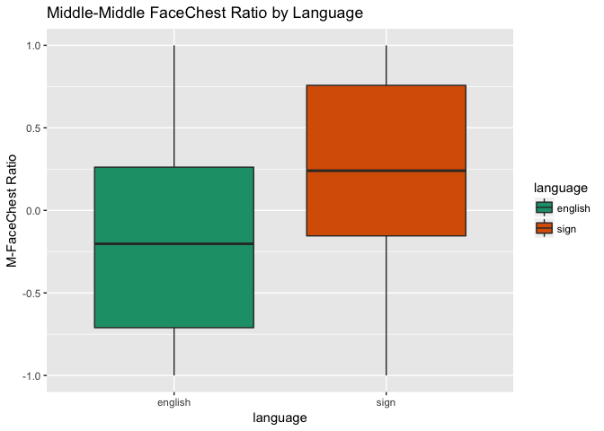

Baby Basic Eye Gaze (study2children)
================
Adam Stone, PhD
10-27-2017

-   [Starting Out](#starting-out)
-   [Statistical Testing of FCR/mFCR](#statistical-testing-of-fcrmfcr)
    -   [Language, Direction, & Age Predictors](#language-direction-age-predictors)
    -   [Language & Age Predictors](#language-age-predictors)
    -   [Direction & Language Predictors](#direction-language-predictors)
    -   [Language as only predictor](#language-as-only-predictor)

Starting Out
============

We've cleaned up the data in [03importcleanbabies](03importcleanbabies.nb.html). So we're importing it here. Let's get a chart of how old our babies are.

``` r
# Libraries
library(tidyverse)
```

    ## Loading tidyverse: ggplot2
    ## Loading tidyverse: tibble
    ## Loading tidyverse: tidyr
    ## Loading tidyverse: readr
    ## Loading tidyverse: purrr
    ## Loading tidyverse: dplyr

    ## Warning: package 'dplyr' was built under R version 3.4.2

    ## Conflicts with tidy packages ----------------------------------------------

    ## filter(): dplyr, stats
    ## lag():    dplyr, stats

``` r
library(feather)
library(scales)
```

    ## 
    ## Attaching package: 'scales'

    ## The following object is masked from 'package:purrr':
    ## 
    ##     discard

    ## The following object is masked from 'package:readr':
    ## 
    ##     col_factor

``` r
library(stringr)
library(viridis)
```

    ## Loading required package: viridisLite

    ## 
    ## Attaching package: 'viridis'

    ## The following object is masked from 'package:scales':
    ## 
    ##     viridis_pal

``` r
library(lme4)
```

    ## Warning: package 'lme4' was built under R version 3.4.2

    ## Loading required package: Matrix

    ## 
    ## Attaching package: 'Matrix'

    ## The following object is masked from 'package:tidyr':
    ## 
    ##     expand

``` r
library(lmerTest)
```

    ## 
    ## Attaching package: 'lmerTest'

    ## The following object is masked from 'package:lme4':
    ## 
    ##     lmer

    ## The following object is masked from 'package:stats':
    ## 
    ##     step

``` r
library(RColorBrewer)
#library(cowplot)

# Import data that's been cleaned up from 01importclean
data <- read_feather("cleanedbabyeyedata.feather")

data_ages <- data %>%
  select(participant, language, age, group) %>%
  distinct()

ggplot(data_ages, aes(x = age, fill = language)) + geom_histogram() + facet_grid(language ~ group) + scale_fill_brewer(palette = "Accent")
```

    ## `stat_bin()` using `bins = 30`. Pick better value with `binwidth`.


Next, let's do boxplots of each AOI across all stories and kids, grouping for forward vs. reversed.

``` r
# Boxplot!
ggplot(data, aes(x = aoi, y = percent, fill = direction)) + 
  geom_boxplot() + theme(axis.text.x = element_text(angle=45, hjust = 1)) +
  ggtitle("Looking Percentages for Each AOI, All Stories") +
  scale_y_continuous(labels = scales::percent, limits = c(0,1))
```


Looks like by far most of the activity is along the Mid\*\* AOIs. Let's look closer.

``` r
data_mid <- data %>%
  filter(str_detect(aoi,"Mid"))

ggplot(data_mid, aes(x = aoi, y = percent, fill = direction)) + 
  geom_boxplot() + theme(axis.text.x = element_text(angle=45, hjust = 1)) +
  ggtitle("Looking Percentages for Middle AOIs, All Stories") +
  scale_y_continuous(labels = scales::percent, limits = c(0,1))
```


As a preliminary analysis I'm going to just look at MidChestTop and MidFaceBottom. Are there differences based on direction, group, or age for either AOI?

``` r
data_mid %>% 
  filter(aoi == "MidChestTop" | aoi == "MidFaceBottom") %>%
  ggplot(aes(x = age, y = percent, color = direction)) + geom_point(alpha = 0.25) +
  geom_smooth(method = "lm") + facet_grid(language ~ aoi) +
  scale_y_continuous(labels = scales::percent, limits = c(0,1)) +
  ggtitle("Top 2 AOIs")
```


I am not observing big differences for direction. And not strong patterns across age, although there are subtle upward trends for increased chest looking in NSE kids as they get older, but increased face looking in CODAS as they get older.

What if we defined a Face-Chest Ratio (FCR) such that:

1.  MidFaceTop, MidFaceCenter, MidFaceBottom = Face
2.  MidChestTop, MidChestCenter, MidChestBottom = Chest
3.  FCR = face - chest / face + chest

Let's try that. Let's also try only MidFaceBottom vs. MidChestTop too, and call that MFCR (for middle of middle).

CHart belows suggests group differences and that CODA babies have a trend to more face-looking while NSE babies don't.

``` r
data_mid <- data_mid %>%
  select(-secs, -hits) %>%
  spread(aoi,percent) %>%
  group_by(participant, trial) %>%
  mutate(face = sum(MidFaceTop, MidFaceCenter, MidFaceBottom, na.rm = TRUE),
         chest = sum(MidChestTop, MidChestCenter, MidChestBottom, na.rm = TRUE),
         fcr = (face - chest) / (face + chest),
         mfcr = (MidFaceBottom - MidChestTop) / (MidFaceBottom + MidChestTop))

ggplot(data_mid, aes(x = age, y = fcr, color = direction)) + geom_point(alpha = 0.25) +
  geom_smooth(method = "lm") + facet_wrap("language") + ggtitle("FaceChest Ratio")
```

    ## Warning: Removed 1 rows containing non-finite values (stat_smooth).

    ## Warning: Removed 1 rows containing missing values (geom_point).


Let's also check out MFCR (a stricter ratio). Almost the same thing.

``` r
ggplot(data_mid, aes(x = age, y = mfcr, color = direction)) + geom_point(alpha = 0.25) +
  geom_smooth(method = "lm") + facet_wrap("language") + ggtitle("Middle-Middle FaceChest Ratio")
```

    ## Warning: Removed 5 rows containing non-finite values (stat_smooth).

    ## Warning: Removed 5 rows containing missing values (geom_point).


So this is rad! Such obvious group differences should also be reflected in a heat map that is collapsed across age and direction. And the heat map below shows that CODAs really focus on the MidFaceBottom AOI, while English-exposed children are a bit more spread out, looking much more at the chest.

``` r
data_mid_heat <- data_mid %>%
  ungroup() %>%
  select(-face, -chest, -fcr, -mfcr) %>%
  gather(aoi, percent, MidChestBottom:MidFaceTop) %>%
  group_by(language, participant, direction, aoi) %>%
  summarise(percent = mean(percent, na.rm = TRUE)) %>%
  group_by(language, direction, aoi) %>%
  summarise(percent = mean(percent, na.rm = TRUE)) %>%
  group_by(language, aoi) %>%
  summarise(percent = mean(percent, na.rm = TRUE)) %>%
  mutate(aoi = factor(aoi, levels = c("MidChestBottom", "MidChestCenter", "MidChestTop",
                                      "MidFaceBottom", "MidFaceCenter", "MidFaceTop")))

ggplot(data_mid_heat, aes(x = language, y = aoi)) +
  geom_tile(aes(fill=percent),color="lightgray",na.rm=TRUE) + 
  scale_fill_viridis(option = "viridis", direction=-1, limits = c(0,1)) +
  theme(axis.text.x=element_text(angle=45,hjust=1)) +
  ylab("") + xlab("") + ggtitle("Eye Gaze Heat Map")
```


Statistical Testing of FCR/mFCR
===============================

Now that we've found something interesting with FCR and mFCR, let's see if it holds up in stats modeling.

Language, Direction, & Age Predictors
-------------------------------------

First, a LMM with predictors Language, Direction, and Age, and outcome variable FCR. Nothing significant.

``` r
fcr_lmm <- lmer(fcr ~ age * language * direction + (1|story) + (1|participant), data = data_mid)
summary(fcr_lmm)
```

    ## Linear mixed model fit by REML t-tests use Satterthwaite approximations
    ##   to degrees of freedom [lmerMod]
    ## Formula: 
    ## fcr ~ age * language * direction + (1 | story) + (1 | participant)
    ##    Data: data_mid
    ## 
    ## REML criterion at convergence: 317
    ## 
    ## Scaled residuals: 
    ##     Min      1Q  Median      3Q     Max 
    ## -2.4361 -0.6497  0.0190  0.5997  2.5501 
    ## 
    ## Random effects:
    ##  Groups      Name        Variance Std.Dev.
    ##  participant (Intercept) 0.293185 0.54147 
    ##  story       (Intercept) 0.009478 0.09736 
    ##  Residual                0.129802 0.36028 
    ## Number of obs: 286, groups:  participant, 23; story, 8
    ## 
    ## Fixed effects:
    ##                                     Estimate Std. Error        df t value
    ## (Intercept)                         -0.06777    0.41652  20.31000  -0.163
    ## age                                 -0.15116    0.61206  19.93000  -0.247
    ## languagesign                        -0.13389    0.68681  20.39000  -0.195
    ## directionreversed                    0.05351    0.15015 252.55000   0.356
    ## age:languagesign                     0.73390    0.84035  20.09000   0.873
    ## age:directionreversed                0.03755    0.21731 252.66000   0.173
    ## languagesign:directionreversed      -0.21129    0.26168 252.53000  -0.807
    ## age:languagesign:directionreversed  -0.05166    0.30853 252.57000  -0.167
    ##                                    Pr(>|t|)
    ## (Intercept)                           0.872
    ## age                                   0.807
    ## languagesign                          0.847
    ## directionreversed                     0.722
    ## age:languagesign                      0.393
    ## age:directionreversed                 0.863
    ## languagesign:directionreversed        0.420
    ## age:languagesign:directionreversed    0.867
    ## 
    ## Correlation of Fixed Effects:
    ##             (Intr) age    lnggsg drctnr ag:lng ag:drc lnggs:
    ## age         -0.938                                          
    ## languagesgn -0.602  0.569                                   
    ## dirctnrvrsd -0.179  0.166  0.108                            
    ## age:lnggsgn  0.683 -0.728 -0.918 -0.121                     
    ## ag:drctnrvr  0.169 -0.177 -0.102 -0.940  0.129              
    ## lnggsgn:drc  0.102 -0.095 -0.188 -0.574  0.166  0.541       
    ## ag:lnggsgn: -0.119  0.125  0.173  0.662 -0.180 -0.705 -0.921

Let's repeat the LMM with outcome mFCR. Same thing, although the t values are slightly better.

``` r
mfcr_lmm <- lmer(mfcr ~ age * language * direction + (1|story) + (1|participant), data = data_mid)
summary(mfcr_lmm)
```

    ## Linear mixed model fit by REML t-tests use Satterthwaite approximations
    ##   to degrees of freedom [lmerMod]
    ## Formula: 
    ## mfcr ~ age * language * direction + (1 | story) + (1 | participant)
    ##    Data: data_mid
    ## 
    ## REML criterion at convergence: 370.2
    ## 
    ## Scaled residuals: 
    ##     Min      1Q  Median      3Q     Max 
    ## -3.1756 -0.5580  0.0836  0.6139  2.5651 
    ## 
    ## Random effects:
    ##  Groups      Name        Variance Std.Dev.
    ##  participant (Intercept) 0.250817 0.50082 
    ##  story       (Intercept) 0.005602 0.07485 
    ##  Residual                0.166079 0.40753 
    ## Number of obs: 282, groups:  participant, 23; story, 8
    ## 
    ## Fixed effects:
    ##                                      Estimate Std. Error         df
    ## (Intercept)                          0.009345   0.392155  20.840000
    ## age                                 -0.191647   0.576034  20.430000
    ## languagesign                        -0.158897   0.647593  21.050000
    ## directionreversed                    0.070462   0.172720 248.740000
    ## age:languagesign                     0.767599   0.791005  20.600000
    ## age:directionreversed                0.048488   0.248236 248.820000
    ## languagesign:directionreversed      -0.218679   0.297503 248.560000
    ## age:languagesign:directionreversed  -0.073115   0.350571 248.610000
    ##                                    t value Pr(>|t|)
    ## (Intercept)                          0.024    0.981
    ## age                                 -0.333    0.743
    ## languagesign                        -0.245    0.809
    ## directionreversed                    0.408    0.684
    ## age:languagesign                     0.970    0.343
    ## age:directionreversed                0.195    0.845
    ## languagesign:directionreversed      -0.735    0.463
    ## age:languagesign:directionreversed  -0.209    0.835
    ## 
    ## Correlation of Fixed Effects:
    ##             (Intr) age    lnggsg drctnr ag:lng ag:drc lnggs:
    ## age         -0.939                                          
    ## languagesgn -0.603  0.569                                   
    ## dirctnrvrsd -0.223  0.205  0.135                            
    ## age:lnggsgn  0.684 -0.728 -0.918 -0.149                     
    ## ag:drctnrvr  0.210 -0.218 -0.127 -0.941  0.159              
    ## lnggsgn:drc  0.129 -0.119 -0.228 -0.580  0.202  0.547       
    ## ag:lnggsgn: -0.148  0.154  0.210  0.666 -0.218 -0.708 -0.922

What if we did ANCOVAs (C because age would be a covariate). First, FCR as outcome.

Language & Age Predictors
-------------------------

Let's take out direction. The FCR LMM tells us same thing, nothing.

``` r
fcr_lmm_nodir <- lmer(fcr ~ age * language + (1|story) + (1|participant) + (1|direction), data = data_mid)
summary(fcr_lmm_nodir)
```

    ## Linear mixed model fit by REML t-tests use Satterthwaite approximations
    ##   to degrees of freedom [lmerMod]
    ## Formula: fcr ~ age * language + (1 | story) + (1 | participant) + (1 |  
    ##     direction)
    ##    Data: data_mid
    ## 
    ## REML criterion at convergence: 314.3
    ## 
    ## Scaled residuals: 
    ##      Min       1Q   Median       3Q      Max 
    ## -2.53207 -0.59821  0.05162  0.55855  2.63521 
    ## 
    ## Random effects:
    ##  Groups      Name        Variance Std.Dev.
    ##  participant (Intercept) 0.293853 0.54208 
    ##  story       (Intercept) 0.009324 0.09656 
    ##  direction   (Intercept) 0.000000 0.00000 
    ##  Residual                0.131379 0.36246 
    ## Number of obs: 286, groups:  participant, 23; story, 8; direction, 2
    ## 
    ## Fixed effects:
    ##                  Estimate Std. Error       df t value Pr(>|t|)
    ## (Intercept)      -0.04225    0.41034 19.03200  -0.103    0.919
    ## age              -0.13114    0.60320 18.70700  -0.217    0.830
    ## languagesign     -0.24174    0.67547 18.97700  -0.358    0.724
    ## age:languagesign  0.71497    0.82777 18.81600   0.864    0.399
    ## 
    ## Correlation of Fixed Effects:
    ##             (Intr) age    lnggsg
    ## age         -0.938              
    ## languagesgn -0.603  0.570       
    ## age:lnggsgn  0.684 -0.729 -0.917

And the mFCR, nothing either.

``` r
mfcr_lmm_nodir <- lmer(mfcr ~ age * language + (1|story) + (1|participant) + (1|direction), data = data_mid)
summary(mfcr_lmm_nodir)
```

    ## Linear mixed model fit by REML t-tests use Satterthwaite approximations
    ##   to degrees of freedom [lmerMod]
    ## Formula: mfcr ~ age * language + (1 | story) + (1 | participant) + (1 |  
    ##     direction)
    ##    Data: data_mid
    ## 
    ## REML criterion at convergence: 368.3
    ## 
    ## Scaled residuals: 
    ##     Min      1Q  Median      3Q     Max 
    ## -3.0351 -0.5763  0.0479  0.6424  2.4327 
    ## 
    ## Random effects:
    ##  Groups      Name        Variance Std.Dev.
    ##  participant (Intercept) 0.250235 0.50023 
    ##  story       (Intercept) 0.005428 0.07367 
    ##  direction   (Intercept) 0.000000 0.00000 
    ##  Residual                0.168011 0.40989 
    ## Number of obs: 282, groups:  participant, 23; story, 8; direction, 2
    ## 
    ## Fixed effects:
    ##                  Estimate Std. Error       df t value Pr(>|t|)
    ## (Intercept)       0.04483    0.38198 18.82500   0.117    0.908
    ## age              -0.16812    0.56178 18.54100  -0.299    0.768
    ## languagesign     -0.27196    0.63004 18.91900  -0.432    0.671
    ## age:languagesign  0.74010    0.77129 18.68400   0.960    0.350
    ## 
    ## Correlation of Fixed Effects:
    ##             (Intr) age    lnggsg
    ## age         -0.939              
    ## languagesgn -0.603  0.569       
    ## age:lnggsgn  0.684 -0.728 -0.918

Direction & Language Predictors
-------------------------------

In the LMMs we've run so far, age is always the worst predictor. So we should have taken that out first, anyway.

Alright, we got an effect of language (p = 0.07) AND an interaction with direction, p = 0.008. CODA babies generally have much higher FCR, but they're also strongly affected by reversal.

``` r
fcr_lmm_noage <- lmer(fcr ~ direction * language + (1|story) + (1|participant), data = data_mid)
summary(fcr_lmm_noage)
```

    ## Linear mixed model fit by REML t-tests use Satterthwaite approximations
    ##   to degrees of freedom [lmerMod]
    ## Formula: fcr ~ direction * language + (1 | story) + (1 | participant)
    ##    Data: data_mid
    ## 
    ## REML criterion at convergence: 317.2
    ## 
    ## Scaled residuals: 
    ##      Min       1Q   Median       3Q      Max 
    ## -2.43482 -0.64836  0.01973  0.59989  2.55402 
    ## 
    ## Random effects:
    ##  Groups      Name        Variance Std.Dev.
    ##  participant (Intercept) 0.27892  0.52813 
    ##  story       (Intercept) 0.00953  0.09762 
    ##  Residual                0.12883  0.35893 
    ## Number of obs: 286, groups:  participant, 23; story, 8
    ## 
    ## Fixed effects:
    ##                                 Estimate Std. Error        df t value
    ## (Intercept)                     -0.16455    0.14122  24.36000  -1.165
    ## directionreversed                0.07790    0.05086 254.19000   1.532
    ## languagesign                     0.47283    0.24832  22.09000   1.904
    ## directionreversed:languagesign  -0.24913    0.09320 253.92000  -2.673
    ##                                Pr(>|t|)   
    ## (Intercept)                       0.255   
    ## directionreversed                 0.127   
    ## languagesign                      0.070 . 
    ## directionreversed:languagesign    0.008 **
    ## ---
    ## Signif. codes:  0 '***' 0.001 '**' 0.01 '*' 0.05 '.' 0.1 ' ' 1
    ## 
    ## Correlation of Fixed Effects:
    ##             (Intr) drctnr lnggsg
    ## dirctnrvrsd -0.177              
    ## languagesgn -0.535  0.100       
    ## drctnrvrsd:  0.097 -0.543 -0.182

The mFCR LMM gives us similar results.

``` r
mfcr_lmm_noage <- lmer(mfcr ~ direction * language + (1|story) + (1|participant), data = data_mid)
summary(mfcr_lmm_noage)
```

    ## Linear mixed model fit by REML t-tests use Satterthwaite approximations
    ##   to degrees of freedom [lmerMod]
    ## Formula: mfcr ~ direction * language + (1 | story) + (1 | participant)
    ##    Data: data_mid
    ## 
    ## REML criterion at convergence: 370.8
    ## 
    ## Scaled residuals: 
    ##     Min      1Q  Median      3Q     Max 
    ## -3.1775 -0.5764  0.0972  0.6252  2.5884 
    ## 
    ## Random effects:
    ##  Groups      Name        Variance Std.Dev.
    ##  participant (Intercept) 0.239730 0.48962 
    ##  story       (Intercept) 0.005677 0.07535 
    ##  Residual                0.164839 0.40600 
    ## Number of obs: 282, groups:  participant, 23; story, 8
    ## 
    ## Fixed effects:
    ##                                 Estimate Std. Error        df t value
    ## (Intercept)                     -0.11360    0.13201  24.04000  -0.861
    ## directionreversed                0.10217    0.05815 250.37000   1.757
    ## languagesign                     0.46905    0.23426  22.53000   2.002
    ## directionreversed:languagesign  -0.27367    0.10575 249.73000  -2.588
    ##                                Pr(>|t|)  
    ## (Intercept)                      0.3980  
    ## directionreversed                0.0801 .
    ## languagesign                     0.0574 .
    ## directionreversed:languagesign   0.0102 *
    ## ---
    ## Signif. codes:  0 '***' 0.001 '**' 0.01 '*' 0.05 '.' 0.1 ' ' 1
    ## 
    ## Correlation of Fixed Effects:
    ##             (Intr) drctnr lnggsg
    ## dirctnrvrsd -0.219              
    ## languagesgn -0.540  0.123       
    ## drctnrvrsd:  0.120 -0.548 -0.219

Language as only predictor
--------------------------

Same thing here. So it's not age or direction, but language, that has the effect. And that's good! I want to look at forward v. reversed separately next.

``` r
fcr_lmm_langonly <- lmer(fcr ~  language + (1|story) + (1|participant) + (1|direction), data = data_mid)
summary(fcr_lmm_langonly)
```

    ## Linear mixed model fit by REML t-tests use Satterthwaite approximations
    ##   to degrees of freedom [lmerMod]
    ## Formula: 
    ## fcr ~ language + (1 | story) + (1 | participant) + (1 | direction)
    ##    Data: data_mid
    ## 
    ## REML criterion at convergence: 316.9
    ## 
    ## Scaled residuals: 
    ##      Min       1Q   Median       3Q      Max 
    ## -2.53002 -0.60478  0.05811  0.57619  2.63605 
    ## 
    ## Random effects:
    ##  Groups      Name        Variance Std.Dev.
    ##  participant (Intercept) 0.279716 0.52888 
    ##  story       (Intercept) 0.009346 0.09668 
    ##  direction   (Intercept) 0.000000 0.00000 
    ##  Residual                0.131414 0.36251 
    ## Number of obs: 286, groups:  participant, 23; story, 8; direction, 2
    ## 
    ## Fixed effects:
    ##              Estimate Std. Error      df t value Pr(>|t|)
    ## (Intercept)   -0.1261     0.1391 22.7950  -0.906    0.374
    ## languagesign   0.3524     0.2446 20.6500   1.441    0.165
    ## 
    ## Correlation of Fixed Effects:
    ##             (Intr)
    ## languagesgn -0.534

Forward only. Language effect, p = 0.05.

``` r
fcr_lmm_langonly_f <- lmer(fcr ~  language + (1|story) + (1|participant), data = filter(data_mid,direction=="forward"))
summary(fcr_lmm_langonly_f)
```

    ## Linear mixed model fit by REML t-tests use Satterthwaite approximations
    ##   to degrees of freedom [lmerMod]
    ## Formula: fcr ~ language + (1 | story) + (1 | participant)
    ##    Data: filter(data_mid, direction == "forward")
    ## 
    ## REML criterion at convergence: 164.1
    ## 
    ## Scaled residuals: 
    ##      Min       1Q   Median       3Q      Max 
    ## -2.51930 -0.54504  0.04282  0.57294  2.18405 
    ## 
    ## Random effects:
    ##  Groups      Name        Variance Std.Dev.
    ##  participant (Intercept) 0.27919  0.5284  
    ##  story       (Intercept) 0.03323  0.1823  
    ##  Residual                0.10521  0.3244  
    ## Number of obs: 146, groups:  participant, 23; story, 8
    ## 
    ## Fixed effects:
    ##              Estimate Std. Error      df t value Pr(>|t|)  
    ## (Intercept)   -0.1836     0.1508 24.5920  -1.218   0.2348  
    ## languagesign   0.5057     0.2472 19.5250   2.046   0.0545 .
    ## ---
    ## Signif. codes:  0 '***' 0.001 '**' 0.01 '*' 0.05 '.' 0.1 ' ' 1
    ## 
    ## Correlation of Fixed Effects:
    ##             (Intr)
    ## languagesgn -0.498

Reversed only. Weaker language effect, p = 0.0131.

``` r
fcr_lmm_langonly_r <- lmer(fcr ~  language + (1|story) + (1|participant), data = filter(data_mid,direction=="reversed"))
summary(fcr_lmm_langonly_r)
```

    ## Linear mixed model fit by REML t-tests use Satterthwaite approximations
    ##   to degrees of freedom [lmerMod]
    ## Formula: fcr ~ language + (1 | story) + (1 | participant)
    ##    Data: filter(data_mid, direction == "reversed")
    ## 
    ## REML criterion at convergence: 182.3
    ## 
    ## Scaled residuals: 
    ##      Min       1Q   Median       3Q      Max 
    ## -2.00342 -0.60450 -0.01042  0.50268  2.73894 
    ## 
    ## Random effects:
    ##  Groups      Name        Variance Std.Dev.
    ##  participant (Intercept) 0.25779  0.5077  
    ##  story       (Intercept) 0.01843  0.1358  
    ##  Residual                0.13377  0.3657  
    ## Number of obs: 140, groups:  participant, 23; story, 8
    ## 
    ## Fixed effects:
    ##              Estimate Std. Error       df t value Pr(>|t|)
    ## (Intercept)  -0.07774    0.14100 23.17800  -0.551    0.587
    ## languagesign  0.21359    0.24091 19.80900   0.887    0.386
    ## 
    ## Correlation of Fixed Effects:
    ##             (Intr)
    ## languagesgn -0.517

Let's go ahead and plot boxplots to represent LMMs with only language as an important effect. (We can add in direction too). FaceChest Ratio here.

``` r
ggplot(data_mid, aes(x = language, y = fcr, fill = language)) + geom_boxplot() + scale_fill_brewer(palette = "Dark2") + ylab("FaceChest Ratio") + ggtitle("FaceChest Ratio by Language")
```

    ## Warning: Removed 1 rows containing non-finite values (stat_boxplot).



``` r
ggplot(data_mid, aes(x = language, y = fcr, fill = direction)) + geom_boxplot() + ylab("FaceChest Ratio") + ggtitle("FaceChest Ratio by Language & Direction")
```

    ## Warning: Removed 1 rows containing non-finite values (stat_boxplot).


And Middle-Middle FaceChest Ratio here.

``` r
ggplot(data_mid, aes(x = language, y = mfcr, fill = language)) + geom_boxplot() + scale_fill_brewer(palette = "Dark2") + ylab("M-FaceChest Ratio") + ggtitle("Middle-Middle FaceChest Ratio by Language")
```

    ## Warning: Removed 5 rows containing non-finite values (stat_boxplot).


``` r
ggplot(data_mid, aes(x = language, y = mfcr, fill = direction)) + geom_boxplot() + ylab("M-FaceChest Ratio") + ggtitle("Middle-Middle FaceChest Ratio by Language & Direction")
```

    ## Warning: Removed 5 rows containing non-finite values (stat_boxplot).


