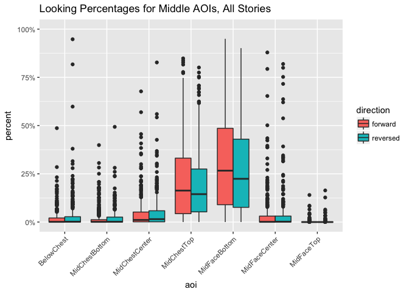
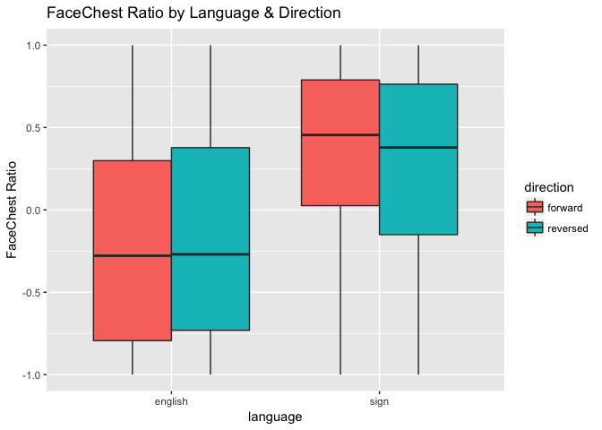

All Children's Eye Gaze (study2children)
================
Adam Stone, PhD
10-30-2017

-   [All Children!](#all-children)
-   [Statistical Testing of FCR/mFCR](#statistical-testing-of-fcrmfcr)
    -   [Language, Direction, & Age Predictors](#language-direction-age-predictors)
    -   [Direction & Language Predictors](#direction-language-predictors)
    -   [Separate for direction](#separate-for-direction)
-   [Are Babies and Children Different?](#are-babies-and-children-different)
-   [Means and SEs](#means-and-ses)

All Children!
=============

We're importing *both* the child and baby data. Let's get a chart of how old all our kids are.

``` r
# Libraries
library(tidyverse)
library(feather)
library(scales)
library(stringr)
library(viridis)
library(lme4)
library(lmerTest)
library(RColorBrewer)
#library(cowplot)

# Import data that's been cleaned up from 01importclean
babydata <- read_feather("cleanedbabyeyedata.feather")
kiddata <- read_feather("cleanedchildeyedata.feather")
data <- rbind(babydata,kiddata)

data_ages <- data %>%
  select(participant, language, age, group) %>%
  distinct()

ggplot(data_ages, aes(x = age, fill = language)) + geom_histogram(binwidth = 0.1) + facet_grid(language ~ .) + scale_fill_brewer(palette = "Accent")
```


Next, let's do boxplots of each AOI across all stories and kids, grouping for forward vs. reversed.

``` r
# Boxplot!
ggplot(data, aes(x = aoi, y = percent, fill = direction)) + 
  geom_boxplot() + theme(axis.text.x = element_text(angle=45, hjust = 1)) +
  ggtitle("Looking Percentages for Each AOI, All Stories") +
  scale_y_continuous(labels = scales::percent, limits = c(0,1))
```


Looks like by far most of the activity is along the Mid\*\* AOIs. Let's look closer.

``` r
data_mid <- data %>%
  filter(str_detect(aoi,"Mid"))

ggplot(data_mid, aes(x = aoi, y = percent, fill = direction)) + 
  geom_boxplot() + theme(axis.text.x = element_text(angle=45, hjust = 1)) +
  ggtitle("Looking Percentages for Middle AOIs, All Stories") +
  scale_y_continuous(labels = scales::percent, limits = c(0,1))
```



As a preliminary analysis I'm going to just look at MidChestTop and MidFaceBottom. Are there differences based on direction, group, or age for either AOI?

``` r
data_mid %>% 
  filter(aoi == "MidChestTop" | aoi == "MidFaceBottom") %>%
  ggplot(aes(x = age, y = percent, color = direction)) + geom_point(alpha = 0.25) +
  geom_smooth(method = "lm") + facet_grid(language ~ aoi) +
  scale_y_continuous(labels = scales::percent, limits = c(0,1)) +
  ggtitle("Top 2 AOIs")
```


I am not observing big differences for direction. And not strong patterns across age, although there are subtle upward trends for increased chest looking in NSE kids as they get older, but increased face looking in CODAS as they get older.

What if we defined a Face-Chest Ratio (FCR) such that:

1.  MidFaceTop, MidFaceCenter, MidFaceBottom = Face
2.  MidChestTop, MidChestCenter, MidChestBottom = Chest
3.  FCR = face - chest / face + chest

Let's try that. Let's also try only MidFaceBottom vs. MidChestTop too, and call that MFCR (for middle-middle).

Chart belows suggests group differences. CODAs overall have higher FCR ratios, AND direction effects work differently. While NSE kids generally do not show an age-related trend towards more face-looking.

``` r
data_mid <- data_mid %>%
  select(-secs, -hits) %>%
  spread(aoi,percent) %>%
  group_by(participant, trial) %>%
  mutate(face = sum(MidFaceTop, MidFaceCenter, MidFaceBottom, na.rm = TRUE),
         chest = sum(MidChestTop, MidChestCenter, MidChestBottom, na.rm = TRUE),
         fcr = (face - chest) / (face + chest),
         mfcr = (MidFaceBottom - MidChestTop) / (MidFaceBottom + MidChestTop))

ggplot(data_mid, aes(x = age, y = fcr, color = direction)) + geom_point(alpha = 0.25) +
  geom_smooth(method = "lm") + facet_wrap("language") + ggtitle("FaceChest Ratio")
```

    ## Warning: Removed 2 rows containing non-finite values (stat_smooth).

    ## Warning: Removed 2 rows containing missing values (geom_point).


Let's also check out MFCR (a stricter ratio). Almost the same thing.

``` r
ggplot(data_mid, aes(x = age, y = mfcr, color = direction)) + geom_point(alpha = 0.25) +
  geom_smooth(method = "lm") + facet_wrap("language") + ggtitle("Middle-Middle FaceChest Ratio")
```

    ## Warning: Removed 11 rows containing non-finite values (stat_smooth).

    ## Warning: Removed 11 rows containing missing values (geom_point).


So this is rad! Such obvious group differences should also be reflected in a heat map that is collapsed across age and direction. And the heat map below shows that CODAs really focus on the MidFaceBottom AOI, while English-exposed children are a bit more spread out, looking much more at the chest.

``` r
data_mid_heat <- data_mid %>%
  ungroup() %>%
  select(-face, -chest, -fcr, -mfcr) %>%
  gather(aoi, percent, MidChestBottom:MidFaceTop) %>%
  group_by(language, participant, direction, aoi) %>%
  summarise(percent = mean(percent, na.rm = TRUE)) %>%
  group_by(language, direction, aoi) %>%
  summarise(percent = mean(percent, na.rm = TRUE)) %>%
  group_by(language, aoi) %>%
  summarise(percent = mean(percent, na.rm = TRUE)) %>%
  mutate(aoi = factor(aoi, levels = c("MidChestBottom", "MidChestCenter", "MidChestTop",
                                      "MidFaceBottom", "MidFaceCenter", "MidFaceTop")))

ggplot(data_mid_heat, aes(x = language, y = aoi)) +
  geom_tile(aes(fill=percent),color="lightgray",na.rm=TRUE) + 
  scale_fill_viridis(option = "viridis", direction=-1, limits = c(0,1)) +
  theme(axis.text.x=element_text(angle=45,hjust=1)) +
  ylab("") + xlab("") + ggtitle("Eye Gaze Heat Map")
```


Statistical Testing of FCR/mFCR
===============================

Now that we've found something interesting with FCR and mFCR, let's see if it holds up in stats modeling.

Language, Direction, & Age Predictors
-------------------------------------

First, a LMM with predictors Language, Direction, and Age, and outcome variable FCR.

Here, some interesting effects (and this model was NOT working with just babies and children!).

1.  *NEED TO UPDATE WRITE-UP...ADDED MORE BABIES*
2.  Overall group effect of language. CODA kids on average have 0.48 higher FCR than NSE kids, p = 0.0494.
3.  Significant Language X Direction interaction (p = 0.01).
4.  No effect of age.

``` r
fcr_lmm <- lmer(fcr ~ age * language * direction + (1|story) + (1|participant), data = data_mid)
summary(fcr_lmm)
```

    ## Linear mixed model fit by REML t-tests use Satterthwaite approximations
    ##   to degrees of freedom [lmerMod]
    ## Formula: 
    ## fcr ~ age * language * direction + (1 | story) + (1 | participant)
    ##    Data: data_mid
    ## 
    ## REML criterion at convergence: 1053.6
    ## 
    ## Scaled residuals: 
    ##     Min      1Q  Median      3Q     Max 
    ## -3.2583 -0.5689  0.0725  0.6492  2.6523 
    ## 
    ## Random effects:
    ##  Groups      Name        Variance Std.Dev.
    ##  participant (Intercept) 0.190067 0.43597 
    ##  story       (Intercept) 0.009561 0.09778 
    ##  Residual                0.194035 0.44049 
    ## Number of obs: 725, groups:  participant, 56; story, 8
    ## 
    ## Fixed effects:
    ##                                     Estimate Std. Error        df t value
    ## (Intercept)                         -0.25062    0.12492  64.20000  -2.006
    ## age                                  0.03759    0.03466  58.90000   1.085
    ## languagesign                         0.53170    0.22977  59.40000   2.314
    ## directionreversed                    0.14638    0.06413 660.20000   2.283
    ## age:languagesign                    -0.01164    0.05602  59.00000  -0.208
    ## age:directionreversed               -0.03768    0.01878 659.60000  -2.006
    ## languagesign:directionreversed      -0.33318    0.12318 658.80000  -2.705
    ## age:languagesign:directionreversed   0.05447    0.03001 664.90000   1.815
    ##                                    Pr(>|t|)   
    ## (Intercept)                         0.04904 * 
    ## age                                 0.28252   
    ## languagesign                        0.02414 * 
    ## directionreversed                   0.02277 * 
    ## age:languagesign                    0.83614   
    ## age:directionreversed               0.04527 * 
    ## languagesign:directionreversed      0.00701 **
    ## age:languagesign:directionreversed  0.07000 . 
    ## ---
    ## Signif. codes:  0 '***' 0.001 '**' 0.01 '*' 0.05 '.' 0.1 ' ' 1
    ## 
    ## Correlation of Fixed Effects:
    ##             (Intr) age    lnggsg drctnr ag:lng ag:drc lnggs:
    ## age         -0.703                                          
    ## languagesgn -0.502  0.382                                   
    ## dirctnrvrsd -0.254  0.196  0.138                            
    ## age:lnggsgn  0.435 -0.619 -0.816 -0.122                     
    ## ag:drctnrvr  0.187 -0.268 -0.102 -0.735  0.168              
    ## lnggsgn:drc  0.132 -0.102 -0.262 -0.520  0.214  0.383       
    ## ag:lnggsgn: -0.118  0.170  0.215  0.462 -0.265 -0.632 -0.817

Let's repeat the LMM with outcome mFCR. Stronger statistical values.

1.  *NEED TO UPDATE WRITE-UP...ADDED MORE BABIES*
2.  Overall group effect of language, p = 0.361.
3.  Significant Direction effect, p = 0.0485.
4.  Significant Language X Direction interaction (p = 0.01).
5.  No effect of age.

``` r
mfcr_lmm <- lmer(mfcr ~ age * language * direction + (1|story) + (1|participant), data = data_mid)
summary(mfcr_lmm)
```

    ## Linear mixed model fit by REML t-tests use Satterthwaite approximations
    ##   to degrees of freedom [lmerMod]
    ## Formula: 
    ## mfcr ~ age * language * direction + (1 | story) + (1 | participant)
    ##    Data: data_mid
    ## 
    ## REML criterion at convergence: 1103.2
    ## 
    ## Scaled residuals: 
    ##     Min      1Q  Median      3Q     Max 
    ## -3.2209 -0.5907  0.0889  0.6690  2.6702 
    ## 
    ## Random effects:
    ##  Groups      Name        Variance Std.Dev.
    ##  participant (Intercept) 0.1790   0.42304 
    ##  story       (Intercept) 0.0054   0.07348 
    ##  Residual                0.2149   0.46360 
    ## Number of obs: 716, groups:  participant, 56; story, 8
    ## 
    ## Fixed effects:
    ##                                     Estimate Std. Error        df t value
    ## (Intercept)                         -0.18629    0.12101  64.30000  -1.540
    ## age                                  0.04077    0.03406  60.00000   1.197
    ## languagesign                         0.53906    0.22591  60.60000   2.386
    ## directionreversed                    0.14988    0.06810 652.20000   2.201
    ## age:languagesign                    -0.02018    0.05504  60.10000  -0.367
    ## age:directionreversed               -0.03256    0.01982 631.10000  -1.642
    ## languagesign:directionreversed      -0.34732    0.12997 650.40000  -2.672
    ## age:languagesign:directionreversed   0.05027    0.03165 653.80000   1.588
    ##                                    Pr(>|t|)   
    ## (Intercept)                         0.12858   
    ## age                                 0.23601   
    ## languagesign                        0.02016 * 
    ## directionreversed                   0.02809 * 
    ## age:languagesign                    0.71511   
    ## age:directionreversed               0.10100   
    ## languagesign:directionreversed      0.00772 **
    ## age:languagesign:directionreversed  0.11274   
    ## ---
    ## Signif. codes:  0 '***' 0.001 '**' 0.01 '*' 0.05 '.' 0.1 ' ' 1
    ## 
    ## Correlation of Fixed Effects:
    ##             (Intr) age    lnggsg drctnr ag:lng ag:drc lnggs:
    ## age         -0.715                                          
    ## languagesgn -0.511  0.383                                   
    ## dirctnrvrsd -0.280  0.212  0.150                            
    ## age:lnggsgn  0.443 -0.619 -0.817 -0.132                     
    ## ag:drctnrvr  0.206 -0.286 -0.110 -0.736  0.179              
    ## lnggsgn:drc  0.147 -0.111 -0.282 -0.524  0.230  0.386       
    ## ag:lnggsgn: -0.129  0.181  0.230  0.463 -0.283 -0.632 -0.817

What if we did ANCOVAs (C because age would be a covariate). First, FCR as outcome.

Direction & Language Predictors
-------------------------------

In the LMMs we've run so far, age is always the worst predictor. So we should take that out.

1.  *NEED TO UPDATE WRITE-UP...ADDED MORE BABIES*
2.  Strong effect of language (p &lt; 0.001)
3.  Significant language x direction interaction (p = 0.02).

``` r
fcr_lmm_noage <- lmer(fcr ~ direction * language + (1|story) + (1|participant), data = data_mid)
summary(fcr_lmm_noage)
```

    ## Linear mixed model fit by REML t-tests use Satterthwaite approximations
    ##   to degrees of freedom [lmerMod]
    ## Formula: fcr ~ direction * language + (1 | story) + (1 | participant)
    ##    Data: data_mid
    ## 
    ## REML criterion at convergence: 1037.9
    ## 
    ## Scaled residuals: 
    ##     Min      1Q  Median      3Q     Max 
    ## -3.2449 -0.5916  0.0646  0.6292  2.5555 
    ## 
    ## Random effects:
    ##  Groups      Name        Variance Std.Dev.
    ##  participant (Intercept) 0.187366 0.43286 
    ##  story       (Intercept) 0.009858 0.09929 
    ##  Residual                0.194626 0.44116 
    ## Number of obs: 725, groups:  participant, 56; story, 8
    ## 
    ## Fixed effects:
    ##                                 Estimate Std. Error        df t value
    ## (Intercept)                     -0.15594    0.08863  59.30000  -1.759
    ## directionreversed                0.05208    0.04356 666.70000   1.196
    ## languagesign                     0.53745    0.12697  61.10000   4.233
    ## directionreversed:languagesign  -0.17399    0.06794 666.10000  -2.561
    ##                                Pr(>|t|)    
    ## (Intercept)                      0.0837 .  
    ## directionreversed                0.2323    
    ## languagesign                   7.88e-05 ***
    ## directionreversed:languagesign   0.0107 *  
    ## ---
    ## Signif. codes:  0 '***' 0.001 '**' 0.01 '*' 0.05 '.' 0.1 ' ' 1
    ## 
    ## Correlation of Fixed Effects:
    ##             (Intr) drctnr lnggsg
    ## dirctnrvrsd -0.243              
    ## languagesgn -0.589  0.172       
    ## drctnrvrsd:  0.157 -0.648 -0.264

The mFCR LMM gives us similar results. *NEED TO UPDATE WRITE-UP...ADDED MORE BABIES*

``` r
mfcr_lmm_noage <- lmer(mfcr ~ direction * language + (1|story) + (1|participant), data = data_mid)
summary(mfcr_lmm_noage)
```

    ## Linear mixed model fit by REML t-tests use Satterthwaite approximations
    ##   to degrees of freedom [lmerMod]
    ## Formula: mfcr ~ direction * language + (1 | story) + (1 | participant)
    ##    Data: data_mid
    ## 
    ## REML criterion at convergence: 1086.4
    ## 
    ## Scaled residuals: 
    ##     Min      1Q  Median      3Q     Max 
    ## -3.2141 -0.5971  0.1001  0.6560  2.5850 
    ## 
    ## Random effects:
    ##  Groups      Name        Variance Std.Dev.
    ##  participant (Intercept) 0.176484 0.42010 
    ##  story       (Intercept) 0.005464 0.07392 
    ##  Residual                0.215222 0.46392 
    ## Number of obs: 716, groups:  participant, 56; story, 8
    ## 
    ## Fixed effects:
    ##                                 Estimate Std. Error        df t value
    ## (Intercept)                     -0.08262    0.08420  63.00000  -0.981
    ## directionreversed                0.06758    0.04610 657.30000   1.466
    ## languagesign                     0.51504    0.12482  62.30000   4.126
    ## directionreversed:languagesign  -0.19644    0.07178 658.80000  -2.737
    ##                                Pr(>|t|)    
    ## (Intercept)                    0.330225    
    ## directionreversed              0.143161    
    ## languagesign                   0.000111 ***
    ## directionreversed:languagesign 0.006376 ** 
    ## ---
    ## Signif. codes:  0 '***' 0.001 '**' 0.01 '*' 0.05 '.' 0.1 ' ' 1
    ## 
    ## Correlation of Fixed Effects:
    ##             (Intr) drctnr lnggsg
    ## dirctnrvrsd -0.271              
    ## languagesgn -0.610  0.185       
    ## drctnrvrsd:  0.176 -0.649 -0.284

Separate for direction
----------------------

Forward only. Language effect, p &lt; 0.001. (I ran this WITH age, and age was not significant). *NEED TO UPDATE WRITE-UP...ADDED MORE BABIES*

``` r
fcr_lmm_langonly_f <- lmer(fcr ~ language + (1|story) + (1|participant), data = filter(data_mid,direction=="forward"))
summary(fcr_lmm_langonly_f)
```

    ## Linear mixed model fit by REML t-tests use Satterthwaite approximations
    ##   to degrees of freedom [lmerMod]
    ## Formula: fcr ~ language + (1 | story) + (1 | participant)
    ##    Data: filter(data_mid, direction == "forward")
    ## 
    ## REML criterion at convergence: 520.3
    ## 
    ## Scaled residuals: 
    ##      Min       1Q   Median       3Q      Max 
    ## -3.13765 -0.52606  0.04539  0.54114  2.44247 
    ## 
    ## Random effects:
    ##  Groups      Name        Variance Std.Dev.
    ##  participant (Intercept) 0.19222  0.4384  
    ##  story       (Intercept) 0.02995  0.1731  
    ##  Residual                0.16653  0.4081  
    ## Number of obs: 367, groups:  participant, 56; story, 8
    ## 
    ## Fixed effects:
    ##              Estimate Std. Error      df t value Pr(>|t|)    
    ## (Intercept)   -0.1583     0.1024 30.0900  -1.546 0.132673    
    ## languagesign   0.5357     0.1278 52.8800   4.191 0.000106 ***
    ## ---
    ## Signif. codes:  0 '***' 0.001 '**' 0.01 '*' 0.05 '.' 0.1 ' ' 1
    ## 
    ## Correlation of Fixed Effects:
    ##             (Intr)
    ## languagesgn -0.517

Reversed only. Slightly weaker language effect, p = 0.008. (I ran this with AGE too and not sig.) *NEED TO UPDATE WRITE-UP...ADDED MORE BABIES*

``` r
fcr_lmm_langonly_r <- lmer(fcr ~ language + (1|story) + (1|participant), data = filter(data_mid,direction=="reversed"))
summary(fcr_lmm_langonly_r)
```

    ## Linear mixed model fit by REML t-tests use Satterthwaite approximations
    ##   to degrees of freedom [lmerMod]
    ## Formula: fcr ~ language + (1 | story) + (1 | participant)
    ##    Data: filter(data_mid, direction == "reversed")
    ## 
    ## REML criterion at convergence: 572.9
    ## 
    ## Scaled residuals: 
    ##     Min      1Q  Median      3Q     Max 
    ## -3.2865 -0.6034  0.0418  0.6066  2.7802 
    ## 
    ## Random effects:
    ##  Groups      Name        Variance Std.Dev.
    ##  participant (Intercept) 0.16686  0.4085  
    ##  story       (Intercept) 0.01358  0.1165  
    ##  Residual                0.21219  0.4606  
    ## Number of obs: 358, groups:  participant, 56; story, 8
    ## 
    ## Fixed effects:
    ##              Estimate Std. Error       df t value Pr(>|t|)   
    ## (Intercept)  -0.10292    0.08873 38.44000  -1.160  0.25326   
    ## languagesign  0.36520    0.12247 52.24000   2.982  0.00434 **
    ## ---
    ## Signif. codes:  0 '***' 0.001 '**' 0.01 '*' 0.05 '.' 0.1 ' ' 1
    ## 
    ## Correlation of Fixed Effects:
    ##             (Intr)
    ## languagesgn -0.569

Let's go ahead and plot boxplots to represent LMMs with only language as an important effect. (We can add in direction too). FaceChest Ratio here.

``` r
ggplot(data_mid, aes(x = language, y = fcr, fill = language)) + geom_boxplot() + scale_fill_brewer(palette = "Dark2") + ylab("FaceChest Ratio") + ggtitle("FaceChest Ratio by Language")
```

    ## Warning: Removed 2 rows containing non-finite values (stat_boxplot).


``` r
ggplot(data_mid, aes(x = language, y = fcr, fill = direction)) + geom_boxplot() + ylab("FaceChest Ratio") + ggtitle("FaceChest Ratio by Language & Direction")
```

    ## Warning: Removed 2 rows containing non-finite values (stat_boxplot).



And Middle-Middle FaceChest Ratio here.

``` r
ggplot(data_mid, aes(x = language, y = mfcr, fill = language)) + geom_boxplot() + scale_fill_brewer(palette = "Dark2") + ylab("M-FaceChest Ratio") + ggtitle("Middle-Middle FaceChest Ratio by Language")
```

    ## Warning: Removed 11 rows containing non-finite values (stat_boxplot).


``` r
ggplot(data_mid, aes(x = language, y = mfcr, fill = direction)) + geom_boxplot() + ylab("M-FaceChest Ratio") + ggtitle("Middle-Middle FaceChest Ratio by Language & Direction")
```

    ## Warning: Removed 11 rows containing non-finite values (stat_boxplot).


Maybe error bars would be nice here. Let's do it.

``` r
data_mid_fcr <- data_mid %>%
  group_by(language, participant, direction) %>%
  summarise(fcr_mean_subj = mean(fcr, na.rm=TRUE)) %>%
  group_by(language, direction) %>%
  summarise(fcr_mean = mean(fcr_mean_subj, na.rm=TRUE),
            fcr_sd = sd(fcr_mean_subj, na.rm=TRUE),
            fcr_n = n()) %>%
  ungroup() %>%
  mutate(fcr_se = fcr_sd/sqrt(fcr_n))

ggplot(data_mid_fcr, aes(x = language, y = fcr_mean, color = direction, group = direction, fill = direction)) + geom_errorbar(aes(ymin = fcr_mean-fcr_se, ymax = fcr_mean+fcr_se), position = "dodge", width = 0.2) +
  geom_point(position = position_dodge(width = 0.2)) + scale_y_continuous(limits = c(-1,1)) + ylab("M-FaceChest Ratio") + ggtitle("FaceChest Ratio by Language & Direction")
```


``` r
data_mid_mfcr <- data_mid %>%
  group_by(language, participant, direction) %>%
  summarise(fcr_mean_subj = mean(mfcr, na.rm=TRUE)) %>%
  group_by(language, direction) %>%
  summarise(fcr_mean = mean(fcr_mean_subj, na.rm=TRUE),
            fcr_sd = sd(fcr_mean_subj, na.rm=TRUE),
            fcr_n = n()) %>%
  ungroup() %>%
  mutate(fcr_se = fcr_sd/sqrt(fcr_n))

ggplot(data_mid_mfcr, aes(x = language, y = fcr_mean, color = direction, group = direction, fill = direction)) + geom_errorbar(aes(ymin = fcr_mean-fcr_se, ymax = fcr_mean+fcr_se), position = "dodge", width = 0.2) +
  geom_point(position = position_dodge(width = 0.2)) + scale_y_continuous(limits = c(-1,1)) + ylab("M-FaceChest Ratio") + ggtitle("Middle-Middle FaceChest Ratio by Language & Direction")
```


``` r
data_mid_fcr <- data_mid %>%
  group_by(language, participant) %>%
  summarise(fcr_mean_subj = mean(fcr, na.rm=TRUE)) %>%
  group_by(language) %>%
  summarise(fcr_mean = mean(fcr_mean_subj, na.rm=TRUE),
            fcr_sd = sd(fcr_mean_subj, na.rm=TRUE),
            fcr_n = n()) %>%
  ungroup() %>%
  mutate(fcr_se = fcr_sd/sqrt(fcr_n))

ggplot(data_mid_fcr, aes(x = language, y = fcr_mean, color = language)) + geom_errorbar(aes(ymin = fcr_mean-fcr_se, ymax = fcr_mean+fcr_se), width = 0.2) +
  geom_point() + scale_y_continuous(limits = c(-1,1)) + ylab("M-FaceChest Ratio") + ggtitle("FaceChest Ratio by Language") + scale_color_brewer(palette = "Dark2")
```


``` r
data_mid_mfcr <- data_mid %>%
  group_by(language, participant) %>%
  summarise(fcr_mean_subj = mean(mfcr, na.rm=TRUE)) %>%
  group_by(language) %>%
  summarise(fcr_mean = mean(fcr_mean_subj, na.rm=TRUE),
            fcr_sd = sd(fcr_mean_subj, na.rm=TRUE),
            fcr_n = n()) %>%
  ungroup() %>%
  mutate(fcr_se = fcr_sd/sqrt(fcr_n))

ggplot(data_mid_mfcr, aes(x = language, y = fcr_mean, color = language)) + geom_errorbar(aes(ymin = fcr_mean-fcr_se, ymax = fcr_mean+fcr_se), width = 0.2) +
  geom_point() + scale_y_continuous(limits = c(-1,1)) + ylab("M-FaceChest Ratio") + ggtitle("Middle-Middle FaceChest Ratio by Language") + scale_color_brewer(palette = "Dark2")
```


Are Babies and Children Different?
==================================

Quick check here. First, are CODA babies different from CODA children?

``` r
data_mid <- data_mid %>% 
  mutate(agegroup = ifelse(age < 2, "baby", "child")) %>%
  mutate(agegroup = as.factor(agegroup))

ggplot(data_mid, aes(x = age, y = fcr, color = direction)) + geom_point(alpha = 0.25) +
  geom_smooth(method = "lm", aes(linetype = agegroup)) + facet_grid(language ~ .) + ggtitle("FaceChest Ratio")
```

 Let's do a LMM with agegroup

``` r
agegroup_lmm <- lmer(fcr ~ agegroup * direction * language + (1|story) + (1|participant), data = data_mid)
summary(agegroup_lmm)
```

    ## Linear mixed model fit by REML t-tests use Satterthwaite approximations
    ##   to degrees of freedom [lmerMod]
    ## Formula: 
    ## fcr ~ agegroup * direction * language + (1 | story) + (1 | participant)
    ##    Data: data_mid
    ## 
    ## REML criterion at convergence: 1042.8
    ## 
    ## Scaled residuals: 
    ##     Min      1Q  Median      3Q     Max 
    ## -3.2650 -0.5829  0.0615  0.6515  2.6297 
    ## 
    ## Random effects:
    ##  Groups      Name        Variance Std.Dev.
    ##  participant (Intercept) 0.190997 0.43703 
    ##  story       (Intercept) 0.009661 0.09829 
    ##  Residual                0.194448 0.44096 
    ## Number of obs: 725, groups:  participant, 56; story, 8
    ## 
    ## Fixed effects:
    ##                                               Estimate Std. Error
    ## (Intercept)                                   -0.23016    0.11383
    ## agegroupchild                                  0.17394    0.16586
    ## directionreversed                              0.11337    0.05763
    ## languagesign                                   0.53992    0.20891
    ## agegroupchild:directionreversed               -0.14300    0.08765
    ## agegroupchild:languagesign                    -0.07160    0.27077
    ## directionreversed:languagesign                -0.27931    0.11192
    ## agegroupchild:directionreversed:languagesign   0.20608    0.14466
    ##                                                     df t value Pr(>|t|)  
    ## (Intercept)                                   63.70000  -2.022   0.0474 *
    ## agegroupchild                                 58.50000   1.049   0.2986  
    ## directionreversed                            658.20000   1.967   0.0496 *
    ## languagesign                                  59.20000   2.584   0.0122 *
    ## agegroupchild:directionreversed              664.70000  -1.632   0.1033  
    ## agegroupchild:languagesign                    58.90000  -0.264   0.7924  
    ## directionreversed:languagesign               657.90000  -2.496   0.0128 *
    ## agegroupchild:directionreversed:languagesign 664.10000   1.425   0.1548  
    ## ---
    ## Signif. codes:  0 '***' 0.001 '**' 0.01 '*' 0.05 '.' 0.1 ' ' 1
    ## 
    ## Correlation of Fixed Effects:
    ##             (Intr) aggrpc drctnr lnggsg aggrpchld:d aggrpchld:l drctn:
    ## agegropchld -0.622                                                    
    ## dirctnrvrsd -0.250  0.171                                             
    ## languagesgn -0.494  0.339  0.136                                      
    ## aggrpchld:d  0.164 -0.263 -0.655 -0.091                               
    ## aggrpchld:l  0.381 -0.613 -0.104 -0.772  0.164                        
    ## drctnrvrsd:  0.128 -0.089 -0.514 -0.259  0.341       0.200            
    ## aggrpchld:: -0.100  0.162  0.396  0.202 -0.615      -0.262      -0.776

LMM here for CODA babies vs. CODA children - no difference based on age group. And here there's no direction effect, either. (Same for mFCR)

``` r
data_coda <- data_mid %>% 
  filter(language=="sign")

coda_lmm <- lmer(fcr ~ agegroup * direction + (1|story) + (1|participant), data = data_coda)
summary(coda_lmm)
```

    ## Linear mixed model fit by REML t-tests use Satterthwaite approximations
    ##   to degrees of freedom [lmerMod]
    ## Formula: fcr ~ agegroup * direction + (1 | story) + (1 | participant)
    ##    Data: data_coda
    ## 
    ## REML criterion at convergence: 445.7
    ## 
    ## Scaled residuals: 
    ##     Min      1Q  Median      3Q     Max 
    ## -3.0590 -0.5124  0.1779  0.6524  2.0285 
    ## 
    ## Random effects:
    ##  Groups      Name        Variance Std.Dev.
    ##  participant (Intercept) 0.115316 0.33958 
    ##  story       (Intercept) 0.008846 0.09405 
    ##  Residual                0.214742 0.46340 
    ## Number of obs: 296, groups:  participant, 23; story, 8
    ## 
    ## Fixed effects:
    ##                                  Estimate Std. Error        df t value
    ## (Intercept)                       0.32057    0.15056  27.51000   2.129
    ## agegroupchild                     0.08920    0.17568  25.26000   0.508
    ## directionreversed                -0.16870    0.10093 264.47000  -1.671
    ## agegroupchild:directionreversed   0.06949    0.12008 266.43000   0.579
    ##                                 Pr(>|t|)  
    ## (Intercept)                       0.0423 *
    ## agegroupchild                     0.6160  
    ## directionreversed                 0.0958 .
    ## agegroupchild:directionreversed   0.5633  
    ## ---
    ## Signif. codes:  0 '***' 0.001 '**' 0.01 '*' 0.05 '.' 0.1 ' ' 1
    ## 
    ## Correlation of Fixed Effects:
    ##             (Intr) aggrpc drctnr
    ## agegropchld -0.815              
    ## dirctnrvrsd -0.322  0.276       
    ## aggrpchld:d  0.271 -0.332 -0.842

LMM here for NSE babies vs. NSE children - no difference based on age group or direction. Same for mFCR.

``` r
data_nse <- data_mid %>% 
  filter(language=="english")

nse_lmm <- lmer(fcr ~ agegroup * direction + (1|story) + (1|participant), data = data_nse)
summary(nse_lmm)
```

    ## Linear mixed model fit by REML t-tests use Satterthwaite approximations
    ##   to degrees of freedom [lmerMod]
    ## Formula: fcr ~ agegroup * direction + (1 | story) + (1 | participant)
    ##    Data: data_nse
    ## 
    ## REML criterion at convergence: 597.8
    ## 
    ## Scaled residuals: 
    ##      Min       1Q   Median       3Q      Max 
    ## -2.76177 -0.60430  0.01793  0.58859  2.83405 
    ## 
    ## Random effects:
    ##  Groups      Name        Variance Std.Dev.
    ##  participant (Intercept) 0.241862 0.49180 
    ##  story       (Intercept) 0.009256 0.09621 
    ##  Residual                0.181448 0.42597 
    ## Number of obs: 429, groups:  participant, 33; story, 8
    ## 
    ## Fixed effects:
    ##                                  Estimate Std. Error        df t value
    ## (Intercept)                      -0.22662    0.12439  37.90000  -1.822
    ## agegroupchild                     0.16692    0.18334  34.10000   0.910
    ## directionreversed                 0.11307    0.05568 387.50000   2.031
    ## agegroupchild:directionreversed  -0.13296    0.08557 393.00000  -1.554
    ##                                 Pr(>|t|)  
    ## (Intercept)                       0.0764 .
    ## agegroupchild                     0.3690  
    ## directionreversed                 0.0430 *
    ## agegroupchild:directionreversed   0.1210  
    ## ---
    ## Signif. codes:  0 '***' 0.001 '**' 0.01 '*' 0.05 '.' 0.1 ' ' 1
    ## 
    ## Correlation of Fixed Effects:
    ##             (Intr) aggrpc drctnr
    ## agegropchld -0.628              
    ## dirctnrvrsd -0.221  0.149       
    ## aggrpchld:d  0.144 -0.232 -0.647

Means and SEs
=============

FCR = Face-Chest Ratio

``` r
data_mid_fcr <- data_mid %>%
  group_by(agegroup, language, participant, direction) %>%
  summarise(fcr_mean_subj = mean(fcr, na.rm=TRUE)) %>%
  group_by(agegroup, language, direction) %>%
  summarise(fcr_mean = mean(fcr_mean_subj, na.rm=TRUE),
            fcr_sd = sd(fcr_mean_subj, na.rm=TRUE),
            fcr_n = n()) %>%
  ungroup() %>%
  mutate(fcr_se = fcr_sd/sqrt(fcr_n))

data_mid_fcr
```

    ## # A tibble: 8 x 7
    ##   agegroup language direction    fcr_mean    fcr_sd fcr_n     fcr_se
    ##      <chr>   <fctr>    <fctr>       <dbl>     <dbl> <int>      <dbl>
    ## 1     baby  english   forward -0.21931876 0.5508220    19 0.12636724
    ## 2     baby  english  reversed -0.10158943 0.4984357    19 0.11434898
    ## 3     baby     sign   forward  0.32632006 0.5542215     7 0.20947605
    ## 4     baby     sign  reversed  0.13988720 0.5908592     7 0.22332379
    ## 5    child  english   forward -0.04601778 0.5128310    14 0.13705984
    ## 6    child  english  reversed -0.09296720 0.5259968    14 0.14057856
    ## 7    child     sign   forward  0.41461425 0.2814525    16 0.07036313
    ## 8    child     sign  reversed  0.31189983 0.2882795    16 0.07206987

mFCR = Middle-Middle Face-Chest Ratio

``` r
data_mid_mfcr <- data_mid %>%
  group_by(agegroup, language, participant, direction) %>%
  summarise(fcr_mean_subj = mean(mfcr, na.rm=TRUE)) %>%
  group_by(agegroup, language, direction) %>%
  summarise(fcr_mean = mean(fcr_mean_subj, na.rm=TRUE),
            fcr_sd = sd(fcr_mean_subj, na.rm=TRUE),
            fcr_n = n()) %>%
  ungroup() %>%
  mutate(fcr_se = fcr_sd/sqrt(fcr_n))

data_mid_mfcr
```

    ## # A tibble: 8 x 7
    ##   agegroup language direction    fcr_mean    fcr_sd fcr_n     fcr_se
    ##      <chr>   <fctr>    <fctr>       <dbl>     <dbl> <int>      <dbl>
    ## 1     baby  english   forward -0.14960679 0.5216557    19 0.11967603
    ## 2     baby  english  reversed -0.03582799 0.4578598    19 0.10504023
    ## 3     baby     sign   forward  0.36802270 0.5704882     7 0.21562426
    ## 4     baby     sign  reversed  0.18253494 0.5896765     7 0.22287677
    ## 5    child  english   forward  0.03297344 0.5298127    14 0.14159841
    ## 6    child  english  reversed  0.01985989 0.5622754    14 0.15027441
    ## 7    child     sign   forward  0.47268061 0.2661491    16 0.06653727
    ## 8    child     sign  reversed  0.35318443 0.2414770    16 0.06036926
