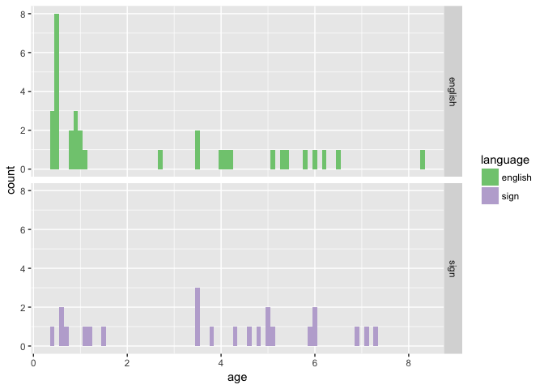
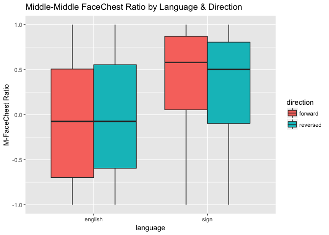
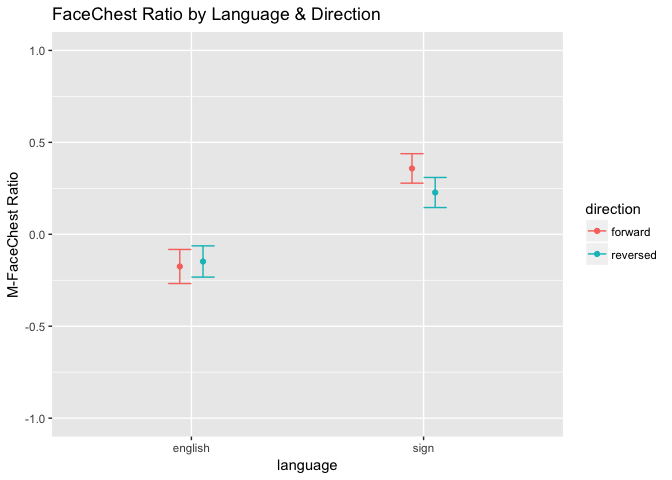
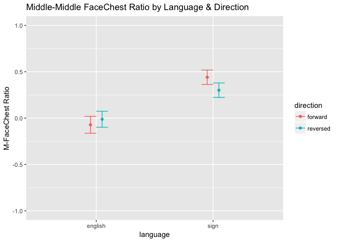

All Children's Eye Gaze (study2children)
================
Adam Stone, PhD
10-30-2017

-   [All Children!](#all-children)
-   [Statistical Testing of FCR/mFCR](#statistical-testing-of-fcrmfcr)
    -   [Language, Direction, & Age Predictors](#language-direction-age-predictors)
    -   [Direction & Language Predictors](#direction-language-predictors)
    -   [Separate for direction](#separate-for-direction)
    -   [Are Babies and Children Different?](#are-babies-and-children-different)

All Children!
=============

We're importing *both* the child and baby data. Let's get a chart of how old all our kids are.

``` r
# Libraries
library(tidyverse)
library(feather)
library(scales)
library(stringr)
library(viridis)
library(lme4)
library(lmerTest)
library(RColorBrewer)
#library(cowplot)

# Import data that's been cleaned up from 01importclean
babydata <- read_feather("cleanedbabyeyedata.feather")
kiddata <- read_feather("cleanedchildeyedata.feather")
data <- rbind(babydata,kiddata)

data_ages <- data %>%
  select(participant, language, age, group) %>%
  distinct()

ggplot(data_ages, aes(x = age, fill = language)) + geom_histogram(binwidth = 0.1) + facet_grid(language ~ .) + scale_fill_brewer(palette = "Accent")
```



Next, let's do boxplots of each AOI across all stories and kids, grouping for forward vs. reversed.

``` r
# Boxplot!
ggplot(data, aes(x = aoi, y = percent, fill = direction)) + 
  geom_boxplot() + theme(axis.text.x = element_text(angle=45, hjust = 1)) +
  ggtitle("Looking Percentages for Each AOI, All Stories") +
  scale_y_continuous(labels = scales::percent, limits = c(0,1))
```


Looks like by far most of the activity is along the Mid\*\* AOIs. Let's look closer.

``` r
data_mid <- data %>%
  filter(str_detect(aoi,"Mid"))

ggplot(data_mid, aes(x = aoi, y = percent, fill = direction)) + 
  geom_boxplot() + theme(axis.text.x = element_text(angle=45, hjust = 1)) +
  ggtitle("Looking Percentages for Middle AOIs, All Stories") +
  scale_y_continuous(labels = scales::percent, limits = c(0,1))
```


As a preliminary analysis I'm going to just look at MidChestTop and MidFaceBottom. Are there differences based on direction, group, or age for either AOI?

``` r
data_mid %>% 
  filter(aoi == "MidChestTop" | aoi == "MidFaceBottom") %>%
  ggplot(aes(x = age, y = percent, color = direction)) + geom_point(alpha = 0.25) +
  geom_smooth(method = "lm") + facet_grid(language ~ aoi) +
  scale_y_continuous(labels = scales::percent, limits = c(0,1)) +
  ggtitle("Top 2 AOIs")
```


I am not observing big differences for direction. And not strong patterns across age, although there are subtle upward trends for increased chest looking in NSE kids as they get older, but increased face looking in CODAS as they get older.

What if we defined a Face-Chest Ratio (FCR) such that:

1.  MidFaceTop, MidFaceCenter, MidFaceBottom = Face
2.  MidChestTop, MidChestCenter, MidChestBottom = Chest
3.  FCR = face - chest / face + chest

Let's try that. Let's also try only MidFaceBottom vs. MidChestTop too, and call that MFCR (for middle-middle).

Chart belows suggests group differences. CODAs overall have higher FCR ratios, AND direction effects work differently. While NSE kids generally do not show an age-related trend towards more face-looking.

``` r
data_mid <- data_mid %>%
  select(-secs, -hits) %>%
  spread(aoi,percent) %>%
  group_by(participant, trial) %>%
  mutate(face = sum(MidFaceTop, MidFaceCenter, MidFaceBottom, na.rm = TRUE),
         chest = sum(MidChestTop, MidChestCenter, MidChestBottom, na.rm = TRUE),
         fcr = (face - chest) / (face + chest),
         mfcr = (MidFaceBottom - MidChestTop) / (MidFaceBottom + MidChestTop))

ggplot(data_mid, aes(x = age, y = fcr, color = direction)) + geom_point(alpha = 0.25) +
  geom_smooth(method = "lm") + facet_wrap("language") + ggtitle("FaceChest Ratio")
```

    ## Warning: Removed 2 rows containing non-finite values (stat_smooth).

    ## Warning: Removed 2 rows containing missing values (geom_point).


Let's also check out MFCR (a stricter ratio). Almost the same thing.

``` r
ggplot(data_mid, aes(x = age, y = mfcr, color = direction)) + geom_point(alpha = 0.25) +
  geom_smooth(method = "lm") + facet_wrap("language") + ggtitle("Middle-Middle FaceChest Ratio")
```

    ## Warning: Removed 11 rows containing non-finite values (stat_smooth).

    ## Warning: Removed 11 rows containing missing values (geom_point).


So this is rad! Such obvious group differences should also be reflected in a heat map that is collapsed across age and direction. And the heat map below shows that CODAs really focus on the MidFaceBottom AOI, while English-exposed children are a bit more spread out, looking much more at the chest.

``` r
data_mid_heat <- data_mid %>%
  ungroup() %>%
  select(-face, -chest, -fcr, -mfcr) %>%
  gather(aoi, percent, MidChestBottom:MidFaceTop) %>%
  group_by(language, participant, direction, aoi) %>%
  summarise(percent = mean(percent, na.rm = TRUE)) %>%
  group_by(language, direction, aoi) %>%
  summarise(percent = mean(percent, na.rm = TRUE)) %>%
  group_by(language, aoi) %>%
  summarise(percent = mean(percent, na.rm = TRUE)) %>%
  mutate(aoi = factor(aoi, levels = c("MidChestBottom", "MidChestCenter", "MidChestTop",
                                      "MidFaceBottom", "MidFaceCenter", "MidFaceTop")))

ggplot(data_mid_heat, aes(x = language, y = aoi)) +
  geom_tile(aes(fill=percent),color="lightgray",na.rm=TRUE) + 
  scale_fill_viridis(option = "viridis", direction=-1, limits = c(0,1)) +
  theme(axis.text.x=element_text(angle=45,hjust=1)) +
  ylab("") + xlab("") + ggtitle("Eye Gaze Heat Map")
```


Statistical Testing of FCR/mFCR
===============================

Now that we've found something interesting with FCR and mFCR, let's see if it holds up in stats modeling.

Language, Direction, & Age Predictors
-------------------------------------

First, a LMM with predictors Language, Direction, and Age, and outcome variable FCR.

Here, some interesting effects (and this model was NOT working with just babies and children!).

1.  Overall group effect of language. CODA kids on average have 0.48 higher FCR than NSE kids, p = 0.0494.
2.  Significant Language X Direction interaction (p = 0.01).
3.  No effect of age.

``` r
fcr_lmm <- lmer(fcr ~ age * language * direction + (1|story) + (1|participant), data = data_mid)
summary(fcr_lmm)
```

    ## Linear mixed model fit by REML t-tests use Satterthwaite approximations
    ##   to degrees of freedom [lmerMod]
    ## Formula: 
    ## fcr ~ age * language * direction + (1 | story) + (1 | participant)
    ##    Data: data_mid
    ## 
    ## REML criterion at convergence: 983
    ## 
    ## Scaled residuals: 
    ##     Min      1Q  Median      3Q     Max 
    ## -3.2985 -0.5701  0.0738  0.6385  2.6288 
    ## 
    ## Random effects:
    ##  Groups      Name        Variance Std.Dev.
    ##  participant (Intercept) 0.19719  0.4441  
    ##  story       (Intercept) 0.01139  0.1067  
    ##  Residual                0.19170  0.4378  
    ## Number of obs: 679, groups:  participant, 52; story, 8
    ## 
    ## Fixed effects:
    ##                                      Estimate Std. Error         df
    ## (Intercept)                        -1.992e-01  1.365e-01  5.910e+01
    ## age                                 2.594e-02  3.623e-02  5.400e+01
    ## languagesign                        4.788e-01  2.383e-01  5.450e+01
    ## directionreversed                   1.173e-01  6.814e-02  6.170e+02
    ## age:languagesign                    3.269e-04  5.752e-02  5.420e+01
    ## age:directionreversed              -3.096e-02  1.924e-02  6.192e+02
    ## languagesign:directionreversed     -3.036e-01  1.248e-01  6.165e+02
    ## age:languagesign:directionreversed  4.750e-02  3.021e-02  6.228e+02
    ##                                    t value Pr(>|t|)  
    ## (Intercept)                         -1.459   0.1498  
    ## age                                  0.716   0.4770  
    ## languagesign                         2.010   0.0494 *
    ## directionreversed                    1.721   0.0857 .
    ## age:languagesign                     0.006   0.9955  
    ## age:directionreversed               -1.609   0.1081  
    ## languagesign:directionreversed      -2.433   0.0153 *
    ## age:languagesign:directionreversed   1.572   0.1164  
    ## ---
    ## Signif. codes:  0 '***' 0.001 '**' 0.01 '*' 0.05 '.' 0.1 ' ' 1
    ## 
    ## Correlation of Fixed Effects:
    ##             (Intr) age    lnggsg drctnr ag:lng ag:drc lnggs:
    ## age         -0.709                                          
    ## languagesgn -0.529  0.406                                   
    ## dirctnrvrsd -0.246  0.192  0.141                            
    ## age:lnggsgn  0.447 -0.630 -0.817 -0.121                     
    ## ag:drctnrvr  0.181 -0.263 -0.104 -0.735  0.168              
    ## lnggsgn:drc  0.135 -0.105 -0.256 -0.546  0.210  0.402       
    ## ag:lnggsgn: -0.116  0.169  0.209  0.469 -0.260 -0.644 -0.815

Let's repeat the LMM with outcome mFCR. Stronger statistical values.

1.  Overall group effect of language, p = 0.361.
2.  Significant Direction effect, p = 0.0485.
3.  Significant Language X Direction interaction (p = 0.01).
4.  No effect of age.

``` r
mfcr_lmm <- lmer(mfcr ~ age * language * direction + (1|story) + (1|participant), data = data_mid)
summary(mfcr_lmm)
```

    ## Linear mixed model fit by REML t-tests use Satterthwaite approximations
    ##   to degrees of freedom [lmerMod]
    ## Formula: 
    ## mfcr ~ age * language * direction + (1 | story) + (1 | participant)
    ##    Data: data_mid
    ## 
    ## REML criterion at convergence: 1020.4
    ## 
    ## Scaled residuals: 
    ##     Min      1Q  Median      3Q     Max 
    ## -3.2362 -0.5702  0.1017  0.6537  2.6656 
    ## 
    ## Random effects:
    ##  Groups      Name        Variance Std.Dev.
    ##  participant (Intercept) 0.183879 0.42881 
    ##  story       (Intercept) 0.006644 0.08151 
    ##  Residual                0.209652 0.45788 
    ## Number of obs: 670, groups:  participant, 52; story, 8
    ## 
    ## Fixed effects:
    ##                                     Estimate Std. Error        df t value
    ## (Intercept)                         -0.14961    0.13168  59.10000  -1.136
    ## age                                  0.03187    0.03541  55.00000   0.900
    ## languagesign                         0.50046    0.23297  55.50000   2.148
    ## directionreversed                    0.14235    0.07202 608.60000   1.977
    ## age:languagesign                    -0.01094    0.05620  55.10000  -0.195
    ## age:directionreversed               -0.02991    0.02019 596.00000  -1.481
    ## languagesign:directionreversed      -0.33812    0.13093 607.80000  -2.582
    ## age:languagesign:directionreversed   0.04713    0.03167 612.50000   1.488
    ##                                    Pr(>|t|)  
    ## (Intercept)                          0.2605  
    ## age                                  0.3720  
    ## languagesign                         0.0361 *
    ## directionreversed                    0.0485 *
    ## age:languagesign                     0.8464  
    ## age:directionreversed                0.1391  
    ## languagesign:directionreversed       0.0100 *
    ## age:languagesign:directionreversed   0.1372  
    ## ---
    ## Signif. codes:  0 '***' 0.001 '**' 0.01 '*' 0.05 '.' 0.1 ' ' 1
    ## 
    ## Correlation of Fixed Effects:
    ##             (Intr) age    lnggsg drctnr ag:lng ag:drc lnggs:
    ## age         -0.720                                          
    ## languagesgn -0.538  0.407                                   
    ## dirctnrvrsd -0.272  0.208  0.154                            
    ## age:lnggsgn  0.454 -0.631 -0.817 -0.131                     
    ## ag:drctnrvr  0.200 -0.280 -0.113 -0.737  0.178              
    ## lnggsgn:drc  0.150 -0.115 -0.275 -0.550  0.225  0.406       
    ## ag:lnggsgn: -0.128  0.181  0.225  0.471 -0.277 -0.644 -0.815

What if we did ANCOVAs (C because age would be a covariate). First, FCR as outcome.

Direction & Language Predictors
-------------------------------

In the LMMs we've run so far, age is always the worst predictor. So we should take that out.

1.  Strong effect of language (p &lt; 0.001)
2.  Significant language x direction interaction (p = 0.02).

``` r
fcr_lmm_noage <- lmer(fcr ~ direction * language + (1|story) + (1|participant), data = data_mid)
summary(fcr_lmm_noage)
```

    ## Linear mixed model fit by REML t-tests use Satterthwaite approximations
    ##   to degrees of freedom [lmerMod]
    ## Formula: fcr ~ direction * language + (1 | story) + (1 | participant)
    ##    Data: data_mid
    ## 
    ## REML criterion at convergence: 965.7
    ## 
    ## Scaled residuals: 
    ##     Min      1Q  Median      3Q     Max 
    ## -3.2858 -0.5876  0.0699  0.6394  2.5516 
    ## 
    ## Random effects:
    ##  Groups      Name        Variance Std.Dev.
    ##  participant (Intercept) 0.19269  0.4390  
    ##  story       (Intercept) 0.01172  0.1082  
    ##  Residual                0.19192  0.4381  
    ## Number of obs: 679, groups:  participant, 52; story, 8
    ## 
    ## Fixed effects:
    ##                                 Estimate Std. Error        df t value
    ## (Intercept)                     -0.13116    0.09572  56.30000  -1.370
    ## directionreversed                0.03697    0.04622 624.80000   0.800
    ## languagesign                     0.51232    0.13197  56.30000   3.882
    ## directionreversed:languagesign  -0.15917    0.06954 624.70000  -2.289
    ##                                Pr(>|t|)    
    ## (Intercept)                    0.176042    
    ## directionreversed              0.424117    
    ## languagesign                   0.000274 ***
    ## directionreversed:languagesign 0.022413 *  
    ## ---
    ## Signif. codes:  0 '***' 0.001 '**' 0.01 '*' 0.05 '.' 0.1 ' ' 1
    ## 
    ## Correlation of Fixed Effects:
    ##             (Intr) drctnr lnggsg
    ## dirctnrvrsd -0.239              
    ## languagesgn -0.610  0.176       
    ## drctnrvrsd:  0.161 -0.674 -0.261

The mFCR LMM gives us similar results.

``` r
mfcr_lmm_noage <- lmer(mfcr ~ direction * language + (1|story) + (1|participant), data = data_mid)
summary(mfcr_lmm_noage)
```

    ## Linear mixed model fit by REML t-tests use Satterthwaite approximations
    ##   to degrees of freedom [lmerMod]
    ## Formula: mfcr ~ direction * language + (1 | story) + (1 | participant)
    ##    Data: data_mid
    ## 
    ## REML criterion at convergence: 1002.8
    ## 
    ## Scaled residuals: 
    ##     Min      1Q  Median      3Q     Max 
    ## -3.2200 -0.5743  0.1016  0.6500  2.5874 
    ## 
    ## Random effects:
    ##  Groups      Name        Variance Std.Dev.
    ##  participant (Intercept) 0.179470 0.42364 
    ##  story       (Intercept) 0.006779 0.08233 
    ##  Residual                0.209796 0.45803 
    ## Number of obs: 670, groups:  participant, 52; story, 8
    ## 
    ## Fixed effects:
    ##                                 Estimate Std. Error        df t value
    ## (Intercept)                     -0.06474    0.09058  59.00000  -0.715
    ## directionreversed                0.06383    0.04866 612.60000   1.312
    ## languagesign                     0.49658    0.12896  57.40000   3.851
    ## directionreversed:languagesign  -0.19294    0.07309 616.20000  -2.640
    ##                                Pr(>|t|)    
    ## (Intercept)                    0.477595    
    ## directionreversed              0.190106    
    ## languagesign                   0.000299 ***
    ## directionreversed:languagesign 0.008502 ** 
    ## ---
    ## Signif. codes:  0 '***' 0.001 '**' 0.01 '*' 0.05 '.' 0.1 ' ' 1
    ## 
    ## Correlation of Fixed Effects:
    ##             (Intr) drctnr lnggsg
    ## dirctnrvrsd -0.266              
    ## languagesgn -0.630  0.190       
    ## drctnrvrsd:  0.180 -0.675 -0.280

Separate for direction
----------------------

Forward only. Language effect, p &lt; 0.001. (I ran this WITH age, and age was not significant).

``` r
fcr_lmm_langonly_f <- lmer(fcr ~ language + (1|story) + (1|participant), data = filter(data_mid,direction=="forward"))
summary(fcr_lmm_langonly_f)
```

    ## Linear mixed model fit by REML t-tests use Satterthwaite approximations
    ##   to degrees of freedom [lmerMod]
    ## Formula: fcr ~ language + (1 | story) + (1 | participant)
    ##    Data: filter(data_mid, direction == "forward")
    ## 
    ## REML criterion at convergence: 484.4
    ## 
    ## Scaled residuals: 
    ##      Min       1Q   Median       3Q      Max 
    ## -3.15139 -0.51393  0.05683  0.53638  2.47387 
    ## 
    ## Random effects:
    ##  Groups      Name        Variance Std.Dev.
    ##  participant (Intercept) 0.19292  0.4392  
    ##  story       (Intercept) 0.03161  0.1778  
    ##  Residual                0.16505  0.4063  
    ## Number of obs: 343, groups:  participant, 52; story, 8
    ## 
    ## Fixed effects:
    ##              Estimate Std. Error      df t value Pr(>|t|)    
    ## (Intercept)   -0.1301     0.1083 30.9800  -1.202 0.238457    
    ## languagesign   0.5079     0.1319 49.0700   3.849 0.000343 ***
    ## ---
    ## Signif. codes:  0 '***' 0.001 '**' 0.01 '*' 0.05 '.' 0.1 ' ' 1
    ## 
    ## Correlation of Fixed Effects:
    ##             (Intr)
    ## languagesgn -0.546

Reversed only. Slightly weaker language effect, p = 0.008. (I ran this with AGE too and not sig.)

``` r
fcr_lmm_langonly_r <- lmer(fcr ~ language + (1|story) + (1|participant), data = filter(data_mid,direction=="reversed"))
summary(fcr_lmm_langonly_r)
```

    ## Linear mixed model fit by REML t-tests use Satterthwaite approximations
    ##   to degrees of freedom [lmerMod]
    ## Formula: fcr ~ language + (1 | story) + (1 | participant)
    ##    Data: filter(data_mid, direction == "reversed")
    ## 
    ## REML criterion at convergence: 536.8
    ## 
    ## Scaled residuals: 
    ##     Min      1Q  Median      3Q     Max 
    ## -3.2441 -0.6030  0.0485  0.6073  2.7886 
    ## 
    ## Random effects:
    ##  Groups      Name        Variance Std.Dev.
    ##  participant (Intercept) 0.17794  0.4218  
    ##  story       (Intercept) 0.01275  0.1129  
    ##  Residual                0.20997  0.4582  
    ## Number of obs: 336, groups:  participant, 52; story, 8
    ## 
    ## Fixed effects:
    ##              Estimate Std. Error       df t value Pr(>|t|)   
    ## (Intercept)  -0.09247    0.09494 41.23000  -0.974  0.33574   
    ## languagesign  0.35437    0.12932 48.59000   2.740  0.00856 **
    ## ---
    ## Signif. codes:  0 '***' 0.001 '**' 0.01 '*' 0.05 '.' 0.1 ' ' 1
    ## 
    ## Correlation of Fixed Effects:
    ##             (Intr)
    ## languagesgn -0.606

Let's go ahead and plot boxplots to represent LMMs with only language as an important effect. (We can add in direction too). FaceChest Ratio here.

``` r
ggplot(data_mid, aes(x = language, y = fcr, fill = language)) + geom_boxplot() + scale_fill_brewer(palette = "Dark2") + ylab("FaceChest Ratio") + ggtitle("FaceChest Ratio by Language")
```

    ## Warning: Removed 2 rows containing non-finite values (stat_boxplot).


``` r
ggplot(data_mid, aes(x = language, y = fcr, fill = direction)) + geom_boxplot() + ylab("FaceChest Ratio") + ggtitle("FaceChest Ratio by Language & Direction")
```

    ## Warning: Removed 2 rows containing non-finite values (stat_boxplot).


And Middle-Middle FaceChest Ratio here.

``` r
ggplot(data_mid, aes(x = language, y = mfcr, fill = language)) + geom_boxplot() + scale_fill_brewer(palette = "Dark2") + ylab("M-FaceChest Ratio") + ggtitle("Middle-Middle FaceChest Ratio by Language")
```

    ## Warning: Removed 11 rows containing non-finite values (stat_boxplot).


``` r
ggplot(data_mid, aes(x = language, y = mfcr, fill = direction)) + geom_boxplot() + ylab("M-FaceChest Ratio") + ggtitle("Middle-Middle FaceChest Ratio by Language & Direction")
```

    ## Warning: Removed 11 rows containing non-finite values (stat_boxplot).



Maybe error bars would be nice here. Let's do it.

``` r
data_mid_fcr <- data_mid %>%
  group_by(language, participant, direction) %>%
  summarise(fcr_mean_subj = mean(fcr, na.rm=TRUE)) %>%
  group_by(language, direction) %>%
  summarise(fcr_mean = mean(fcr_mean_subj, na.rm=TRUE),
            fcr_sd = sd(fcr_mean_subj, na.rm=TRUE),
            fcr_n = n()) %>%
  ungroup() %>%
  mutate(fcr_se = fcr_sd/sqrt(fcr_n))

ggplot(data_mid_fcr, aes(x = language, y = fcr_mean, color = direction, group = direction, fill = direction)) + geom_errorbar(aes(ymin = fcr_mean-fcr_se, ymax = fcr_mean+fcr_se), position = "dodge", width = 0.2) +
  geom_point(position = position_dodge(width = 0.2)) + scale_y_continuous(limits = c(-1,1)) + ylab("M-FaceChest Ratio") + ggtitle("FaceChest Ratio by Language & Direction")
```



``` r
data_mid_mfcr <- data_mid %>%
  group_by(language, participant, direction) %>%
  summarise(fcr_mean_subj = mean(mfcr, na.rm=TRUE)) %>%
  group_by(language, direction) %>%
  summarise(fcr_mean = mean(fcr_mean_subj, na.rm=TRUE),
            fcr_sd = sd(fcr_mean_subj, na.rm=TRUE),
            fcr_n = n()) %>%
  ungroup() %>%
  mutate(fcr_se = fcr_sd/sqrt(fcr_n))

ggplot(data_mid_mfcr, aes(x = language, y = fcr_mean, color = direction, group = direction, fill = direction)) + geom_errorbar(aes(ymin = fcr_mean-fcr_se, ymax = fcr_mean+fcr_se), position = "dodge", width = 0.2) +
  geom_point(position = position_dodge(width = 0.2)) + scale_y_continuous(limits = c(-1,1)) + ylab("M-FaceChest Ratio") + ggtitle("Middle-Middle FaceChest Ratio by Language & Direction")
```



``` r
data_mid_fcr <- data_mid %>%
  group_by(language, participant) %>%
  summarise(fcr_mean_subj = mean(fcr, na.rm=TRUE)) %>%
  group_by(language) %>%
  summarise(fcr_mean = mean(fcr_mean_subj, na.rm=TRUE),
            fcr_sd = sd(fcr_mean_subj, na.rm=TRUE),
            fcr_n = n()) %>%
  ungroup() %>%
  mutate(fcr_se = fcr_sd/sqrt(fcr_n))

ggplot(data_mid_fcr, aes(x = language, y = fcr_mean, color = language)) + geom_errorbar(aes(ymin = fcr_mean-fcr_se, ymax = fcr_mean+fcr_se), width = 0.2) +
  geom_point() + scale_y_continuous(limits = c(-1,1)) + ylab("M-FaceChest Ratio") + ggtitle("FaceChest Ratio by Language") + scale_color_brewer(palette = "Dark2")
```


``` r
data_mid_mfcr <- data_mid %>%
  group_by(language, participant) %>%
  summarise(fcr_mean_subj = mean(mfcr, na.rm=TRUE)) %>%
  group_by(language) %>%
  summarise(fcr_mean = mean(fcr_mean_subj, na.rm=TRUE),
            fcr_sd = sd(fcr_mean_subj, na.rm=TRUE),
            fcr_n = n()) %>%
  ungroup() %>%
  mutate(fcr_se = fcr_sd/sqrt(fcr_n))

ggplot(data_mid_mfcr, aes(x = language, y = fcr_mean, color = language)) + geom_errorbar(aes(ymin = fcr_mean-fcr_se, ymax = fcr_mean+fcr_se), width = 0.2) +
  geom_point() + scale_y_continuous(limits = c(-1,1)) + ylab("M-FaceChest Ratio") + ggtitle("Middle-Middle FaceChest Ratio by Language") + scale_color_brewer(palette = "Dark2")
```


Are Babies and Children Different?
----------------------------------

Quick check here. First, are CODA babies different from CODA children?

``` r
data_mid <- data_mid %>% 
  mutate(agegroup = ifelse(age < 2, "baby", "child")) %>%
  mutate(agegroup = as.factor(agegroup))
```

    ## Warning in mutate_impl(.data, dots): Unequal factor levels: coercing to
    ## character

    ## Warning in mutate_impl(.data, dots): binding character and factor vector,
    ## coercing into character vector

    ## Warning in mutate_impl(.data, dots): binding character and factor vector,
    ## coercing into character vector

    ## Warning in mutate_impl(.data, dots): binding character and factor vector,
    ## coercing into character vector

    ## Warning in mutate_impl(.data, dots): binding character and factor vector,
    ## coercing into character vector

    ## Warning in mutate_impl(.data, dots): binding character and factor vector,
    ## coercing into character vector

    ## Warning in mutate_impl(.data, dots): binding character and factor vector,
    ## coercing into character vector

    ## Warning in mutate_impl(.data, dots): binding character and factor vector,
    ## coercing into character vector

    ## Warning in mutate_impl(.data, dots): binding character and factor vector,
    ## coercing into character vector

    ## Warning in mutate_impl(.data, dots): binding character and factor vector,
    ## coercing into character vector

    ## Warning in mutate_impl(.data, dots): binding character and factor vector,
    ## coercing into character vector

    ## Warning in mutate_impl(.data, dots): binding character and factor vector,
    ## coercing into character vector

    ## Warning in mutate_impl(.data, dots): binding character and factor vector,
    ## coercing into character vector

    ## Warning in mutate_impl(.data, dots): binding character and factor vector,
    ## coercing into character vector

    ## Warning in mutate_impl(.data, dots): binding character and factor vector,
    ## coercing into character vector

    ## Warning in mutate_impl(.data, dots): binding character and factor vector,
    ## coercing into character vector

    ## Warning in mutate_impl(.data, dots): binding character and factor vector,
    ## coercing into character vector

    ## Warning in mutate_impl(.data, dots): binding character and factor vector,
    ## coercing into character vector

    ## Warning in mutate_impl(.data, dots): binding character and factor vector,
    ## coercing into character vector

    ## Warning in mutate_impl(.data, dots): binding character and factor vector,
    ## coercing into character vector

    ## Warning in mutate_impl(.data, dots): binding character and factor vector,
    ## coercing into character vector

    ## Warning in mutate_impl(.data, dots): binding character and factor vector,
    ## coercing into character vector

    ## Warning in mutate_impl(.data, dots): binding character and factor vector,
    ## coercing into character vector

    ## Warning in mutate_impl(.data, dots): binding character and factor vector,
    ## coercing into character vector

    ## Warning in mutate_impl(.data, dots): binding character and factor vector,
    ## coercing into character vector

    ## Warning in mutate_impl(.data, dots): binding character and factor vector,
    ## coercing into character vector

    ## Warning in mutate_impl(.data, dots): binding character and factor vector,
    ## coercing into character vector

    ## Warning in mutate_impl(.data, dots): binding character and factor vector,
    ## coercing into character vector

    ## Warning in mutate_impl(.data, dots): binding character and factor vector,
    ## coercing into character vector

    ## Warning in mutate_impl(.data, dots): binding character and factor vector,
    ## coercing into character vector

    ## Warning in mutate_impl(.data, dots): binding character and factor vector,
    ## coercing into character vector

    ## Warning in mutate_impl(.data, dots): binding character and factor vector,
    ## coercing into character vector

    ## Warning in mutate_impl(.data, dots): binding character and factor vector,
    ## coercing into character vector

    ## Warning in mutate_impl(.data, dots): binding character and factor vector,
    ## coercing into character vector

    ## Warning in mutate_impl(.data, dots): binding character and factor vector,
    ## coercing into character vector

    ## Warning in mutate_impl(.data, dots): binding character and factor vector,
    ## coercing into character vector

    ## Warning in mutate_impl(.data, dots): binding character and factor vector,
    ## coercing into character vector

    ## Warning in mutate_impl(.data, dots): binding character and factor vector,
    ## coercing into character vector

    ## Warning in mutate_impl(.data, dots): binding character and factor vector,
    ## coercing into character vector

    ## Warning in mutate_impl(.data, dots): binding character and factor vector,
    ## coercing into character vector

    ## Warning in mutate_impl(.data, dots): binding character and factor vector,
    ## coercing into character vector

    ## Warning in mutate_impl(.data, dots): binding character and factor vector,
    ## coercing into character vector

    ## Warning in mutate_impl(.data, dots): binding character and factor vector,
    ## coercing into character vector

    ## Warning in mutate_impl(.data, dots): binding character and factor vector,
    ## coercing into character vector

    ## Warning in mutate_impl(.data, dots): binding character and factor vector,
    ## coercing into character vector

    ## Warning in mutate_impl(.data, dots): binding character and factor vector,
    ## coercing into character vector

    ## Warning in mutate_impl(.data, dots): binding character and factor vector,
    ## coercing into character vector

    ## Warning in mutate_impl(.data, dots): binding character and factor vector,
    ## coercing into character vector

    ## Warning in mutate_impl(.data, dots): binding character and factor vector,
    ## coercing into character vector

    ## Warning in mutate_impl(.data, dots): binding character and factor vector,
    ## coercing into character vector

    ## Warning in mutate_impl(.data, dots): binding character and factor vector,
    ## coercing into character vector

    ## Warning in mutate_impl(.data, dots): binding character and factor vector,
    ## coercing into character vector

    ## Warning in mutate_impl(.data, dots): binding character and factor vector,
    ## coercing into character vector

    ## Warning in mutate_impl(.data, dots): binding character and factor vector,
    ## coercing into character vector

    ## Warning in mutate_impl(.data, dots): binding character and factor vector,
    ## coercing into character vector

    ## Warning in mutate_impl(.data, dots): binding character and factor vector,
    ## coercing into character vector

    ## Warning in mutate_impl(.data, dots): binding character and factor vector,
    ## coercing into character vector

    ## Warning in mutate_impl(.data, dots): binding character and factor vector,
    ## coercing into character vector

    ## Warning in mutate_impl(.data, dots): binding character and factor vector,
    ## coercing into character vector

    ## Warning in mutate_impl(.data, dots): binding character and factor vector,
    ## coercing into character vector

    ## Warning in mutate_impl(.data, dots): binding character and factor vector,
    ## coercing into character vector

    ## Warning in mutate_impl(.data, dots): binding character and factor vector,
    ## coercing into character vector

    ## Warning in mutate_impl(.data, dots): binding character and factor vector,
    ## coercing into character vector

    ## Warning in mutate_impl(.data, dots): binding character and factor vector,
    ## coercing into character vector

    ## Warning in mutate_impl(.data, dots): binding character and factor vector,
    ## coercing into character vector

    ## Warning in mutate_impl(.data, dots): binding character and factor vector,
    ## coercing into character vector

    ## Warning in mutate_impl(.data, dots): binding character and factor vector,
    ## coercing into character vector

    ## Warning in mutate_impl(.data, dots): binding character and factor vector,
    ## coercing into character vector

    ## Warning in mutate_impl(.data, dots): binding character and factor vector,
    ## coercing into character vector

    ## Warning in mutate_impl(.data, dots): binding character and factor vector,
    ## coercing into character vector

    ## Warning in mutate_impl(.data, dots): binding character and factor vector,
    ## coercing into character vector

    ## Warning in mutate_impl(.data, dots): binding character and factor vector,
    ## coercing into character vector

    ## Warning in mutate_impl(.data, dots): binding character and factor vector,
    ## coercing into character vector

    ## Warning in mutate_impl(.data, dots): binding character and factor vector,
    ## coercing into character vector

    ## Warning in mutate_impl(.data, dots): binding character and factor vector,
    ## coercing into character vector

    ## Warning in mutate_impl(.data, dots): binding character and factor vector,
    ## coercing into character vector

    ## Warning in mutate_impl(.data, dots): binding character and factor vector,
    ## coercing into character vector

    ## Warning in mutate_impl(.data, dots): binding character and factor vector,
    ## coercing into character vector

    ## Warning in mutate_impl(.data, dots): binding character and factor vector,
    ## coercing into character vector

    ## Warning in mutate_impl(.data, dots): binding character and factor vector,
    ## coercing into character vector

    ## Warning in mutate_impl(.data, dots): binding character and factor vector,
    ## coercing into character vector

    ## Warning in mutate_impl(.data, dots): binding character and factor vector,
    ## coercing into character vector

    ## Warning in mutate_impl(.data, dots): binding character and factor vector,
    ## coercing into character vector

    ## Warning in mutate_impl(.data, dots): binding character and factor vector,
    ## coercing into character vector

    ## Warning in mutate_impl(.data, dots): binding character and factor vector,
    ## coercing into character vector

    ## Warning in mutate_impl(.data, dots): binding character and factor vector,
    ## coercing into character vector

    ## Warning in mutate_impl(.data, dots): binding character and factor vector,
    ## coercing into character vector

    ## Warning in mutate_impl(.data, dots): binding character and factor vector,
    ## coercing into character vector

    ## Warning in mutate_impl(.data, dots): binding character and factor vector,
    ## coercing into character vector

    ## Warning in mutate_impl(.data, dots): binding character and factor vector,
    ## coercing into character vector

    ## Warning in mutate_impl(.data, dots): binding character and factor vector,
    ## coercing into character vector

    ## Warning in mutate_impl(.data, dots): binding character and factor vector,
    ## coercing into character vector

    ## Warning in mutate_impl(.data, dots): binding character and factor vector,
    ## coercing into character vector

    ## Warning in mutate_impl(.data, dots): binding character and factor vector,
    ## coercing into character vector

    ## Warning in mutate_impl(.data, dots): binding character and factor vector,
    ## coercing into character vector

    ## Warning in mutate_impl(.data, dots): binding character and factor vector,
    ## coercing into character vector

    ## Warning in mutate_impl(.data, dots): binding character and factor vector,
    ## coercing into character vector

    ## Warning in mutate_impl(.data, dots): binding character and factor vector,
    ## coercing into character vector

    ## Warning in mutate_impl(.data, dots): binding character and factor vector,
    ## coercing into character vector

    ## Warning in mutate_impl(.data, dots): binding character and factor vector,
    ## coercing into character vector

    ## Warning in mutate_impl(.data, dots): binding character and factor vector,
    ## coercing into character vector

    ## Warning in mutate_impl(.data, dots): binding character and factor vector,
    ## coercing into character vector

    ## Warning in mutate_impl(.data, dots): binding character and factor vector,
    ## coercing into character vector

    ## Warning in mutate_impl(.data, dots): binding character and factor vector,
    ## coercing into character vector

    ## Warning in mutate_impl(.data, dots): binding character and factor vector,
    ## coercing into character vector

    ## Warning in mutate_impl(.data, dots): binding character and factor vector,
    ## coercing into character vector

    ## Warning in mutate_impl(.data, dots): binding character and factor vector,
    ## coercing into character vector

    ## Warning in mutate_impl(.data, dots): binding character and factor vector,
    ## coercing into character vector

    ## Warning in mutate_impl(.data, dots): binding character and factor vector,
    ## coercing into character vector

    ## Warning in mutate_impl(.data, dots): binding character and factor vector,
    ## coercing into character vector

    ## Warning in mutate_impl(.data, dots): binding character and factor vector,
    ## coercing into character vector

    ## Warning in mutate_impl(.data, dots): binding character and factor vector,
    ## coercing into character vector

    ## Warning in mutate_impl(.data, dots): binding character and factor vector,
    ## coercing into character vector

    ## Warning in mutate_impl(.data, dots): binding character and factor vector,
    ## coercing into character vector

    ## Warning in mutate_impl(.data, dots): binding character and factor vector,
    ## coercing into character vector

    ## Warning in mutate_impl(.data, dots): binding character and factor vector,
    ## coercing into character vector

    ## Warning in mutate_impl(.data, dots): binding character and factor vector,
    ## coercing into character vector

    ## Warning in mutate_impl(.data, dots): binding character and factor vector,
    ## coercing into character vector

    ## Warning in mutate_impl(.data, dots): binding character and factor vector,
    ## coercing into character vector

    ## Warning in mutate_impl(.data, dots): binding character and factor vector,
    ## coercing into character vector

    ## Warning in mutate_impl(.data, dots): binding character and factor vector,
    ## coercing into character vector

    ## Warning in mutate_impl(.data, dots): binding character and factor vector,
    ## coercing into character vector

    ## Warning in mutate_impl(.data, dots): binding character and factor vector,
    ## coercing into character vector

    ## Warning in mutate_impl(.data, dots): binding character and factor vector,
    ## coercing into character vector

    ## Warning in mutate_impl(.data, dots): binding character and factor vector,
    ## coercing into character vector

    ## Warning in mutate_impl(.data, dots): binding character and factor vector,
    ## coercing into character vector

    ## Warning in mutate_impl(.data, dots): binding character and factor vector,
    ## coercing into character vector

    ## Warning in mutate_impl(.data, dots): binding character and factor vector,
    ## coercing into character vector

    ## Warning in mutate_impl(.data, dots): binding character and factor vector,
    ## coercing into character vector

    ## Warning in mutate_impl(.data, dots): binding character and factor vector,
    ## coercing into character vector

    ## Warning in mutate_impl(.data, dots): binding character and factor vector,
    ## coercing into character vector

    ## Warning in mutate_impl(.data, dots): binding character and factor vector,
    ## coercing into character vector

    ## Warning in mutate_impl(.data, dots): binding character and factor vector,
    ## coercing into character vector

    ## Warning in mutate_impl(.data, dots): binding character and factor vector,
    ## coercing into character vector

    ## Warning in mutate_impl(.data, dots): binding character and factor vector,
    ## coercing into character vector

    ## Warning in mutate_impl(.data, dots): binding character and factor vector,
    ## coercing into character vector

    ## Warning in mutate_impl(.data, dots): binding character and factor vector,
    ## coercing into character vector

    ## Warning in mutate_impl(.data, dots): binding character and factor vector,
    ## coercing into character vector

    ## Warning in mutate_impl(.data, dots): binding character and factor vector,
    ## coercing into character vector

    ## Warning in mutate_impl(.data, dots): binding character and factor vector,
    ## coercing into character vector

    ## Warning in mutate_impl(.data, dots): binding character and factor vector,
    ## coercing into character vector

    ## Warning in mutate_impl(.data, dots): binding character and factor vector,
    ## coercing into character vector

    ## Warning in mutate_impl(.data, dots): binding character and factor vector,
    ## coercing into character vector

    ## Warning in mutate_impl(.data, dots): binding character and factor vector,
    ## coercing into character vector

    ## Warning in mutate_impl(.data, dots): binding character and factor vector,
    ## coercing into character vector

    ## Warning in mutate_impl(.data, dots): binding character and factor vector,
    ## coercing into character vector

    ## Warning in mutate_impl(.data, dots): binding character and factor vector,
    ## coercing into character vector

    ## Warning in mutate_impl(.data, dots): binding character and factor vector,
    ## coercing into character vector

    ## Warning in mutate_impl(.data, dots): binding character and factor vector,
    ## coercing into character vector

    ## Warning in mutate_impl(.data, dots): binding character and factor vector,
    ## coercing into character vector

    ## Warning in mutate_impl(.data, dots): binding character and factor vector,
    ## coercing into character vector

    ## Warning in mutate_impl(.data, dots): binding character and factor vector,
    ## coercing into character vector

    ## Warning in mutate_impl(.data, dots): binding character and factor vector,
    ## coercing into character vector

    ## Warning in mutate_impl(.data, dots): binding character and factor vector,
    ## coercing into character vector

    ## Warning in mutate_impl(.data, dots): binding character and factor vector,
    ## coercing into character vector

    ## Warning in mutate_impl(.data, dots): binding character and factor vector,
    ## coercing into character vector

    ## Warning in mutate_impl(.data, dots): binding character and factor vector,
    ## coercing into character vector

    ## Warning in mutate_impl(.data, dots): binding character and factor vector,
    ## coercing into character vector

    ## Warning in mutate_impl(.data, dots): binding character and factor vector,
    ## coercing into character vector

    ## Warning in mutate_impl(.data, dots): binding character and factor vector,
    ## coercing into character vector

    ## Warning in mutate_impl(.data, dots): binding character and factor vector,
    ## coercing into character vector

    ## Warning in mutate_impl(.data, dots): binding character and factor vector,
    ## coercing into character vector

    ## Warning in mutate_impl(.data, dots): binding character and factor vector,
    ## coercing into character vector

    ## Warning in mutate_impl(.data, dots): binding character and factor vector,
    ## coercing into character vector

    ## Warning in mutate_impl(.data, dots): binding character and factor vector,
    ## coercing into character vector

    ## Warning in mutate_impl(.data, dots): binding character and factor vector,
    ## coercing into character vector

    ## Warning in mutate_impl(.data, dots): binding character and factor vector,
    ## coercing into character vector

    ## Warning in mutate_impl(.data, dots): binding character and factor vector,
    ## coercing into character vector

    ## Warning in mutate_impl(.data, dots): binding character and factor vector,
    ## coercing into character vector

    ## Warning in mutate_impl(.data, dots): binding character and factor vector,
    ## coercing into character vector

    ## Warning in mutate_impl(.data, dots): binding character and factor vector,
    ## coercing into character vector

    ## Warning in mutate_impl(.data, dots): binding character and factor vector,
    ## coercing into character vector

    ## Warning in mutate_impl(.data, dots): binding character and factor vector,
    ## coercing into character vector

    ## Warning in mutate_impl(.data, dots): binding character and factor vector,
    ## coercing into character vector

    ## Warning in mutate_impl(.data, dots): binding character and factor vector,
    ## coercing into character vector

    ## Warning in mutate_impl(.data, dots): binding character and factor vector,
    ## coercing into character vector

    ## Warning in mutate_impl(.data, dots): binding character and factor vector,
    ## coercing into character vector

    ## Warning in mutate_impl(.data, dots): binding character and factor vector,
    ## coercing into character vector

    ## Warning in mutate_impl(.data, dots): binding character and factor vector,
    ## coercing into character vector

    ## Warning in mutate_impl(.data, dots): binding character and factor vector,
    ## coercing into character vector

    ## Warning in mutate_impl(.data, dots): binding character and factor vector,
    ## coercing into character vector

    ## Warning in mutate_impl(.data, dots): binding character and factor vector,
    ## coercing into character vector

    ## Warning in mutate_impl(.data, dots): binding character and factor vector,
    ## coercing into character vector

    ## Warning in mutate_impl(.data, dots): binding character and factor vector,
    ## coercing into character vector

    ## Warning in mutate_impl(.data, dots): binding character and factor vector,
    ## coercing into character vector

    ## Warning in mutate_impl(.data, dots): binding character and factor vector,
    ## coercing into character vector

    ## Warning in mutate_impl(.data, dots): binding character and factor vector,
    ## coercing into character vector

    ## Warning in mutate_impl(.data, dots): binding character and factor vector,
    ## coercing into character vector

    ## Warning in mutate_impl(.data, dots): binding character and factor vector,
    ## coercing into character vector

    ## Warning in mutate_impl(.data, dots): binding character and factor vector,
    ## coercing into character vector

    ## Warning in mutate_impl(.data, dots): binding character and factor vector,
    ## coercing into character vector

    ## Warning in mutate_impl(.data, dots): binding character and factor vector,
    ## coercing into character vector

    ## Warning in mutate_impl(.data, dots): binding character and factor vector,
    ## coercing into character vector

    ## Warning in mutate_impl(.data, dots): binding character and factor vector,
    ## coercing into character vector

    ## Warning in mutate_impl(.data, dots): binding character and factor vector,
    ## coercing into character vector

    ## Warning in mutate_impl(.data, dots): binding character and factor vector,
    ## coercing into character vector

    ## Warning in mutate_impl(.data, dots): binding character and factor vector,
    ## coercing into character vector

    ## Warning in mutate_impl(.data, dots): binding character and factor vector,
    ## coercing into character vector

    ## Warning in mutate_impl(.data, dots): binding character and factor vector,
    ## coercing into character vector

    ## Warning in mutate_impl(.data, dots): binding character and factor vector,
    ## coercing into character vector

    ## Warning in mutate_impl(.data, dots): binding character and factor vector,
    ## coercing into character vector

    ## Warning in mutate_impl(.data, dots): binding character and factor vector,
    ## coercing into character vector

    ## Warning in mutate_impl(.data, dots): binding character and factor vector,
    ## coercing into character vector

    ## Warning in mutate_impl(.data, dots): binding character and factor vector,
    ## coercing into character vector

    ## Warning in mutate_impl(.data, dots): binding character and factor vector,
    ## coercing into character vector

    ## Warning in mutate_impl(.data, dots): binding character and factor vector,
    ## coercing into character vector

    ## Warning in mutate_impl(.data, dots): binding character and factor vector,
    ## coercing into character vector

    ## Warning in mutate_impl(.data, dots): binding character and factor vector,
    ## coercing into character vector

    ## Warning in mutate_impl(.data, dots): binding character and factor vector,
    ## coercing into character vector

    ## Warning in mutate_impl(.data, dots): binding character and factor vector,
    ## coercing into character vector

    ## Warning in mutate_impl(.data, dots): binding character and factor vector,
    ## coercing into character vector

    ## Warning in mutate_impl(.data, dots): binding character and factor vector,
    ## coercing into character vector

    ## Warning in mutate_impl(.data, dots): binding character and factor vector,
    ## coercing into character vector

    ## Warning in mutate_impl(.data, dots): binding character and factor vector,
    ## coercing into character vector

    ## Warning in mutate_impl(.data, dots): binding character and factor vector,
    ## coercing into character vector

    ## Warning in mutate_impl(.data, dots): binding character and factor vector,
    ## coercing into character vector

    ## Warning in mutate_impl(.data, dots): binding character and factor vector,
    ## coercing into character vector

    ## Warning in mutate_impl(.data, dots): binding character and factor vector,
    ## coercing into character vector

    ## Warning in mutate_impl(.data, dots): binding character and factor vector,
    ## coercing into character vector

    ## Warning in mutate_impl(.data, dots): binding character and factor vector,
    ## coercing into character vector

    ## Warning in mutate_impl(.data, dots): binding character and factor vector,
    ## coercing into character vector

    ## Warning in mutate_impl(.data, dots): binding character and factor vector,
    ## coercing into character vector

    ## Warning in mutate_impl(.data, dots): binding character and factor vector,
    ## coercing into character vector

    ## Warning in mutate_impl(.data, dots): binding character and factor vector,
    ## coercing into character vector

    ## Warning in mutate_impl(.data, dots): binding character and factor vector,
    ## coercing into character vector

    ## Warning in mutate_impl(.data, dots): binding character and factor vector,
    ## coercing into character vector

    ## Warning in mutate_impl(.data, dots): binding character and factor vector,
    ## coercing into character vector

    ## Warning in mutate_impl(.data, dots): binding character and factor vector,
    ## coercing into character vector

    ## Warning in mutate_impl(.data, dots): binding character and factor vector,
    ## coercing into character vector

    ## Warning in mutate_impl(.data, dots): binding character and factor vector,
    ## coercing into character vector

    ## Warning in mutate_impl(.data, dots): binding character and factor vector,
    ## coercing into character vector

    ## Warning in mutate_impl(.data, dots): binding character and factor vector,
    ## coercing into character vector

    ## Warning in mutate_impl(.data, dots): binding character and factor vector,
    ## coercing into character vector

    ## Warning in mutate_impl(.data, dots): binding character and factor vector,
    ## coercing into character vector

    ## Warning in mutate_impl(.data, dots): binding character and factor vector,
    ## coercing into character vector

    ## Warning in mutate_impl(.data, dots): binding character and factor vector,
    ## coercing into character vector

    ## Warning in mutate_impl(.data, dots): binding character and factor vector,
    ## coercing into character vector

    ## Warning in mutate_impl(.data, dots): binding character and factor vector,
    ## coercing into character vector

    ## Warning in mutate_impl(.data, dots): binding character and factor vector,
    ## coercing into character vector

    ## Warning in mutate_impl(.data, dots): binding character and factor vector,
    ## coercing into character vector

    ## Warning in mutate_impl(.data, dots): binding character and factor vector,
    ## coercing into character vector

    ## Warning in mutate_impl(.data, dots): binding character and factor vector,
    ## coercing into character vector

    ## Warning in mutate_impl(.data, dots): binding character and factor vector,
    ## coercing into character vector

    ## Warning in mutate_impl(.data, dots): binding character and factor vector,
    ## coercing into character vector

    ## Warning in mutate_impl(.data, dots): binding character and factor vector,
    ## coercing into character vector

    ## Warning in mutate_impl(.data, dots): binding character and factor vector,
    ## coercing into character vector

    ## Warning in mutate_impl(.data, dots): binding character and factor vector,
    ## coercing into character vector

    ## Warning in mutate_impl(.data, dots): binding character and factor vector,
    ## coercing into character vector

    ## Warning in mutate_impl(.data, dots): binding character and factor vector,
    ## coercing into character vector

    ## Warning in mutate_impl(.data, dots): binding character and factor vector,
    ## coercing into character vector

    ## Warning in mutate_impl(.data, dots): binding character and factor vector,
    ## coercing into character vector

    ## Warning in mutate_impl(.data, dots): binding character and factor vector,
    ## coercing into character vector

    ## Warning in mutate_impl(.data, dots): binding character and factor vector,
    ## coercing into character vector

    ## Warning in mutate_impl(.data, dots): binding character and factor vector,
    ## coercing into character vector

    ## Warning in mutate_impl(.data, dots): binding character and factor vector,
    ## coercing into character vector

    ## Warning in mutate_impl(.data, dots): binding character and factor vector,
    ## coercing into character vector

    ## Warning in mutate_impl(.data, dots): binding character and factor vector,
    ## coercing into character vector

    ## Warning in mutate_impl(.data, dots): binding character and factor vector,
    ## coercing into character vector

    ## Warning in mutate_impl(.data, dots): binding character and factor vector,
    ## coercing into character vector

    ## Warning in mutate_impl(.data, dots): binding character and factor vector,
    ## coercing into character vector

    ## Warning in mutate_impl(.data, dots): binding character and factor vector,
    ## coercing into character vector

    ## Warning in mutate_impl(.data, dots): binding character and factor vector,
    ## coercing into character vector

    ## Warning in mutate_impl(.data, dots): binding character and factor vector,
    ## coercing into character vector

    ## Warning in mutate_impl(.data, dots): binding character and factor vector,
    ## coercing into character vector

    ## Warning in mutate_impl(.data, dots): binding character and factor vector,
    ## coercing into character vector

    ## Warning in mutate_impl(.data, dots): binding character and factor vector,
    ## coercing into character vector

    ## Warning in mutate_impl(.data, dots): binding character and factor vector,
    ## coercing into character vector

    ## Warning in mutate_impl(.data, dots): binding character and factor vector,
    ## coercing into character vector

    ## Warning in mutate_impl(.data, dots): binding character and factor vector,
    ## coercing into character vector

    ## Warning in mutate_impl(.data, dots): binding character and factor vector,
    ## coercing into character vector

    ## Warning in mutate_impl(.data, dots): binding character and factor vector,
    ## coercing into character vector

    ## Warning in mutate_impl(.data, dots): binding character and factor vector,
    ## coercing into character vector

    ## Warning in mutate_impl(.data, dots): binding character and factor vector,
    ## coercing into character vector

    ## Warning in mutate_impl(.data, dots): binding character and factor vector,
    ## coercing into character vector

    ## Warning in mutate_impl(.data, dots): binding character and factor vector,
    ## coercing into character vector

    ## Warning in mutate_impl(.data, dots): binding character and factor vector,
    ## coercing into character vector

    ## Warning in mutate_impl(.data, dots): binding character and factor vector,
    ## coercing into character vector

    ## Warning in mutate_impl(.data, dots): binding character and factor vector,
    ## coercing into character vector

    ## Warning in mutate_impl(.data, dots): binding character and factor vector,
    ## coercing into character vector

    ## Warning in mutate_impl(.data, dots): binding character and factor vector,
    ## coercing into character vector

    ## Warning in mutate_impl(.data, dots): binding character and factor vector,
    ## coercing into character vector

    ## Warning in mutate_impl(.data, dots): binding character and factor vector,
    ## coercing into character vector

    ## Warning in mutate_impl(.data, dots): binding character and factor vector,
    ## coercing into character vector

    ## Warning in mutate_impl(.data, dots): binding character and factor vector,
    ## coercing into character vector

    ## Warning in mutate_impl(.data, dots): binding character and factor vector,
    ## coercing into character vector

    ## Warning in mutate_impl(.data, dots): binding character and factor vector,
    ## coercing into character vector

    ## Warning in mutate_impl(.data, dots): binding character and factor vector,
    ## coercing into character vector

    ## Warning in mutate_impl(.data, dots): binding character and factor vector,
    ## coercing into character vector

    ## Warning in mutate_impl(.data, dots): binding character and factor vector,
    ## coercing into character vector

    ## Warning in mutate_impl(.data, dots): binding character and factor vector,
    ## coercing into character vector

    ## Warning in mutate_impl(.data, dots): binding character and factor vector,
    ## coercing into character vector

    ## Warning in mutate_impl(.data, dots): binding character and factor vector,
    ## coercing into character vector

    ## Warning in mutate_impl(.data, dots): binding character and factor vector,
    ## coercing into character vector

    ## Warning in mutate_impl(.data, dots): binding character and factor vector,
    ## coercing into character vector

    ## Warning in mutate_impl(.data, dots): binding character and factor vector,
    ## coercing into character vector

    ## Warning in mutate_impl(.data, dots): binding character and factor vector,
    ## coercing into character vector

    ## Warning in mutate_impl(.data, dots): binding character and factor vector,
    ## coercing into character vector

    ## Warning in mutate_impl(.data, dots): binding character and factor vector,
    ## coercing into character vector

    ## Warning in mutate_impl(.data, dots): binding character and factor vector,
    ## coercing into character vector

    ## Warning in mutate_impl(.data, dots): binding character and factor vector,
    ## coercing into character vector

    ## Warning in mutate_impl(.data, dots): binding character and factor vector,
    ## coercing into character vector

    ## Warning in mutate_impl(.data, dots): binding character and factor vector,
    ## coercing into character vector

    ## Warning in mutate_impl(.data, dots): binding character and factor vector,
    ## coercing into character vector

    ## Warning in mutate_impl(.data, dots): binding character and factor vector,
    ## coercing into character vector

    ## Warning in mutate_impl(.data, dots): binding character and factor vector,
    ## coercing into character vector

    ## Warning in mutate_impl(.data, dots): binding character and factor vector,
    ## coercing into character vector

    ## Warning in mutate_impl(.data, dots): binding character and factor vector,
    ## coercing into character vector

    ## Warning in mutate_impl(.data, dots): binding character and factor vector,
    ## coercing into character vector

    ## Warning in mutate_impl(.data, dots): binding character and factor vector,
    ## coercing into character vector

    ## Warning in mutate_impl(.data, dots): binding character and factor vector,
    ## coercing into character vector

    ## Warning in mutate_impl(.data, dots): binding character and factor vector,
    ## coercing into character vector

    ## Warning in mutate_impl(.data, dots): binding character and factor vector,
    ## coercing into character vector

    ## Warning in mutate_impl(.data, dots): binding character and factor vector,
    ## coercing into character vector

    ## Warning in mutate_impl(.data, dots): binding character and factor vector,
    ## coercing into character vector

    ## Warning in mutate_impl(.data, dots): binding character and factor vector,
    ## coercing into character vector

    ## Warning in mutate_impl(.data, dots): binding character and factor vector,
    ## coercing into character vector

    ## Warning in mutate_impl(.data, dots): binding character and factor vector,
    ## coercing into character vector

    ## Warning in mutate_impl(.data, dots): binding character and factor vector,
    ## coercing into character vector

    ## Warning in mutate_impl(.data, dots): binding character and factor vector,
    ## coercing into character vector

    ## Warning in mutate_impl(.data, dots): binding character and factor vector,
    ## coercing into character vector

    ## Warning in mutate_impl(.data, dots): binding character and factor vector,
    ## coercing into character vector

    ## Warning in mutate_impl(.data, dots): binding character and factor vector,
    ## coercing into character vector

    ## Warning in mutate_impl(.data, dots): binding character and factor vector,
    ## coercing into character vector

    ## Warning in mutate_impl(.data, dots): binding character and factor vector,
    ## coercing into character vector

    ## Warning in mutate_impl(.data, dots): binding character and factor vector,
    ## coercing into character vector

    ## Warning in mutate_impl(.data, dots): binding character and factor vector,
    ## coercing into character vector

    ## Warning in mutate_impl(.data, dots): binding character and factor vector,
    ## coercing into character vector

    ## Warning in mutate_impl(.data, dots): binding character and factor vector,
    ## coercing into character vector

    ## Warning in mutate_impl(.data, dots): binding character and factor vector,
    ## coercing into character vector

    ## Warning in mutate_impl(.data, dots): binding character and factor vector,
    ## coercing into character vector

    ## Warning in mutate_impl(.data, dots): binding character and factor vector,
    ## coercing into character vector

    ## Warning in mutate_impl(.data, dots): binding character and factor vector,
    ## coercing into character vector

    ## Warning in mutate_impl(.data, dots): binding character and factor vector,
    ## coercing into character vector

    ## Warning in mutate_impl(.data, dots): binding character and factor vector,
    ## coercing into character vector

    ## Warning in mutate_impl(.data, dots): binding character and factor vector,
    ## coercing into character vector

    ## Warning in mutate_impl(.data, dots): binding character and factor vector,
    ## coercing into character vector

    ## Warning in mutate_impl(.data, dots): binding character and factor vector,
    ## coercing into character vector

    ## Warning in mutate_impl(.data, dots): binding character and factor vector,
    ## coercing into character vector

    ## Warning in mutate_impl(.data, dots): binding character and factor vector,
    ## coercing into character vector

    ## Warning in mutate_impl(.data, dots): binding character and factor vector,
    ## coercing into character vector

    ## Warning in mutate_impl(.data, dots): binding character and factor vector,
    ## coercing into character vector

    ## Warning in mutate_impl(.data, dots): binding character and factor vector,
    ## coercing into character vector

    ## Warning in mutate_impl(.data, dots): binding character and factor vector,
    ## coercing into character vector

    ## Warning in mutate_impl(.data, dots): binding character and factor vector,
    ## coercing into character vector

    ## Warning in mutate_impl(.data, dots): binding character and factor vector,
    ## coercing into character vector

    ## Warning in mutate_impl(.data, dots): binding character and factor vector,
    ## coercing into character vector

    ## Warning in mutate_impl(.data, dots): binding character and factor vector,
    ## coercing into character vector

    ## Warning in mutate_impl(.data, dots): binding character and factor vector,
    ## coercing into character vector

    ## Warning in mutate_impl(.data, dots): binding character and factor vector,
    ## coercing into character vector

    ## Warning in mutate_impl(.data, dots): binding character and factor vector,
    ## coercing into character vector

    ## Warning in mutate_impl(.data, dots): binding character and factor vector,
    ## coercing into character vector

    ## Warning in mutate_impl(.data, dots): binding character and factor vector,
    ## coercing into character vector

    ## Warning in mutate_impl(.data, dots): binding character and factor vector,
    ## coercing into character vector

    ## Warning in mutate_impl(.data, dots): binding character and factor vector,
    ## coercing into character vector

    ## Warning in mutate_impl(.data, dots): binding character and factor vector,
    ## coercing into character vector

    ## Warning in mutate_impl(.data, dots): binding character and factor vector,
    ## coercing into character vector

    ## Warning in mutate_impl(.data, dots): binding character and factor vector,
    ## coercing into character vector

    ## Warning in mutate_impl(.data, dots): binding character and factor vector,
    ## coercing into character vector

    ## Warning in mutate_impl(.data, dots): binding character and factor vector,
    ## coercing into character vector

    ## Warning in mutate_impl(.data, dots): binding character and factor vector,
    ## coercing into character vector

    ## Warning in mutate_impl(.data, dots): binding character and factor vector,
    ## coercing into character vector

    ## Warning in mutate_impl(.data, dots): binding character and factor vector,
    ## coercing into character vector

    ## Warning in mutate_impl(.data, dots): binding character and factor vector,
    ## coercing into character vector

    ## Warning in mutate_impl(.data, dots): binding character and factor vector,
    ## coercing into character vector

    ## Warning in mutate_impl(.data, dots): binding character and factor vector,
    ## coercing into character vector

    ## Warning in mutate_impl(.data, dots): binding character and factor vector,
    ## coercing into character vector

    ## Warning in mutate_impl(.data, dots): binding character and factor vector,
    ## coercing into character vector

    ## Warning in mutate_impl(.data, dots): binding character and factor vector,
    ## coercing into character vector

    ## Warning in mutate_impl(.data, dots): binding character and factor vector,
    ## coercing into character vector

    ## Warning in mutate_impl(.data, dots): binding character and factor vector,
    ## coercing into character vector

    ## Warning in mutate_impl(.data, dots): binding character and factor vector,
    ## coercing into character vector

    ## Warning in mutate_impl(.data, dots): binding character and factor vector,
    ## coercing into character vector

    ## Warning in mutate_impl(.data, dots): binding character and factor vector,
    ## coercing into character vector

    ## Warning in mutate_impl(.data, dots): binding character and factor vector,
    ## coercing into character vector

    ## Warning in mutate_impl(.data, dots): binding character and factor vector,
    ## coercing into character vector

    ## Warning in mutate_impl(.data, dots): binding character and factor vector,
    ## coercing into character vector

    ## Warning in mutate_impl(.data, dots): binding character and factor vector,
    ## coercing into character vector

    ## Warning in mutate_impl(.data, dots): binding character and factor vector,
    ## coercing into character vector

    ## Warning in mutate_impl(.data, dots): binding character and factor vector,
    ## coercing into character vector

    ## Warning in mutate_impl(.data, dots): binding character and factor vector,
    ## coercing into character vector

    ## Warning in mutate_impl(.data, dots): binding character and factor vector,
    ## coercing into character vector

    ## Warning in mutate_impl(.data, dots): binding character and factor vector,
    ## coercing into character vector

    ## Warning in mutate_impl(.data, dots): binding character and factor vector,
    ## coercing into character vector

    ## Warning in mutate_impl(.data, dots): binding character and factor vector,
    ## coercing into character vector

    ## Warning in mutate_impl(.data, dots): binding character and factor vector,
    ## coercing into character vector

    ## Warning in mutate_impl(.data, dots): binding character and factor vector,
    ## coercing into character vector

    ## Warning in mutate_impl(.data, dots): binding character and factor vector,
    ## coercing into character vector

    ## Warning in mutate_impl(.data, dots): binding character and factor vector,
    ## coercing into character vector

    ## Warning in mutate_impl(.data, dots): binding character and factor vector,
    ## coercing into character vector

    ## Warning in mutate_impl(.data, dots): binding character and factor vector,
    ## coercing into character vector

    ## Warning in mutate_impl(.data, dots): binding character and factor vector,
    ## coercing into character vector

    ## Warning in mutate_impl(.data, dots): binding character and factor vector,
    ## coercing into character vector

    ## Warning in mutate_impl(.data, dots): binding character and factor vector,
    ## coercing into character vector

    ## Warning in mutate_impl(.data, dots): binding character and factor vector,
    ## coercing into character vector

    ## Warning in mutate_impl(.data, dots): binding character and factor vector,
    ## coercing into character vector

    ## Warning in mutate_impl(.data, dots): binding character and factor vector,
    ## coercing into character vector

    ## Warning in mutate_impl(.data, dots): binding character and factor vector,
    ## coercing into character vector

    ## Warning in mutate_impl(.data, dots): binding character and factor vector,
    ## coercing into character vector

    ## Warning in mutate_impl(.data, dots): binding character and factor vector,
    ## coercing into character vector

    ## Warning in mutate_impl(.data, dots): binding character and factor vector,
    ## coercing into character vector

    ## Warning in mutate_impl(.data, dots): binding character and factor vector,
    ## coercing into character vector

    ## Warning in mutate_impl(.data, dots): binding character and factor vector,
    ## coercing into character vector

    ## Warning in mutate_impl(.data, dots): binding character and factor vector,
    ## coercing into character vector

    ## Warning in mutate_impl(.data, dots): binding character and factor vector,
    ## coercing into character vector

    ## Warning in mutate_impl(.data, dots): binding character and factor vector,
    ## coercing into character vector

    ## Warning in mutate_impl(.data, dots): binding character and factor vector,
    ## coercing into character vector

    ## Warning in mutate_impl(.data, dots): binding character and factor vector,
    ## coercing into character vector

    ## Warning in mutate_impl(.data, dots): binding character and factor vector,
    ## coercing into character vector

    ## Warning in mutate_impl(.data, dots): binding character and factor vector,
    ## coercing into character vector

    ## Warning in mutate_impl(.data, dots): binding character and factor vector,
    ## coercing into character vector

    ## Warning in mutate_impl(.data, dots): binding character and factor vector,
    ## coercing into character vector

    ## Warning in mutate_impl(.data, dots): binding character and factor vector,
    ## coercing into character vector

    ## Warning in mutate_impl(.data, dots): binding character and factor vector,
    ## coercing into character vector

    ## Warning in mutate_impl(.data, dots): binding character and factor vector,
    ## coercing into character vector

    ## Warning in mutate_impl(.data, dots): binding character and factor vector,
    ## coercing into character vector

    ## Warning in mutate_impl(.data, dots): binding character and factor vector,
    ## coercing into character vector

    ## Warning in mutate_impl(.data, dots): binding character and factor vector,
    ## coercing into character vector

    ## Warning in mutate_impl(.data, dots): binding character and factor vector,
    ## coercing into character vector

    ## Warning in mutate_impl(.data, dots): binding character and factor vector,
    ## coercing into character vector

    ## Warning in mutate_impl(.data, dots): binding character and factor vector,
    ## coercing into character vector

    ## Warning in mutate_impl(.data, dots): binding character and factor vector,
    ## coercing into character vector

    ## Warning in mutate_impl(.data, dots): binding character and factor vector,
    ## coercing into character vector

    ## Warning in mutate_impl(.data, dots): binding character and factor vector,
    ## coercing into character vector

    ## Warning in mutate_impl(.data, dots): binding character and factor vector,
    ## coercing into character vector

    ## Warning in mutate_impl(.data, dots): binding character and factor vector,
    ## coercing into character vector

    ## Warning in mutate_impl(.data, dots): binding character and factor vector,
    ## coercing into character vector

    ## Warning in mutate_impl(.data, dots): binding character and factor vector,
    ## coercing into character vector

    ## Warning in mutate_impl(.data, dots): binding character and factor vector,
    ## coercing into character vector

    ## Warning in mutate_impl(.data, dots): binding character and factor vector,
    ## coercing into character vector

    ## Warning in mutate_impl(.data, dots): binding character and factor vector,
    ## coercing into character vector

    ## Warning in mutate_impl(.data, dots): binding character and factor vector,
    ## coercing into character vector

    ## Warning in mutate_impl(.data, dots): binding character and factor vector,
    ## coercing into character vector

    ## Warning in mutate_impl(.data, dots): binding character and factor vector,
    ## coercing into character vector

    ## Warning in mutate_impl(.data, dots): binding character and factor vector,
    ## coercing into character vector

    ## Warning in mutate_impl(.data, dots): binding character and factor vector,
    ## coercing into character vector

    ## Warning in mutate_impl(.data, dots): binding character and factor vector,
    ## coercing into character vector

    ## Warning in mutate_impl(.data, dots): binding character and factor vector,
    ## coercing into character vector

    ## Warning in mutate_impl(.data, dots): binding character and factor vector,
    ## coercing into character vector

    ## Warning in mutate_impl(.data, dots): binding character and factor vector,
    ## coercing into character vector

    ## Warning in mutate_impl(.data, dots): binding character and factor vector,
    ## coercing into character vector

    ## Warning in mutate_impl(.data, dots): binding character and factor vector,
    ## coercing into character vector

    ## Warning in mutate_impl(.data, dots): binding character and factor vector,
    ## coercing into character vector

    ## Warning in mutate_impl(.data, dots): binding character and factor vector,
    ## coercing into character vector

    ## Warning in mutate_impl(.data, dots): binding character and factor vector,
    ## coercing into character vector

    ## Warning in mutate_impl(.data, dots): binding character and factor vector,
    ## coercing into character vector

    ## Warning in mutate_impl(.data, dots): binding character and factor vector,
    ## coercing into character vector

    ## Warning in mutate_impl(.data, dots): binding character and factor vector,
    ## coercing into character vector

    ## Warning in mutate_impl(.data, dots): binding character and factor vector,
    ## coercing into character vector

    ## Warning in mutate_impl(.data, dots): binding character and factor vector,
    ## coercing into character vector

    ## Warning in mutate_impl(.data, dots): binding character and factor vector,
    ## coercing into character vector

    ## Warning in mutate_impl(.data, dots): binding character and factor vector,
    ## coercing into character vector

    ## Warning in mutate_impl(.data, dots): binding character and factor vector,
    ## coercing into character vector

    ## Warning in mutate_impl(.data, dots): binding character and factor vector,
    ## coercing into character vector

    ## Warning in mutate_impl(.data, dots): binding character and factor vector,
    ## coercing into character vector

    ## Warning in mutate_impl(.data, dots): binding character and factor vector,
    ## coercing into character vector

    ## Warning in mutate_impl(.data, dots): binding character and factor vector,
    ## coercing into character vector

    ## Warning in mutate_impl(.data, dots): binding character and factor vector,
    ## coercing into character vector

    ## Warning in mutate_impl(.data, dots): binding character and factor vector,
    ## coercing into character vector

    ## Warning in mutate_impl(.data, dots): binding character and factor vector,
    ## coercing into character vector

    ## Warning in mutate_impl(.data, dots): binding character and factor vector,
    ## coercing into character vector

    ## Warning in mutate_impl(.data, dots): binding character and factor vector,
    ## coercing into character vector

    ## Warning in mutate_impl(.data, dots): binding character and factor vector,
    ## coercing into character vector

    ## Warning in mutate_impl(.data, dots): binding character and factor vector,
    ## coercing into character vector

    ## Warning in mutate_impl(.data, dots): binding character and factor vector,
    ## coercing into character vector

    ## Warning in mutate_impl(.data, dots): binding character and factor vector,
    ## coercing into character vector

    ## Warning in mutate_impl(.data, dots): binding character and factor vector,
    ## coercing into character vector

    ## Warning in mutate_impl(.data, dots): binding character and factor vector,
    ## coercing into character vector

    ## Warning in mutate_impl(.data, dots): binding character and factor vector,
    ## coercing into character vector

    ## Warning in mutate_impl(.data, dots): binding character and factor vector,
    ## coercing into character vector

    ## Warning in mutate_impl(.data, dots): binding character and factor vector,
    ## coercing into character vector

    ## Warning in mutate_impl(.data, dots): binding character and factor vector,
    ## coercing into character vector

    ## Warning in mutate_impl(.data, dots): binding character and factor vector,
    ## coercing into character vector

    ## Warning in mutate_impl(.data, dots): binding character and factor vector,
    ## coercing into character vector

    ## Warning in mutate_impl(.data, dots): binding character and factor vector,
    ## coercing into character vector

    ## Warning in mutate_impl(.data, dots): binding character and factor vector,
    ## coercing into character vector

    ## Warning in mutate_impl(.data, dots): binding character and factor vector,
    ## coercing into character vector

    ## Warning in mutate_impl(.data, dots): binding character and factor vector,
    ## coercing into character vector

    ## Warning in mutate_impl(.data, dots): binding character and factor vector,
    ## coercing into character vector

    ## Warning in mutate_impl(.data, dots): binding character and factor vector,
    ## coercing into character vector

    ## Warning in mutate_impl(.data, dots): binding character and factor vector,
    ## coercing into character vector

    ## Warning in mutate_impl(.data, dots): binding character and factor vector,
    ## coercing into character vector

    ## Warning in mutate_impl(.data, dots): binding character and factor vector,
    ## coercing into character vector

    ## Warning in mutate_impl(.data, dots): binding character and factor vector,
    ## coercing into character vector

    ## Warning in mutate_impl(.data, dots): binding character and factor vector,
    ## coercing into character vector

    ## Warning in mutate_impl(.data, dots): binding character and factor vector,
    ## coercing into character vector

    ## Warning in mutate_impl(.data, dots): binding character and factor vector,
    ## coercing into character vector

    ## Warning in mutate_impl(.data, dots): binding character and factor vector,
    ## coercing into character vector

    ## Warning in mutate_impl(.data, dots): binding character and factor vector,
    ## coercing into character vector

    ## Warning in mutate_impl(.data, dots): binding character and factor vector,
    ## coercing into character vector

    ## Warning in mutate_impl(.data, dots): binding character and factor vector,
    ## coercing into character vector

    ## Warning in mutate_impl(.data, dots): binding character and factor vector,
    ## coercing into character vector

    ## Warning in mutate_impl(.data, dots): binding character and factor vector,
    ## coercing into character vector

    ## Warning in mutate_impl(.data, dots): binding character and factor vector,
    ## coercing into character vector

    ## Warning in mutate_impl(.data, dots): binding character and factor vector,
    ## coercing into character vector

    ## Warning in mutate_impl(.data, dots): binding character and factor vector,
    ## coercing into character vector

    ## Warning in mutate_impl(.data, dots): binding character and factor vector,
    ## coercing into character vector

    ## Warning in mutate_impl(.data, dots): binding character and factor vector,
    ## coercing into character vector

    ## Warning in mutate_impl(.data, dots): binding character and factor vector,
    ## coercing into character vector

    ## Warning in mutate_impl(.data, dots): binding character and factor vector,
    ## coercing into character vector

    ## Warning in mutate_impl(.data, dots): binding character and factor vector,
    ## coercing into character vector

    ## Warning in mutate_impl(.data, dots): binding character and factor vector,
    ## coercing into character vector

    ## Warning in mutate_impl(.data, dots): binding character and factor vector,
    ## coercing into character vector

    ## Warning in mutate_impl(.data, dots): binding character and factor vector,
    ## coercing into character vector

    ## Warning in mutate_impl(.data, dots): binding character and factor vector,
    ## coercing into character vector

    ## Warning in mutate_impl(.data, dots): binding character and factor vector,
    ## coercing into character vector

    ## Warning in mutate_impl(.data, dots): binding character and factor vector,
    ## coercing into character vector

    ## Warning in mutate_impl(.data, dots): binding character and factor vector,
    ## coercing into character vector

    ## Warning in mutate_impl(.data, dots): binding character and factor vector,
    ## coercing into character vector

    ## Warning in mutate_impl(.data, dots): binding character and factor vector,
    ## coercing into character vector

    ## Warning in mutate_impl(.data, dots): binding character and factor vector,
    ## coercing into character vector

    ## Warning in mutate_impl(.data, dots): binding character and factor vector,
    ## coercing into character vector

    ## Warning in mutate_impl(.data, dots): binding character and factor vector,
    ## coercing into character vector

    ## Warning in mutate_impl(.data, dots): binding character and factor vector,
    ## coercing into character vector

    ## Warning in mutate_impl(.data, dots): binding character and factor vector,
    ## coercing into character vector

    ## Warning in mutate_impl(.data, dots): binding character and factor vector,
    ## coercing into character vector

    ## Warning in mutate_impl(.data, dots): binding character and factor vector,
    ## coercing into character vector

    ## Warning in mutate_impl(.data, dots): binding character and factor vector,
    ## coercing into character vector

    ## Warning in mutate_impl(.data, dots): binding character and factor vector,
    ## coercing into character vector

    ## Warning in mutate_impl(.data, dots): binding character and factor vector,
    ## coercing into character vector

    ## Warning in mutate_impl(.data, dots): binding character and factor vector,
    ## coercing into character vector

    ## Warning in mutate_impl(.data, dots): binding character and factor vector,
    ## coercing into character vector

    ## Warning in mutate_impl(.data, dots): binding character and factor vector,
    ## coercing into character vector

    ## Warning in mutate_impl(.data, dots): binding character and factor vector,
    ## coercing into character vector

    ## Warning in mutate_impl(.data, dots): binding character and factor vector,
    ## coercing into character vector

    ## Warning in mutate_impl(.data, dots): binding character and factor vector,
    ## coercing into character vector

    ## Warning in mutate_impl(.data, dots): binding character and factor vector,
    ## coercing into character vector

    ## Warning in mutate_impl(.data, dots): binding character and factor vector,
    ## coercing into character vector

    ## Warning in mutate_impl(.data, dots): binding character and factor vector,
    ## coercing into character vector

    ## Warning in mutate_impl(.data, dots): binding character and factor vector,
    ## coercing into character vector

    ## Warning in mutate_impl(.data, dots): binding character and factor vector,
    ## coercing into character vector

    ## Warning in mutate_impl(.data, dots): binding character and factor vector,
    ## coercing into character vector

    ## Warning in mutate_impl(.data, dots): binding character and factor vector,
    ## coercing into character vector

    ## Warning in mutate_impl(.data, dots): binding character and factor vector,
    ## coercing into character vector

    ## Warning in mutate_impl(.data, dots): binding character and factor vector,
    ## coercing into character vector

    ## Warning in mutate_impl(.data, dots): binding character and factor vector,
    ## coercing into character vector

    ## Warning in mutate_impl(.data, dots): binding character and factor vector,
    ## coercing into character vector

    ## Warning in mutate_impl(.data, dots): binding character and factor vector,
    ## coercing into character vector

    ## Warning in mutate_impl(.data, dots): binding character and factor vector,
    ## coercing into character vector

    ## Warning in mutate_impl(.data, dots): binding character and factor vector,
    ## coercing into character vector

    ## Warning in mutate_impl(.data, dots): binding character and factor vector,
    ## coercing into character vector

    ## Warning in mutate_impl(.data, dots): binding character and factor vector,
    ## coercing into character vector

    ## Warning in mutate_impl(.data, dots): binding character and factor vector,
    ## coercing into character vector

    ## Warning in mutate_impl(.data, dots): binding character and factor vector,
    ## coercing into character vector

    ## Warning in mutate_impl(.data, dots): binding character and factor vector,
    ## coercing into character vector

    ## Warning in mutate_impl(.data, dots): binding character and factor vector,
    ## coercing into character vector

    ## Warning in mutate_impl(.data, dots): binding character and factor vector,
    ## coercing into character vector

    ## Warning in mutate_impl(.data, dots): binding character and factor vector,
    ## coercing into character vector

    ## Warning in mutate_impl(.data, dots): binding character and factor vector,
    ## coercing into character vector

    ## Warning in mutate_impl(.data, dots): binding character and factor vector,
    ## coercing into character vector

    ## Warning in mutate_impl(.data, dots): binding character and factor vector,
    ## coercing into character vector

    ## Warning in mutate_impl(.data, dots): binding character and factor vector,
    ## coercing into character vector

    ## Warning in mutate_impl(.data, dots): binding character and factor vector,
    ## coercing into character vector

    ## Warning in mutate_impl(.data, dots): binding character and factor vector,
    ## coercing into character vector

    ## Warning in mutate_impl(.data, dots): binding character and factor vector,
    ## coercing into character vector

    ## Warning in mutate_impl(.data, dots): binding character and factor vector,
    ## coercing into character vector

    ## Warning in mutate_impl(.data, dots): binding character and factor vector,
    ## coercing into character vector

    ## Warning in mutate_impl(.data, dots): binding character and factor vector,
    ## coercing into character vector

    ## Warning in mutate_impl(.data, dots): binding character and factor vector,
    ## coercing into character vector

    ## Warning in mutate_impl(.data, dots): binding character and factor vector,
    ## coercing into character vector

    ## Warning in mutate_impl(.data, dots): binding character and factor vector,
    ## coercing into character vector

    ## Warning in mutate_impl(.data, dots): binding character and factor vector,
    ## coercing into character vector

    ## Warning in mutate_impl(.data, dots): binding character and factor vector,
    ## coercing into character vector

    ## Warning in mutate_impl(.data, dots): binding character and factor vector,
    ## coercing into character vector

    ## Warning in mutate_impl(.data, dots): binding character and factor vector,
    ## coercing into character vector

    ## Warning in mutate_impl(.data, dots): binding character and factor vector,
    ## coercing into character vector

    ## Warning in mutate_impl(.data, dots): binding character and factor vector,
    ## coercing into character vector

    ## Warning in mutate_impl(.data, dots): binding character and factor vector,
    ## coercing into character vector

    ## Warning in mutate_impl(.data, dots): binding character and factor vector,
    ## coercing into character vector

    ## Warning in mutate_impl(.data, dots): binding character and factor vector,
    ## coercing into character vector

    ## Warning in mutate_impl(.data, dots): binding character and factor vector,
    ## coercing into character vector

    ## Warning in mutate_impl(.data, dots): binding character and factor vector,
    ## coercing into character vector

    ## Warning in mutate_impl(.data, dots): binding character and factor vector,
    ## coercing into character vector

    ## Warning in mutate_impl(.data, dots): binding character and factor vector,
    ## coercing into character vector

    ## Warning in mutate_impl(.data, dots): binding character and factor vector,
    ## coercing into character vector

    ## Warning in mutate_impl(.data, dots): binding character and factor vector,
    ## coercing into character vector

    ## Warning in mutate_impl(.data, dots): binding character and factor vector,
    ## coercing into character vector

    ## Warning in mutate_impl(.data, dots): binding character and factor vector,
    ## coercing into character vector

    ## Warning in mutate_impl(.data, dots): binding character and factor vector,
    ## coercing into character vector

    ## Warning in mutate_impl(.data, dots): binding character and factor vector,
    ## coercing into character vector

    ## Warning in mutate_impl(.data, dots): binding character and factor vector,
    ## coercing into character vector

    ## Warning in mutate_impl(.data, dots): binding character and factor vector,
    ## coercing into character vector

    ## Warning in mutate_impl(.data, dots): binding character and factor vector,
    ## coercing into character vector

    ## Warning in mutate_impl(.data, dots): binding character and factor vector,
    ## coercing into character vector

    ## Warning in mutate_impl(.data, dots): binding character and factor vector,
    ## coercing into character vector

    ## Warning in mutate_impl(.data, dots): binding character and factor vector,
    ## coercing into character vector

    ## Warning in mutate_impl(.data, dots): binding character and factor vector,
    ## coercing into character vector

    ## Warning in mutate_impl(.data, dots): binding character and factor vector,
    ## coercing into character vector

    ## Warning in mutate_impl(.data, dots): binding character and factor vector,
    ## coercing into character vector

    ## Warning in mutate_impl(.data, dots): binding character and factor vector,
    ## coercing into character vector

    ## Warning in mutate_impl(.data, dots): binding character and factor vector,
    ## coercing into character vector

    ## Warning in mutate_impl(.data, dots): binding character and factor vector,
    ## coercing into character vector

    ## Warning in mutate_impl(.data, dots): binding character and factor vector,
    ## coercing into character vector

    ## Warning in mutate_impl(.data, dots): binding character and factor vector,
    ## coercing into character vector

    ## Warning in mutate_impl(.data, dots): binding character and factor vector,
    ## coercing into character vector

    ## Warning in mutate_impl(.data, dots): binding character and factor vector,
    ## coercing into character vector

    ## Warning in mutate_impl(.data, dots): binding character and factor vector,
    ## coercing into character vector

    ## Warning in mutate_impl(.data, dots): binding character and factor vector,
    ## coercing into character vector

    ## Warning in mutate_impl(.data, dots): binding character and factor vector,
    ## coercing into character vector

    ## Warning in mutate_impl(.data, dots): binding character and factor vector,
    ## coercing into character vector

    ## Warning in mutate_impl(.data, dots): binding character and factor vector,
    ## coercing into character vector

    ## Warning in mutate_impl(.data, dots): binding character and factor vector,
    ## coercing into character vector

    ## Warning in mutate_impl(.data, dots): binding character and factor vector,
    ## coercing into character vector

    ## Warning in mutate_impl(.data, dots): binding character and factor vector,
    ## coercing into character vector

    ## Warning in mutate_impl(.data, dots): binding character and factor vector,
    ## coercing into character vector

    ## Warning in mutate_impl(.data, dots): binding character and factor vector,
    ## coercing into character vector

    ## Warning in mutate_impl(.data, dots): binding character and factor vector,
    ## coercing into character vector

    ## Warning in mutate_impl(.data, dots): binding character and factor vector,
    ## coercing into character vector

    ## Warning in mutate_impl(.data, dots): binding character and factor vector,
    ## coercing into character vector

    ## Warning in mutate_impl(.data, dots): binding character and factor vector,
    ## coercing into character vector

    ## Warning in mutate_impl(.data, dots): binding character and factor vector,
    ## coercing into character vector

    ## Warning in mutate_impl(.data, dots): binding character and factor vector,
    ## coercing into character vector

    ## Warning in mutate_impl(.data, dots): binding character and factor vector,
    ## coercing into character vector

    ## Warning in mutate_impl(.data, dots): binding character and factor vector,
    ## coercing into character vector

    ## Warning in mutate_impl(.data, dots): binding character and factor vector,
    ## coercing into character vector

    ## Warning in mutate_impl(.data, dots): binding character and factor vector,
    ## coercing into character vector

    ## Warning in mutate_impl(.data, dots): binding character and factor vector,
    ## coercing into character vector

    ## Warning in mutate_impl(.data, dots): binding character and factor vector,
    ## coercing into character vector

    ## Warning in mutate_impl(.data, dots): binding character and factor vector,
    ## coercing into character vector

    ## Warning in mutate_impl(.data, dots): binding character and factor vector,
    ## coercing into character vector

    ## Warning in mutate_impl(.data, dots): binding character and factor vector,
    ## coercing into character vector

    ## Warning in mutate_impl(.data, dots): binding character and factor vector,
    ## coercing into character vector

    ## Warning in mutate_impl(.data, dots): binding character and factor vector,
    ## coercing into character vector

    ## Warning in mutate_impl(.data, dots): binding character and factor vector,
    ## coercing into character vector

    ## Warning in mutate_impl(.data, dots): binding character and factor vector,
    ## coercing into character vector

    ## Warning in mutate_impl(.data, dots): binding character and factor vector,
    ## coercing into character vector

    ## Warning in mutate_impl(.data, dots): binding character and factor vector,
    ## coercing into character vector

    ## Warning in mutate_impl(.data, dots): binding character and factor vector,
    ## coercing into character vector

    ## Warning in mutate_impl(.data, dots): binding character and factor vector,
    ## coercing into character vector

    ## Warning in mutate_impl(.data, dots): binding character and factor vector,
    ## coercing into character vector

    ## Warning in mutate_impl(.data, dots): binding character and factor vector,
    ## coercing into character vector

    ## Warning in mutate_impl(.data, dots): binding character and factor vector,
    ## coercing into character vector

    ## Warning in mutate_impl(.data, dots): binding character and factor vector,
    ## coercing into character vector

    ## Warning in mutate_impl(.data, dots): binding character and factor vector,
    ## coercing into character vector

    ## Warning in mutate_impl(.data, dots): binding character and factor vector,
    ## coercing into character vector

    ## Warning in mutate_impl(.data, dots): binding character and factor vector,
    ## coercing into character vector

    ## Warning in mutate_impl(.data, dots): binding character and factor vector,
    ## coercing into character vector

    ## Warning in mutate_impl(.data, dots): binding character and factor vector,
    ## coercing into character vector

    ## Warning in mutate_impl(.data, dots): binding character and factor vector,
    ## coercing into character vector

    ## Warning in mutate_impl(.data, dots): binding character and factor vector,
    ## coercing into character vector

    ## Warning in mutate_impl(.data, dots): binding character and factor vector,
    ## coercing into character vector

    ## Warning in mutate_impl(.data, dots): binding character and factor vector,
    ## coercing into character vector

    ## Warning in mutate_impl(.data, dots): binding character and factor vector,
    ## coercing into character vector

    ## Warning in mutate_impl(.data, dots): binding character and factor vector,
    ## coercing into character vector

    ## Warning in mutate_impl(.data, dots): binding character and factor vector,
    ## coercing into character vector

    ## Warning in mutate_impl(.data, dots): binding character and factor vector,
    ## coercing into character vector

    ## Warning in mutate_impl(.data, dots): binding character and factor vector,
    ## coercing into character vector

    ## Warning in mutate_impl(.data, dots): binding character and factor vector,
    ## coercing into character vector

    ## Warning in mutate_impl(.data, dots): binding character and factor vector,
    ## coercing into character vector

    ## Warning in mutate_impl(.data, dots): binding character and factor vector,
    ## coercing into character vector

    ## Warning in mutate_impl(.data, dots): binding character and factor vector,
    ## coercing into character vector

    ## Warning in mutate_impl(.data, dots): binding character and factor vector,
    ## coercing into character vector

    ## Warning in mutate_impl(.data, dots): binding character and factor vector,
    ## coercing into character vector

    ## Warning in mutate_impl(.data, dots): binding character and factor vector,
    ## coercing into character vector

    ## Warning in mutate_impl(.data, dots): binding character and factor vector,
    ## coercing into character vector

    ## Warning in mutate_impl(.data, dots): binding character and factor vector,
    ## coercing into character vector

    ## Warning in mutate_impl(.data, dots): binding character and factor vector,
    ## coercing into character vector

    ## Warning in mutate_impl(.data, dots): binding character and factor vector,
    ## coercing into character vector

    ## Warning in mutate_impl(.data, dots): binding character and factor vector,
    ## coercing into character vector

    ## Warning in mutate_impl(.data, dots): binding character and factor vector,
    ## coercing into character vector

    ## Warning in mutate_impl(.data, dots): binding character and factor vector,
    ## coercing into character vector

    ## Warning in mutate_impl(.data, dots): binding character and factor vector,
    ## coercing into character vector

    ## Warning in mutate_impl(.data, dots): binding character and factor vector,
    ## coercing into character vector

    ## Warning in mutate_impl(.data, dots): binding character and factor vector,
    ## coercing into character vector

    ## Warning in mutate_impl(.data, dots): binding character and factor vector,
    ## coercing into character vector

    ## Warning in mutate_impl(.data, dots): binding character and factor vector,
    ## coercing into character vector

    ## Warning in mutate_impl(.data, dots): binding character and factor vector,
    ## coercing into character vector

    ## Warning in mutate_impl(.data, dots): binding character and factor vector,
    ## coercing into character vector

    ## Warning in mutate_impl(.data, dots): binding character and factor vector,
    ## coercing into character vector

``` r
ggplot(data_mid, aes(x = age, y = fcr, color = direction)) + geom_point(alpha = 0.25) +
  geom_smooth(method = "lm", aes(linetype = agegroup)) + facet_grid(language ~ .) + ggtitle("FaceChest Ratio")
```

    ## Warning: Removed 2 rows containing non-finite values (stat_smooth).

    ## Warning: Removed 2 rows containing missing values (geom_point).

 Let's do a LMM with agegroup

``` r
agegroup_lmm <- lmer(fcr ~ agegroup * direction * language + (1|story) + (1|participant), data = data_mid)
summary(agegroup_lmm)
```

    ## Linear mixed model fit by REML t-tests use Satterthwaite approximations
    ##   to degrees of freedom [lmerMod]
    ## Formula: 
    ## fcr ~ agegroup * direction * language + (1 | story) + (1 | participant)
    ##    Data: data_mid
    ## 
    ## REML criterion at convergence: 972.2
    ## 
    ## Scaled residuals: 
    ##     Min      1Q  Median      3Q     Max 
    ## -3.3043 -0.5755  0.0608  0.6407  2.6036 
    ## 
    ## Random effects:
    ##  Groups      Name        Variance Std.Dev.
    ##  participant (Intercept) 0.19879  0.4459  
    ##  story       (Intercept) 0.01153  0.1074  
    ##  Residual                0.19213  0.4383  
    ## Number of obs: 679, groups:  participant, 52; story, 8
    ## 
    ## Fixed effects:
    ##                                               Estimate Std. Error
    ## (Intercept)                                   -0.17202    0.12580
    ## agegroupchild                                  0.09192    0.17874
    ## directionreversed                              0.08250    0.06206
    ## languagesign                                   0.47986    0.21758
    ## agegroupchild:directionreversed               -0.10248    0.09241
    ## agegroupchild:languagesign                     0.01278    0.28160
    ## directionreversed:languagesign                -0.24766    0.11377
    ## agegroupchild:directionreversed:languagesign   0.16381    0.14731
    ##                                                     df t value Pr(>|t|)  
    ## (Intercept)                                   59.10000  -1.367   0.1767  
    ## agegroupchild                                 53.70000   0.514   0.6092  
    ## directionreversed                            616.10000   1.329   0.1842  
    ## languagesign                                  54.30000   2.205   0.0317 *
    ## agegroupchild:directionreversed              622.70000  -1.109   0.2679  
    ## agegroupchild:languagesign                    54.10000   0.045   0.9640  
    ## directionreversed:languagesign               615.80000  -2.177   0.0299 *
    ## agegroupchild:directionreversed:languagesign 622.30000   1.112   0.2666  
    ## ---
    ## Signif. codes:  0 '***' 0.001 '**' 0.01 '*' 0.05 '.' 0.1 ' ' 1
    ## 
    ## Correlation of Fixed Effects:
    ##             (Intr) aggrpc drctnr lnggsg aggrpchld:d aggrpchld:l drctn:
    ## agegropchld -0.640                                                    
    ## dirctnrvrsd -0.243  0.170                                             
    ## languagesgn -0.525  0.370  0.140                                      
    ## aggrpchld:d  0.163 -0.258 -0.667 -0.096                               
    ## aggrpchld:l  0.406 -0.636 -0.107 -0.773  0.167                        
    ## drctnrvrsd:  0.132 -0.094 -0.544 -0.253  0.368       0.196            
    ## aggrpchld:: -0.102  0.165  0.417  0.197 -0.638      -0.257      -0.774

LMM here for CODA babies vs. CODA children - no difference based on age group. And here there's no direction effect, either. (Same for mFCR)

``` r
data_coda <- data_mid %>% 
  filter(language=="sign")

coda_lmm <- lmer(fcr ~ agegroup * direction + (1|story) + (1|participant), data = data_coda)
summary(coda_lmm)
```

    ## Linear mixed model fit by REML t-tests use Satterthwaite approximations
    ##   to degrees of freedom [lmerMod]
    ## Formula: fcr ~ agegroup * direction + (1 | story) + (1 | participant)
    ##    Data: data_coda
    ## 
    ## REML criterion at convergence: 445.7
    ## 
    ## Scaled residuals: 
    ##     Min      1Q  Median      3Q     Max 
    ## -3.0590 -0.5124  0.1779  0.6524  2.0285 
    ## 
    ## Random effects:
    ##  Groups      Name        Variance Std.Dev.
    ##  participant (Intercept) 0.115316 0.33958 
    ##  story       (Intercept) 0.008846 0.09405 
    ##  Residual                0.214742 0.46340 
    ## Number of obs: 296, groups:  participant, 23; story, 8
    ## 
    ## Fixed effects:
    ##                                  Estimate Std. Error        df t value
    ## (Intercept)                       0.32057    0.15056  27.51000   2.129
    ## agegroupchild                     0.08920    0.17568  25.26000   0.508
    ## directionreversed                -0.16870    0.10093 264.47000  -1.671
    ## agegroupchild:directionreversed   0.06949    0.12008 266.43000   0.579
    ##                                 Pr(>|t|)  
    ## (Intercept)                       0.0423 *
    ## agegroupchild                     0.6160  
    ## directionreversed                 0.0958 .
    ## agegroupchild:directionreversed   0.5633  
    ## ---
    ## Signif. codes:  0 '***' 0.001 '**' 0.01 '*' 0.05 '.' 0.1 ' ' 1
    ## 
    ## Correlation of Fixed Effects:
    ##             (Intr) aggrpc drctnr
    ## agegropchld -0.815              
    ## dirctnrvrsd -0.322  0.276       
    ## aggrpchld:d  0.271 -0.332 -0.842

LMM here for NSE babies vs. NSE children - no difference based on age group or direction. Same for mFCR.

``` r
data_nse <- data_mid %>% 
  filter(language=="english")

nse_lmm <- lmer(fcr ~ agegroup * direction + (1|story) + (1|participant), data = data_nse)
summary(nse_lmm)
```

    ## Linear mixed model fit by REML t-tests use Satterthwaite approximations
    ##   to degrees of freedom [lmerMod]
    ## Formula: fcr ~ agegroup * direction + (1 | story) + (1 | participant)
    ##    Data: data_nse
    ## 
    ## REML criterion at convergence: 527
    ## 
    ## Scaled residuals: 
    ##      Min       1Q   Median       3Q      Max 
    ## -2.70309 -0.59545  0.01691  0.55557  2.81587 
    ## 
    ## Random effects:
    ##  Groups      Name        Variance Std.Dev.
    ##  participant (Intercept) 0.26317  0.5130  
    ##  story       (Intercept) 0.01218  0.1104  
    ##  Residual                0.17622  0.4198  
    ## Number of obs: 383, groups:  participant, 29; story, 8
    ## 
    ## Fixed effects:
    ##                                  Estimate Std. Error        df t value
    ## (Intercept)                      -0.16897    0.14061  33.10000  -1.202
    ## agegroupchild                     0.07989    0.20164  29.50000   0.396
    ## directionreversed                 0.08292    0.05946 345.50000   1.394
    ## agegroupchild:directionreversed  -0.08407    0.09012 349.80000  -0.933
    ##                                 Pr(>|t|)
    ## (Intercept)                        0.238
    ## agegroupchild                      0.695
    ## directionreversed                  0.164
    ## agegroupchild:directionreversed    0.352
    ## 
    ## Correlation of Fixed Effects:
    ##             (Intr) aggrpc drctnr
    ## agegropchld -0.644              
    ## dirctnrvrsd -0.208  0.143       
    ## aggrpchld:d  0.137 -0.224 -0.652
