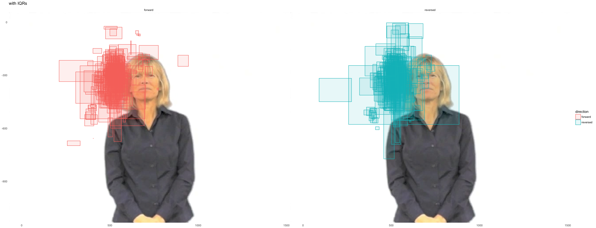

Raw XY Data (study2children)
================
Adam Stone, PhD
11-17-2017

-   [Introduction](#introduction)
-   [Removing Discarded Kids (to come)](#removing-discarded-kids-to-come)
-   [Shifting Data (to come)](#shifting-data-to-come)
-   [Save!](#save)
-   [Participant Table](#participant-table)
-   [Analysis Time!](#analysis-time)
-   [IQR](#iqr)
-   [Viewing Space Charts](#viewing-space-charts)
-   [Viewing Space Charts for Individuals](#viewing-space-charts-for-individuals)

Introduction
============

Great! At this point, I've run a Matlab script on the children's raw data to collect XY gaze data for each video/trial they viewed. We start with 68 children.

Right now, I'm putting ALL those kids. **Later, I should probably throw out those that were NOT in our AOI analysis. That's a simple thing to do.**

Also, a few of them need to have their xy data corrected because of large offsets.

For now here's **all** our data.

``` r
# Libraries
library(tidyverse)
library(feather)
library(lme4)
library(grid)
library(png)
#library(cowplot)

# Import data (and fix one participant name, and fix Owen as EnglishExposed)
data <- read_feather("../Child Data/childxydata.feather") %>%
  mutate(participant = case_when(
    participant == "Ab07ov09_22m" ~ "Ab07ov09_32m",
    TRUE ~ participant
  )) %>%
  mutate(language = case_when(
    participant == "OwenTwin030212_4y2m" ~ "EnglishExposed",
    TRUE ~ language
  ))

# Get ages
ages <- read_csv("childrenages.csv")
data <- data %>% left_join(ages, by = "participant")
data %>% select(participant,language,age) %>% distinct() # print data table
```

    ## # A tibble: 68 x 3
    ##            participant            language   age
    ##                  <chr>               <chr> <dbl>
    ##  1        Ab07ov09_32m      EnglishExposed   2.7
    ##  2     AB11Mi20_5M_10D      EnglishExposed   0.4
    ##  3  Ainsely03_27_5y_1m      EnglishExposed   5.1
    ##  4       al10pa24_4yrs      EnglishExposed   4.0
    ##  5       Allan_SE_3.5y SignLanguageExposed   3.5
    ##  6         an06he01_6m      EnglishExposed   0.5
    ##  7 Annika_3_24_10_CODA SignLanguageExposed   6.0
    ##  8      AsherCalibOnly      EnglishExposed   0.0
    ##  9     aubrey CODA 11m SignLanguageExposed   0.9
    ## 10  Aveline CODA 6y,1m SignLanguageExposed   5.1
    ## # ... with 58 more rows

``` r
# Histogram of ages
data %>% select(participant,language,age) %>% 
  distinct() %>% 
  ggplot(aes(x = age)) + geom_histogram(fill = "royalblue") + ggtitle("Ages in Full Dataset")
```


Removing Discarded Kids (to come)
=================================

This is the part where I want to remove all children that were not included in the AOI analysis. But I haven't written the code yet, so.

Shifting Data (to come)
=======================

Then there are some kids whose data needs to be corrected because of large offsets which we detected via [twopuppies.nb.html](twopuppies.nb.html). I should list those kids here, too.

Save!
=====

Great. Let's save this as \`cleanedchildxydata.csv'.

``` r
# Pull apart condition columns
data <- data %>%
  separate(condition, into = c("story", "clipnum", "direction", "media"), sep = "_") %>%
  unite(story, clipnum, col = "story", sep = "_") %>%
  select(-media) 

# A bit more cleaning up
data <- data %>%
  mutate(direction = case_when(
    direction == "FW" ~ "forward",
    direction == "ER" ~ "reversed"
  )) %>%
  mutate(language = case_when(
    language == "SignLanguageExposed" ~ "sign",
    language == "EnglishExposed" ~ "english"
  )) %>%
  mutate(group = as.factor(group),
         gender = as.factor(gender),
         language = as.factor(language),
         story = as.factor(story),
         direction = as.factor(direction))

# Save as csv and feather (feather preserves column types for R)
write_csv(data,"../Child Data/cleanedchildxydata.csv")
write_feather(data,"../Child Data/cleanedchildxydata.feather")
```

Participant Table
=================

Now we can present the following table about our participants.

``` r
participants <- data %>%
  select(participant, gender, language, age) %>%
  distinct()

participants_n <- participants %>%
  count(gender, language) %>%
  spread(gender, n)

participants_age <- participants %>%
  group_by(language) %>%
  summarise(age_m = round(mean(age), 1), 
            age_sd = round(sd(age), 1),
            age_min = range(age)[1],
            age_max = range(age)[2]) %>%
  mutate(age_range = paste(age_min, age_max, sep = " - ")) %>%
  select(-age_min, -age_max) %>%
  mutate(age_mean = paste(age_m, age_sd, sep = "±")) %>%
  select(-age_m, -age_sd) %>%
  select(language, age_mean, age_range)

left_join(participants_n, participants_age, by = "language")
```

    ## # A tibble: 2 x 5
    ##   language Female  Male age_mean age_range
    ##     <fctr>  <int> <int>    <chr>     <chr>
    ## 1  english     19    22  2.3±2.3   0 - 8.3
    ## 2     sign     17    10  3.5±2.3 0.4 - 7.3

Analysis Time!
==============

First, let's trim each participant's data, getting rid of the first 60 samples (0.5 secs). Then we'll get the the mean x and y coordinate for each story for each participant.

``` r
# Just to load data again 
data <- read_feather("../Child Data/cleanedchildxydata.feather")

data <- data %>%
  group_by(participant,trial) %>%
  slice(60:n())

means <- data %>%
  group_by(participant,trial) %>%
  summarise(x = mean(x,na.rm=TRUE),
            y = mean(y,na.rm=TRUE))
head(means,10)
```

    ## # A tibble: 10 x 4
    ## # Groups:   participant [1]
    ##     participant trial        x        y
    ##           <chr> <int>    <dbl>    <dbl>
    ##  1 Ab07ov09_32m     1 518.2213 318.4398
    ##  2 Ab07ov09_32m     2 515.2019 269.2530
    ##  3 Ab07ov09_32m     3 520.0502 286.6715
    ##  4 Ab07ov09_32m     4 542.0149 298.3843
    ##  5 Ab07ov09_32m     5 548.4278 318.3076
    ##  6 Ab07ov09_32m     6 553.1987 251.1674
    ##  7 Ab07ov09_32m     7 506.2269 391.8369
    ##  8 Ab07ov09_32m     8 557.8473 298.3606
    ##  9 Ab07ov09_32m     9 566.5259 356.7556
    ## 10 Ab07ov09_32m    10 518.2249 342.4257

And I can get x or y plots of one participant across 4 stories. Let's do Emmet. We'll set the x and y limits to the whole width of the Tobii monitor (1600x1200). But because Tobii considers (0,0) to be the upper left corner (and not the bottom left corner), we also need to flip the y axis.

``` r
emmet <- filter(data,participant=="emmet_12_10_12_CODA") %>% mutate(y = y*-1)
ggplot(emmet,aes(x=x,y=y,color=story)) + geom_point(size=0.1) + geom_path() + facet_wrap("story",ncol=4,nrow=2) + guides(color="none") + scale_x_continuous(limit=c(0,1600)) + scale_y_continuous(limit=c(-1200,0))
```

    ## Warning: Removed 7200 rows containing missing values (geom_point).

    ## Warning: Removed 2664 rows containing missing values (geom_path).


Cool, yeah?

IQR
===

Now let's get the middle 50% (aka the IQR) of x and y for each participant's story (we've already trimmed the first 60 samples). That should also take care of further weird outliers. And we are defining "viewing space" as the IQR of the x and y axis.

``` r
iqr <- data %>%
  group_by(participant,trial) %>%
  summarise(xIQR = IQR(x,na.rm=TRUE),
                   yIQR = IQR(y,na.rm=TRUE),
                   xmed = median(x, na.rm=TRUE),
                   ymed = median(y, na.rm=TRUE)) %>%
  ungroup()
head(iqr,10)
```

    ## # A tibble: 10 x 6
    ##     participant trial  xIQR  yIQR  xmed  ymed
    ##           <chr> <int> <dbl> <dbl> <dbl> <dbl>
    ##  1 Ab07ov09_32m     1  34.0  76.0 526.0   284
    ##  2 Ab07ov09_32m     2  35.5  39.0 514.0   267
    ##  3 Ab07ov09_32m     3  30.0  45.5 524.0   249
    ##  4 Ab07ov09_32m     4  15.0  25.0 541.0   294
    ##  5 Ab07ov09_32m     5  32.0  33.0 552.5   319
    ##  6 Ab07ov09_32m     6  57.0  30.0 552.0   248
    ##  7 Ab07ov09_32m     7  73.0 285.0 522.0   334
    ##  8 Ab07ov09_32m     8  24.5  63.5 554.0   266
    ##  9 Ab07ov09_32m     9  11.0  44.0 566.0   361
    ## 10 Ab07ov09_32m    10  36.0  38.0 506.0   339

``` r
# Join participant info back into IQR table
participantinfo <- data %>%
  select(participant, trial, age, group, gender, language, story, direction, mark, repetition) %>%
  distinct()

iqr <- left_join(iqr, participantinfo, by = c("participant","trial"))
```

And check out the histograms. I truncated the y-axis at 100 to better see outliers.

``` r
iqr %>% 
  gather(axis,iqr,xIQR:yIQR) %>%
  ggplot(aes(x=iqr,fill=axis)) + geom_histogram() + facet_grid(axis~.) + 
  coord_cartesian(ylim = c(0,50))
```

    ## `stat_bin()` using `bins = 30`. Pick better value with `binwidth`.

    ## Warning: Removed 90 rows containing non-finite values (stat_bin).


So we see some outliers. Who are those? Let's get a table of them. Review those AFTER I've done the cleanups of course.

``` r
xoutliers <- iqr %>%
  arrange(desc(xIQR)) %>%
  slice(1:10)
youtliers <- iqr %>%
  arrange(desc(yIQR)) %>%
  slice(1:10)
```

Next, check the medians.

``` r
iqr %>% 
  gather(axis,med,xmed:ymed) %>%
  ggplot(aes(x=med,fill=axis)) + geom_histogram() + facet_grid(axis~.) + 
  coord_cartesian(ylim = c(0,50))
```

    ## `stat_bin()` using `bins = 30`. Pick better value with `binwidth`.

    ## Warning: Removed 90 rows containing non-finite values (stat_bin).


SO I need to review those too. After cleaning up/removing kids.

``` r
iqr.gather <- iqr %>% gather(axis,value,xIQR:ymed)
iqr.iqr <- filter(iqr.gather,axis=="xIQR" | axis=="yIQR")
iqr.med <- filter(iqr.gather,axis=="xmed" | axis=="ymed")


ggplot(iqr.iqr,aes(x=language,y=value,fill=direction)) + 
  geom_boxplot() + theme(axis.text.x=element_text(angle=45,hjust=1)) +
  facet_grid(.~axis)
```

    ## Warning: Removed 90 rows containing non-finite values (stat_boxplot).


And the median x and y position (this assumes all calibrations are correct):

``` r
ggplot(iqr.med,aes(x=language,y=value,fill=direction)) + 
  geom_boxplot() + theme(axis.text.x=element_text(angle=45,hjust=1)) +
  facet_grid(.~axis)
```

    ## Warning: Removed 90 rows containing non-finite values (stat_boxplot).


First, does reversal and language experience have an effect on X IQR? We have random intercepts for each participant and media, and a random slope adjustment for reversed for each participant.

``` r
xiqr.reversal <- lmer(xIQR ~ direction * language + (direction|participant) + (1|story), data = iqr)
summary(xiqr.reversal)$coefficients
```

    ##                                  Estimate Std. Error    t value
    ## (Intercept)                     40.651974   2.419302 16.8031816
    ## directionreversed               19.761856  12.158529  1.6253492
    ## languagesign                    -9.019172   3.794033 -2.3771991
    ## directionreversed:languagesign -17.019853  19.293332 -0.8821625

That's fine, we're not exactly predicting changes along the x-axis. The y-axis is what we are really interested in! :)

``` r
yiqr.reversal <- lmer(yIQR ~ direction * language + (direction|participant) + (1|story), data = iqr)
summary(yiqr.reversal)$coefficients
```

    ##                                 Estimate Std. Error   t value
    ## (Intercept)                     61.89272   4.258159 14.535089
    ## directionreversed               25.17458   8.578833  2.934500
    ## languagesign                   -17.24320   6.789348 -2.539743
    ## directionreversed:languagesign -21.29204  13.607362 -1.564744

Viewing Space Charts
====================

I want to learn how to make rectangle plots so here we go. Using each participant's four x and y medians and 4 x and y IQRs (one set for each story, for 4 stories). So I can get the logic and code down. Let's assume all calibrations were correct. Here's the chart for the whole media size of 1440x1080 (as reported in Tobii).

``` r
# In this order, we'll get a grand median by taking a participant's median across their 4 stories, than the median for forward and reverse across all participants. 
medians <- iqr %>%
  group_by(participant,direction) %>%
  summarise(xIQR = median(xIQR,na.rm=TRUE),
                   yIQR = median(yIQR,na.rm=TRUE),
                   xmed = median(xmed,na.rm=TRUE),
                   ymed = median(ymed,na.rm=TRUE)) %>%
  group_by(direction) %>% 
  summarise(xIQR = median(xIQR,na.rm=TRUE),
                   yIQR = median(yIQR,na.rm=TRUE),
                   x = median(xmed,na.rm=TRUE),
                   y = median(ymed,na.rm=TRUE))

medians <- medians %>%
  mutate(y = y*-1,
         xmin = x-(xIQR/2),
         xmax = x+(xIQR/2),
         ymin = y-(yIQR/2),
         ymax = y+(yIQR/2))

img <- readPNG("cindy.png")
g <- rasterGrob(img, interpolate=TRUE, width=unit(1,"npc"), height=unit(1,"npc")) 

ggplot(medians, aes(fill=direction,color=direction)) +
  annotation_custom(g, xmin=-Inf, xmax=Inf, ymin=-Inf, ymax=Inf) +
  geom_rect(aes(xmin=xmin,ymin=ymin,xmax=xmax,ymax=ymax),alpha=.1) + 
  theme_minimal() + xlim(0,1440) + ylim(-1080,0)
```


``` r
# ggplot(iqr.global, aes(fill=direction,color=direction)) +
#   annotation_custom(g, xmin=-Inf, xmax=Inf, ymin=-Inf, ymax=Inf) +
#   geom_rect(aes(xmin=xmin,ymin=ymin,xmax=xmax,ymax=ymax),alpha=.1) + 
#   theme_minimal() + xlim(0,1440) + ylim(-1080,0) +
#   geom_hline(yintercept=-1080+885) +
#   geom_hline(yintercept=-1080+525) + 
#   annotate(geom="text", x = 300, y = -1080+555, label = "upper shoulder point") +
#   annotate(geom="point", x = 535, y = -1080+525) + 
#   annotate(geom="text", x = 535, y = -1080+910, label = "height line") + 
#   annotate(geom="rect", xmin = 535, xmax = 535+365, ymin = -525-551, ymax = -1080+525, fill="maroon", color="black", alpha=0.5) + 
#   annotate(geom="text", x = 700, y = -900, label = "torso")
```

Viewing Space Charts for Individuals
====================================

Now let's see the variation in viewing spaces for all our individuals. Should be fun.

``` r
iqr.individuals <- iqr %>%
  rename(x = xmed,
         y = ymed) %>%
  mutate(y = y*-1,
         xmin = x-(xIQR/2),
         xmax = x+(xIQR/2),
         ymin = y-(yIQR/2),
         ymax = y+(yIQR/2))

ggplot(iqr.individuals, aes(fill=direction,color=direction)) +
  annotation_custom(g, xmin=-Inf, xmax=Inf, ymin=-Inf, ymax=Inf) +
  geom_rect(aes(xmin=xmin,ymin=ymin,xmax=xmax,ymax=ymax),alpha=.1) + 
  theme_minimal() + xlim(0,1440) + ylim(-1080,0) + facet_wrap("direction") +
  ggtitle("with IQRs")
```

    ## Warning: Removed 49 rows containing missing values (geom_rect).



Now let's make Outer Limits charts which is IQR +/- 2 SDs. But I want to change that because I don't like the idea of mixing IQRs and SDs.

``` r
# sd.individuals <- select(sd.individuals,participant,media,xsd,ysd)
# iqrsd.individuals <- left_join(iqr.individuals,sd.individuals,by=c("participant","media")) %>%
#   mutate(xmin = xmin-(2*xsd),
#          xmax = xmax+(2*xsd),
#          ymin = ymin-(2*ysd),
#          ymax = ymax+(2*ysd))
# 
# ggplot(iqrsd.individuals, aes(fill=direction,color=direction)) +
#   annotation_custom(g, xmin=-Inf, xmax=Inf, ymin=-Inf, ymax=Inf) +
#   geom_rect(aes(xmin=xmin,ymin=ymin,xmax=xmax,ymax=ymax),alpha=.1) + 
#   theme_minimal() + xlim(0,1440) + ylim(-1080,0) + facet_wrap("direction") +
#   ggtitle("with SDs")
```

``` r
# iqrsd.individuals <- iqrsd.individuals %>%
#   group_by(direction) %>%
#   dplyr::summarize(x = mean(x,na.rm=TRUE),
#             y = mean(y,na.rm=TRUE),
#             xmin = mean(xmin,na.rm=TRUE),
#             ymin = mean(ymin,na.rm=TRUE),
#             xmax = mean(xmax,na.rm=TRUE),
#             ymax = mean(ymax,na.rm=TRUE))
# ggplot(iqrsd.individuals, aes(fill=direction,color=direction)) +
#   annotation_custom(g, xmin=-Inf, xmax=Inf, ymin=-Inf, ymax=Inf) +
#   geom_rect(aes(xmin=xmin,ymin=ymin,xmax=xmax,ymax=ymax),alpha=.1) + 
#   theme_minimal() + xlim(0,1440) + ylim(-1080,0) + facet_wrap("direction") +
#   ggtitle("Average of above chart (rain's outer limits)")
```
