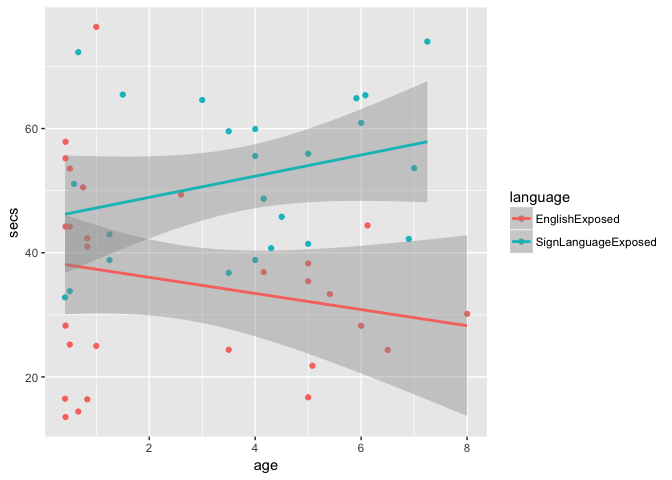

Puppy Data (study2children)
================
Adam Stone, PhD
09-29-2017

-   [Looking Time Only](#looking-time-only)
-   [On-AOI Percentages](#on-aoi-percentages)
-   [Conclusion!](#conclusion)

Looking Time Only
=================

Import files. **I'm taking out all participants that aren't marked "GoodData."**

Let's just look at overall looking-on-puppy time (ignoring "Not On AOI" for now). That tells us how much time it took to redirect the child's attention to the puppy before the trial started, right? Each data point is a kid.

``` r
library(tidyverse)
library(stringr)
library(lme4)
library(lmerTest)
library(broom)

# Get and combine data from groups 1 & 2
puppies1 <- read_csv('puppies1.csv') %>% filter(analysis=="GoodData")
puppies2 <- read_csv('puppies2.csv') %>% filter(analysis=="GoodData")
puppies <- bind_rows(puppies1,puppies2)

puppies <- puppies %>%
  select(-ends_with(".na")) %>%
  add_column(id = 1:nrow(.))

puppies.total <- puppies %>%
  select(-participant,-recording,-age,-analysis,-gender,-group,-language) %>%
  mutate(total = rowSums(.,na.rm=TRUE)) %>%
  select(id,total) %>%
  left_join(puppies,by="id")

ggplot(puppies.total,aes(x=age,y=total,color=language)) + 
  geom_point() + geom_smooth(method="lm") + ylab("secs")
```



Hmm, hmm. Looks like a HUGE difference! But those are subject-level averages. Let's plot individual trials instead.

``` r
puppies.total <- puppies.total %>%
  select(-total) %>%
  gather(puppy,secs,huskies1:golden6)

ggplot(puppies.total,aes(x=age,y=secs,color=language)) + geom_point() + geom_smooth(method="lm") + ylab("secs")
```

    ## Warning: Removed 373 rows containing non-finite values (stat_smooth).

    ## Warning: Removed 373 rows containing missing values (geom_point).


Okay, that's better - no huge differences between groups. Let's see what a linear mixed model tells us.

``` r
puppy.lm <- lmer(secs ~ language * age * (1|participant), data=puppies.total)
summary(puppy.lm)
```

    ## Linear mixed model fit by REML t-tests use Satterthwaite approximations
    ##   to degrees of freedom [lmerMod]
    ## Formula: secs ~ language * age * (1 | participant)
    ##    Data: puppies.total
    ## 
    ## REML criterion at convergence: 1802.2
    ## 
    ## Scaled residuals: 
    ##     Min      1Q  Median      3Q     Max 
    ## -2.9858 -0.5392 -0.1791  0.3467  5.8506 
    ## 
    ## Random effects:
    ##  Groups      Name        Variance Std.Dev.
    ##  participant (Intercept) 0.5424   0.7365  
    ##  Residual                1.2104   1.1002  
    ## Number of obs: 563, groups:  participant, 52
    ## 
    ## Fixed effects:
    ##                                 Estimate Std. Error       df t value
    ## (Intercept)                      1.96329    0.22598 48.58000   8.688
    ## languageSignLanguageExposed     -0.56928    0.40144 47.01000  -1.418
    ## age                             -0.05162    0.06380 49.44000  -0.809
    ## languageSignLanguageExposed:age  0.02924    0.09951 47.33000   0.294
    ##                                 Pr(>|t|)    
    ## (Intercept)                     1.86e-11 ***
    ## languageSignLanguageExposed        0.163    
    ## age                                0.422    
    ## languageSignLanguageExposed:age    0.770    
    ## ---
    ## Signif. codes:  0 '***' 0.001 '**' 0.01 '*' 0.05 '.' 0.1 ' ' 1
    ## 
    ## Correlation of Fixed Effects:
    ##             (Intr) lngSLE age   
    ## lnggSgnLngE -0.563              
    ## age         -0.727  0.409       
    ## lnggSgnLnE:  0.466 -0.813 -0.641

Cool. No effect of age or language on how long they look at the puppy. Had I run a *simple* linear model (aka simple linear regression) with no random terms, I'd have gotten this output:

``` r
puppy.lm.simple <- lm(secs ~ language * age, data = puppies.total)
summary(puppy.lm.simple)
```

    ## 
    ## Call:
    ## lm(formula = secs ~ language * age, data = puppies.total)
    ## 
    ## Residuals:
    ##     Min      1Q  Median      3Q     Max 
    ## -1.8648 -0.8165 -0.2916  0.4706  7.1980 
    ## 
    ## Coefficients:
    ##                                   Estimate Std. Error t value Pr(>|t|)    
    ## (Intercept)                      1.8912673  0.1119131  16.899   <2e-16 ***
    ## languageSignLanguageExposed     -0.4820643  0.1938244  -2.487   0.0132 *  
    ## age                             -0.0393155  0.0329357  -1.194   0.2331    
    ## languageSignLanguageExposed:age -0.0002077  0.0488104  -0.004   0.9966    
    ## ---
    ## Signif. codes:  0 '***' 0.001 '**' 0.01 '*' 0.05 '.' 0.1 ' ' 1
    ## 
    ## Residual standard error: 1.299 on 559 degrees of freedom
    ##   (373 observations deleted due to missingness)
    ## Multiple R-squared:  0.04575,    Adjusted R-squared:  0.04062 
    ## F-statistic: 8.933 on 3 and 559 DF,  p-value: 8.667e-06

Shocking - an effect of language on how much they look at puppies! That's because we used the item-level data, not subject-level data (559 degrees of freedom), which gave us too much power and treated each item as its own participant. Wrong wrong. If you look at the mixed model output, you'll see this part:

    Random effects:
    Groups      Name        Variance Std.Dev.
     participant (Intercept) 0.5424   0.7365  
     Residual                1.2104   1.1002  
    Number of obs: 563, groups:  participant, 52

The important part is the last line - where it says observations and groups. We picked participant as a grouping variable, so the linear mixed model was able to pool together the variance within each participant and account for that in the model, making it easier to look for only between-participant effects.

ANYWAY. I digress. Let's look at how on-AOI vs off-AOI data.

On-AOI Percentages
==================

Here's the chart - each data point is a child - for percent of looking-at-AOI times. I calculated percentages this way:

1.  OnAOI / (OnAOI + OffAOI)
2.  If Off AOI time was 0, I gave them 100%.
3.  If On AOI time was 0, I gave them 0%.
4.  If both On and Off AOI times were 0, I left it empty (`NA`)

``` r
puppies <- bind_rows(puppies1,puppies2) %>%
  gather(scene,secs,huskies1:golden6.na) %>%
  mutate(onaoi = !str_detect(scene,".na"))

puppies.onaoi <- filter(puppies,onaoi==TRUE) %>% select(-onaoi) %>% rename(secson = secs) 
puppies.offaoi <- filter(puppies,onaoi==FALSE) %>% select(-onaoi) %>% rename(secsoff = secs) %>%
  mutate(scene = str_sub(scene,1,-4))

puppies <- left_join(puppies.onaoi,puppies.offaoi)
```

    ## Joining, by = c("participant", "recording", "age", "analysis", "gender", "group", "language", "scene")

``` r
puppies[is.na(puppies)] <- 0
puppies <- puppies %>%
  mutate(percent = ifelse(secson > 0 & secsoff > 0, secson/(secson+secsoff),
                          ifelse(secson > 0 & secsoff == 0, 1,
                                 ifelse(secson == 0 & secsoff > 0, 0, NA))))

agelang <- select(puppies,participant,age,language) %>% distinct()

puppies.total <- puppies %>%
  group_by(participant) %>%
  summarize(percent = mean(percent, na.rm=TRUE)) %>%
  left_join(agelang)
```

    ## Joining, by = "participant"

``` r
ggplot(puppies.total,aes(x=age,y=percent,color=language)) + 
  geom_point() + geom_smooth(method="lm") + ylab("percent")
```


Looks great, no differences. I'm curious about item-level, too.

``` r
ggplot(puppies,aes(x=age,y=percent,color=language)) + geom_point() + geom_smooth(method="lm") + ylab("percent")
```

    ## Warning: Removed 357 rows containing non-finite values (stat_smooth).

    ## Warning: Removed 357 rows containing missing values (geom_point).


Looks about the same at the subject level and item level. Great! Just out of curiosity, here's the histograms.

``` r
ggplot(puppies,aes(x=percent,fill=language)) + geom_histogram() + facet_grid(language~.)
```

    ## `stat_bin()` using `bins = 30`. Pick better value with `binwidth`.

    ## Warning: Removed 357 rows containing non-finite values (stat_bin).


Nearly identical distributions. Great! And the linear mixed model (LMM) tells us the same thing. Except now there's an effect of age, which is fine (older kids should look at puppies more than babies, I think). It's only p = 0.044 anyway.

``` r
puppy.lm <- lmer(percent ~ language * age * (1|participant), data=puppies)
summary(puppy.lm)
```

    ## Linear mixed model fit by REML t-tests use Satterthwaite approximations
    ##   to degrees of freedom [lmerMod]
    ## Formula: percent ~ language * age * (1 | participant)
    ##    Data: puppies
    ## 
    ## REML criterion at convergence: -18.3
    ## 
    ## Scaled residuals: 
    ##     Min      1Q  Median      3Q     Max 
    ## -3.9522 -0.2921  0.2505  0.4802  2.9412 
    ## 
    ## Random effects:
    ##  Groups      Name        Variance Std.Dev.
    ##  participant (Intercept) 0.01611  0.1269  
    ##  Residual                0.04769  0.2184  
    ## Number of obs: 579, groups:  participant, 52
    ## 
    ## Fixed effects:
    ##                                 Estimate Std. Error       df t value
    ## (Intercept)                      0.76952    0.03958 47.40000  19.442
    ## languageSignLanguageExposed      0.08524    0.07072 46.61000   1.205
    ## age                              0.02335    0.01128 49.83000   2.070
    ## languageSignLanguageExposed:age -0.02439    0.01758 47.44000  -1.387
    ##                                 Pr(>|t|)    
    ## (Intercept)                       <2e-16 ***
    ## languageSignLanguageExposed       0.2342    
    ## age                               0.0437 *  
    ## languageSignLanguageExposed:age   0.1718    
    ## ---
    ## Signif. codes:  0 '***' 0.001 '**' 0.01 '*' 0.05 '.' 0.1 ' ' 1
    ## 
    ## Correlation of Fixed Effects:
    ##             (Intr) lngSLE age   
    ## lnggSgnLngE -0.560              
    ## age         -0.723  0.404       
    ## lnggSgnLnE:  0.464 -0.812 -0.642

Again, see what happens if we mistakenly used a *simple linear regression* here, with nearly a thousand item-level rows. It tells us everything is significant, which we know it isn't. 575 degrees of freedom, too many!

``` r
puppy.lm <- lm(percent ~ language * age, data=puppies)
summary(puppy.lm)
```

    ## 
    ## Call:
    ## lm(formula = percent ~ language * age, data = puppies)
    ## 
    ## Residuals:
    ##      Min       1Q   Median       3Q      Max 
    ## -0.85573 -0.05416  0.10682  0.14704  0.21807 
    ## 
    ## Coefficients:
    ##                                  Estimate Std. Error t value Pr(>|t|)    
    ## (Intercept)                      0.772149   0.020736  37.237  < 2e-16 ***
    ## languageSignLanguageExposed      0.078029   0.036470   2.140 0.032810 *  
    ## age                              0.023281   0.006236   3.733 0.000208 ***
    ## languageSignLanguageExposed:age -0.022355   0.009259  -2.414 0.016076 *  
    ## ---
    ## Signif. codes:  0 '***' 0.001 '**' 0.01 '*' 0.05 '.' 0.1 ' ' 1
    ## 
    ## Residual standard error: 0.2493 on 575 degrees of freedom
    ##   (357 observations deleted due to missingness)
    ## Multiple R-squared:  0.02651,    Adjusted R-squared:  0.02143 
    ## F-statistic: 5.219 on 3 and 575 DF,  p-value: 0.001462

Conclusion!
===========

1.  Great news: no group differences!
    1.  Age may be significant, but that's because we're looking at babies *and* children here!

2.  I need to do some minor outlier cleanup here.
