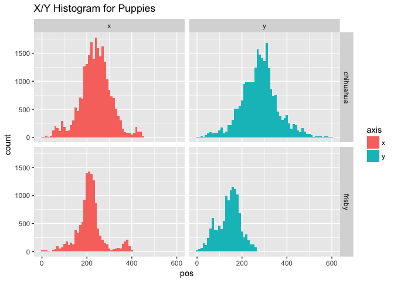
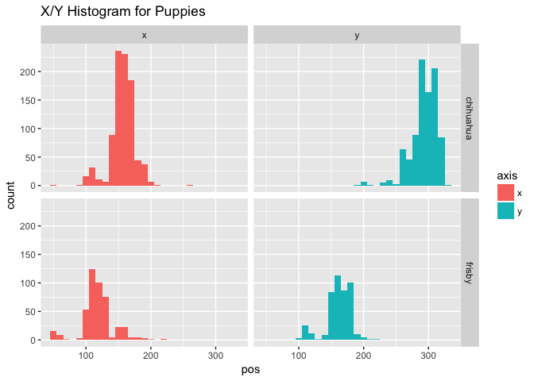
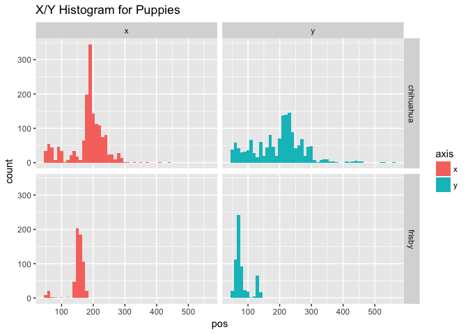

TwoPuppies (study2children)
================
Adam Stone, PhD
11-03-2017

-   [Aubrey](#aubrey)
-   [Owen](#owen)

Let's get all the puppy data and see histograms.

``` r
# Libraries
library(tidyverse)
library(feather)
#library(stringr)
#library(cowplot)

# Import data 
data <- read_feather("twopuppies.feather") %>%
  mutate(puppy = case_when(
    mark == 1 ~ "chihuahua",
    mark == 2 ~ "frisby"
  ))

# Get ages
# ages <- read_csv("childrenages.csv")
# data <- data %>% left_join(ages, by = "participant")
# data %>% select(participant,language,age) %>% distinct() # print data table

# Histogram of ages
data <- data %>% rename(x = xpos, y = ypos) %>%
  gather(axis, pos, x:y)

ggplot(data, aes(x = pos, fill = axis)) + geom_histogram(binwidth = 10) + ggtitle("X/Y Histogram for Puppies") + facet_grid(puppy ~ axis)
```



And let's get mean and medians

``` r
data_stats <- data %>%
  group_by(puppy, axis) %>%
  summarise(mean = mean(pos, na.rm=TRUE),
         median = median(pos, na.rm=TRUE))
data_stats
```

    ## # A tibble: 4 x 4
    ## # Groups:   puppy [?]
    ##       puppy  axis     mean median
    ##       <chr> <chr>    <dbl>  <dbl>
    ## 1 chihuahua     x 239.3381    241
    ## 2 chihuahua     y 279.6249    280
    ## 3    frisby     x 214.3130    212
    ## 4    frisby     y 142.3619    149

``` r
globalmedian = data_stats$median
```

Aubrey
======

``` r
aubrey <- read_csv("../Child Data/_twopuppies/Aubrey_Rec 02_TwoPuppiesData.csv") %>%
  mutate(puppy = case_when(
    mark == 1 ~ "chihuahua",
    mark == 2 ~ "frisby"
  )) %>%
  rename(x = xpos, y = ypos) %>%
  gather(axis, pos, x:y)
```

    ## Parsed with column specification:
    ## cols(
    ##   mark = col_integer(),
    ##   xpos = col_integer(),
    ##   ypos = col_integer()
    ## )

``` r
ggplot(aubrey, aes(x = pos, fill = axis)) + geom_histogram(binwidth = 10) + ggtitle("X/Y Histogram for Puppies") + facet_grid(puppy ~ axis)
```



``` r
aubrey_stats <- aubrey %>%
  group_by(puppy, axis) %>%
  summarise(mean = mean(pos, na.rm=TRUE),
         median = median(pos, na.rm=TRUE)) %>%
  ungroup() %>%
  mutate(offset = median - globalmedian)
aubrey_stats
```

    ## # A tibble: 4 x 5
    ##       puppy  axis     mean median offset
    ##       <chr> <chr>    <dbl>  <dbl>  <dbl>
    ## 1 chihuahua     x 156.8231    158    -83
    ## 2 chihuahua     y 293.9666    296     16
    ## 3    frisby     x 119.1451    119    -93
    ## 4    frisby     y 161.7991    163     14

Aubrey's offsets are approximately:

``` r
aubrey_stats %>% group_by(axis) %>% summarise(offset = mean(offset))
```

    ## # A tibble: 2 x 2
    ##    axis offset
    ##   <chr>  <dbl>
    ## 1     x    -88
    ## 2     y     15

Aubrey's data needs to be shifted RIGHT by 88 and UP by 15.

Owen
====

Owen's data is misaligned. See below:

``` r
owen <- read_csv("../Child Data/_twopuppies/Owen twin 4y2m POOR CALIB_TwoPuppiesData.csv") %>%
  mutate(puppy = case_when(
    mark == 1 ~ "chihuahua",
    mark == 2 ~ "frisby"
  )) %>%
  rename(x = xpos, y = ypos) %>%
  gather(axis, pos, x:y)
```

    ## Parsed with column specification:
    ## cols(
    ##   mark = col_integer(),
    ##   xpos = col_integer(),
    ##   ypos = col_integer()
    ## )

``` r
ggplot(owen, aes(x = pos, fill = axis)) + geom_histogram(binwidth = 10) + ggtitle("X/Y Histogram for Puppies") + facet_grid(puppy ~ axis)
```



``` r
owen_stats <- owen %>%
  group_by(puppy, axis) %>%
  summarise(mean = mean(pos, na.rm=TRUE),
         median = median(pos, na.rm=TRUE)) %>%
  ungroup() %>%
  mutate(offset = median - globalmedian)
owen_stats
```

    ## # A tibble: 4 x 5
    ##       puppy  axis      mean median offset
    ##       <chr> <chr>     <dbl>  <int>  <dbl>
    ## 1 chihuahua     x 183.55483    191    -50
    ## 2 chihuahua     y 197.78066    211    -69
    ## 3    frisby     x 152.18212    156    -56
    ## 4    frisby     y  80.13659     72    -77

Owen's offsets are approximately:

``` r
owen_stats %>% group_by(axis) %>% summarise(offset = mean(offset))
```

    ## # A tibble: 2 x 2
    ##    axis offset
    ##   <chr>  <dbl>
    ## 1     x    -53
    ## 2     y    -73

Owen's data needs to be shifted RIGHT by 53 and DOWN by 73.
