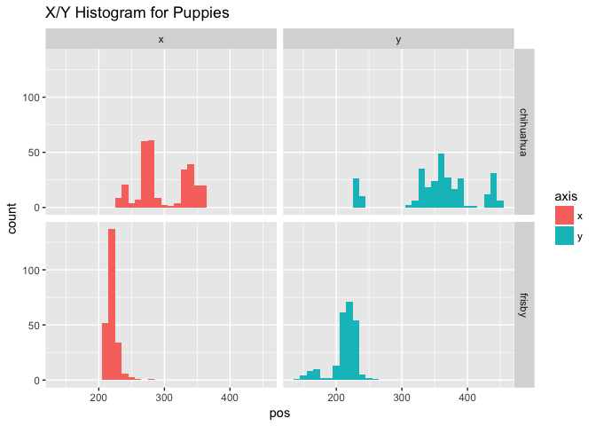
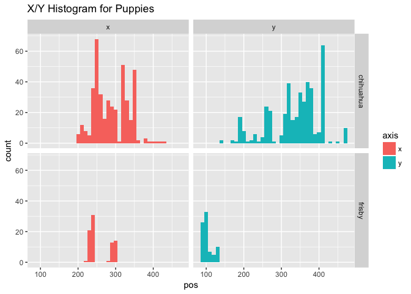
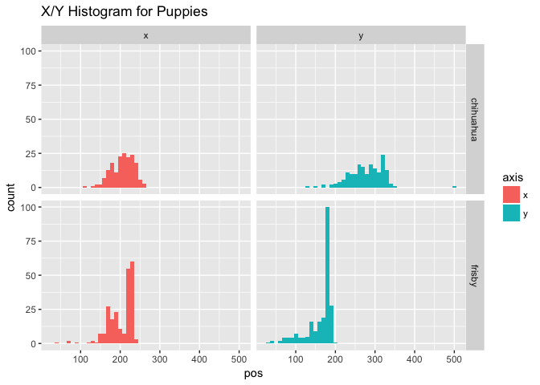

TwoPuppies (study2children)
================
Adam Stone, PhD
11-03-2017

-   [Aubrey](#aubrey)
-   [Owen](#owen)
-   [Lyla](#lyla)
-   [Mason](#mason)
-   [Ainsley](#ainsley)

Let's get all the puppy data and see histograms.

``` r
# Libraries
library(tidyverse)
library(feather)
#library(stringr)
#library(cowplot)

# Import data 
data <- read_feather("twopuppies.feather") %>%
  mutate(puppy = case_when(
    mark == 1 ~ "chihuahua",
    mark == 2 ~ "frisby"
  ))

# Get ages
# ages <- read_csv("childrenages.csv")
# data <- data %>% left_join(ages, by = "participant")
# data %>% select(participant,language,age) %>% distinct() # print data table

# Histogram of ages
data <- data %>% rename(x = xpos, y = ypos) %>%
  gather(axis, pos, x:y)

ggplot(data, aes(x = pos, fill = axis)) + geom_histogram(binwidth = 10) + ggtitle("X/Y Histogram for Puppies") + facet_grid(puppy ~ axis)
```


And let's get mean and medians

``` r
data_stats <- data %>%
  group_by(puppy, axis) %>%
  summarise(mean = mean(pos, na.rm=TRUE),
         median = median(pos, na.rm=TRUE))
data_stats
```

    ## # A tibble: 4 x 4
    ## # Groups:   puppy [?]
    ##       puppy  axis     mean median
    ##       <chr> <chr>    <dbl>  <dbl>
    ## 1 chihuahua     x 239.3381    241
    ## 2 chihuahua     y 279.6249    280
    ## 3    frisby     x 214.3130    212
    ## 4    frisby     y 142.3619    149

``` r
globalmedian = data_stats$median
```

Aubrey
======

``` r
aubrey <- read_csv("../Child Data/_twopuppies/Aubrey_Rec 02_TwoPuppiesData.csv") %>%
  mutate(puppy = case_when(
    mark == 1 ~ "chihuahua",
    mark == 2 ~ "frisby"
  )) %>%
  rename(x = xpos, y = ypos) %>%
  gather(axis, pos, x:y)

ggplot(aubrey, aes(x = pos, fill = axis)) + geom_histogram(binwidth = 10) + ggtitle("X/Y Histogram for Puppies") + facet_grid(puppy ~ axis)
```


``` r
aubrey_stats <- aubrey %>%
  group_by(puppy, axis) %>%
  summarise(mean = mean(pos, na.rm=TRUE),
         median = median(pos, na.rm=TRUE)) %>%
  ungroup() %>%
  mutate(offset = median - globalmedian)
aubrey_stats
```

    ## # A tibble: 4 x 5
    ##       puppy  axis     mean median offset
    ##       <chr> <chr>    <dbl>  <dbl>  <dbl>
    ## 1 chihuahua     x 156.8231    158    -83
    ## 2 chihuahua     y 293.9666    296     16
    ## 3    frisby     x 119.1451    119    -93
    ## 4    frisby     y 161.7991    163     14

Aubrey's offsets are approximately:

``` r
aubrey_stats %>% group_by(axis) %>% summarise(offset = mean(offset))
```

    ## # A tibble: 2 x 2
    ##    axis offset
    ##   <chr>  <dbl>
    ## 1     x    -88
    ## 2     y     15

Aubrey's data needs to be shifted RIGHT by 88 and UP by 15.

Owen
====

Owen's data is misaligned. See below:

``` r
owen <- read_csv("../Child Data/_twopuppies/Owen twin 4y2m POOR CALIB_TwoPuppiesData.csv") %>%
  mutate(puppy = case_when(
    mark == 1 ~ "chihuahua",
    mark == 2 ~ "frisby"
  )) %>%
  rename(x = xpos, y = ypos) %>%
  gather(axis, pos, x:y)

ggplot(owen, aes(x = pos, fill = axis)) + geom_histogram(binwidth = 10) + ggtitle("X/Y Histogram for Puppies") + facet_grid(puppy ~ axis)
```


``` r
owen_stats <- owen %>%
  group_by(puppy, axis) %>%
  summarise(mean = mean(pos, na.rm=TRUE),
         median = median(pos, na.rm=TRUE)) %>%
  ungroup() %>%
  mutate(offset = median - globalmedian)
owen_stats
```

    ## # A tibble: 4 x 5
    ##       puppy  axis      mean median offset
    ##       <chr> <chr>     <dbl>  <int>  <dbl>
    ## 1 chihuahua     x 183.55483    191    -50
    ## 2 chihuahua     y 197.78066    211    -69
    ## 3    frisby     x 152.18212    156    -56
    ## 4    frisby     y  80.13659     72    -77

Owen's offsets are approximately:

``` r
owen_stats %>% group_by(axis) %>% summarise(offset = mean(offset))
```

    ## # A tibble: 2 x 2
    ##    axis offset
    ##   <chr>  <dbl>
    ## 1     x    -53
    ## 2     y    -73

Owen's data needs to be shifted RIGHT by 53 and DOWN by 73.

Lyla
====

I wanted to check Lyla's data. Becaues when I was checking for AOI outliers, I noticed Lyla had a lot of high AOI %'s on the chest.

``` r
lyla <- read_csv("../Child Data/_twopuppies/Rec 09 Lyla GREAT_TwoPuppiesData.csv") %>%
  mutate(puppy = case_when(
    mark == 1 ~ "chihuahua",
    mark == 2 ~ "frisby"
  )) %>%
  rename(x = xpos, y = ypos) %>%
  gather(axis, pos, x:y)

ggplot(lyla, aes(x = pos, fill = axis)) + geom_histogram(binwidth = 10) + ggtitle("X/Y Histogram for Puppies") + facet_grid(puppy ~ axis)
```



``` r
lyla_stats <- lyla %>%
  group_by(puppy, axis) %>%
  summarise(mean = mean(pos, na.rm=TRUE),
         median = median(pos, na.rm=TRUE)) %>%
  ungroup() %>%
  mutate(offset = median - globalmedian)
lyla_stats
```

    ## # A tibble: 4 x 5
    ##       puppy  axis     mean median offset
    ##       <chr> <chr>    <dbl>  <dbl>  <dbl>
    ## 1 chihuahua     x 298.0206    281     40
    ## 2 chihuahua     y 356.3299    360     80
    ## 3    frisby     x 220.7692    219      7
    ## 4    frisby     y 213.4188    217     68

I don't like her data for Chihuahua (seems scattered) so let's only use Frisby to calculate offset

Lyla's offsets are approximately:

``` r
lyla_stats %>% filter(puppy=='frisby') %>% select(axis, offset)
```

    ## # A tibble: 2 x 2
    ##    axis offset
    ##   <chr>  <dbl>
    ## 1     x      7
    ## 2     y     68

Lyla's data needs to be shifted LEFT by 7 and UP by 68. That sounds just about right! I would just move it up vertically by 68, and not worry about horizontal offsets.

Mason
=====

I wanted to check Mason's data because I noticed he had a lot of high MidFaceCenter AOI percentages.

``` r
mason <- read_csv("../Child Data/_twopuppies/Mason_CODA_6y_GOOD_TwoPuppiesData.csv") %>%
  mutate(puppy = case_when(
    mark == 1 ~ "chihuahua",
    mark == 2 ~ "frisby"
  )) %>%
  rename(x = xpos, y = ypos) %>%
  gather(axis, pos, x:y)

ggplot(mason, aes(x = pos, fill = axis)) + geom_histogram(binwidth = 10) + ggtitle("X/Y Histogram for Puppies") + facet_grid(puppy ~ axis)
```



``` r
mason_stats <- mason %>%
  group_by(puppy, axis) %>%
  summarise(mean = mean(pos, na.rm=TRUE),
         median = median(pos, na.rm=TRUE)) %>%
  ungroup() %>%
  mutate(offset = median - globalmedian)
mason_stats
```

    ## # A tibble: 4 x 5
    ##       puppy  axis     mean median offset
    ##       <chr> <chr>    <dbl>  <dbl>  <dbl>
    ## 1 chihuahua     x 288.5049  280.5   39.5
    ## 2 chihuahua     y 337.8951  350.0   70.0
    ## 3    frisby     x 256.8025  240.0   28.0
    ## 4    frisby     y 102.8642   98.0  -51.0

Mason's offsets are approximately:

``` r
mason_stats %>% group_by(axis) %>% summarise(offset = mean(offset))
```

    ## # A tibble: 2 x 2
    ##    axis offset
    ##   <chr>  <dbl>
    ## 1     x  33.75
    ## 2     y   9.50

Mason's data needs to be shifted LEFT by 34 and UP by 10. Mabye that's peanuts and we can leave it alone. At the most, the x-offset seems consistent so maybe we should correct horizontal offset? While the y-offset appears to be zero and we can leave it alone.

Ainsley
=======

I wanted to check Ainsley's data as an example of a GOOD kid...what kind of offsets would we see?

``` r
ainsley <- read_csv("../Child Data/_twopuppies/Ainsely 5y1m GREAT_TwoPuppiesData.csv") %>%
  mutate(puppy = case_when(
    mark == 1 ~ "chihuahua",
    mark == 2 ~ "frisby"
  )) %>%
  rename(x = xpos, y = ypos) %>%
  gather(axis, pos, x:y)

ggplot(ainsley, aes(x = pos, fill = axis)) + geom_histogram(binwidth = 10) + ggtitle("X/Y Histogram for Puppies") + facet_grid(puppy ~ axis)
```



``` r
ainsley_stats <- ainsley %>%
  group_by(puppy, axis) %>%
  summarise(mean = mean(pos, na.rm=TRUE),
         median = median(pos, na.rm=TRUE)) %>%
  ungroup() %>%
  mutate(offset = median - globalmedian)
ainsley_stats
```

    ## # A tibble: 4 x 5
    ##       puppy  axis     mean median offset
    ##       <chr> <chr>    <dbl>  <dbl>  <dbl>
    ## 1 chihuahua     x 206.3693  209.5  -31.5
    ## 2 chihuahua     y 277.8125  282.0    2.0
    ## 3    frisby     x 201.5796  218.5    6.5
    ## 4    frisby     y 161.1460  177.0   28.0

Ainsley's offsets are approximately:

``` r
ainsley_stats %>% group_by(axis) %>% summarise(offset = mean(offset))
```

    ## # A tibble: 2 x 2
    ##    axis offset
    ##   <chr>  <dbl>
    ## 1     x  -12.5
    ## 2     y   15.0

Ainsley's data needs to be shifted RIGHT by 13 and UP by 15. Which is nothing, so yes, it's well-calibrated.
